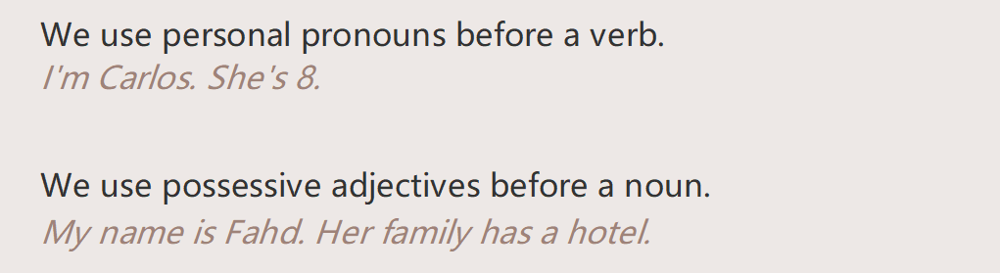
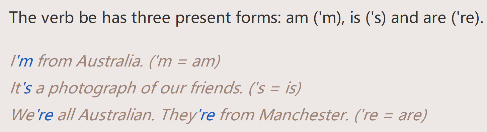

# Episode1

**听力A**

```
Carlos: Hi, hello. I'm Carlos. I'm going to tell you about Koko. She's a student in our class. She's 18 and she's from Japan. Her family's from Sapporo. Her father's a teacher. She wants to study English at university.

Kerry: A-l-l right! Thank you, Carlos. So, Koko. It's your turn. Please introduce the student next to you.

Koko: Hello! Yes! I'm going to tell you about Hussain. This is Hussain. He's from Al Ain. Al Ain is in, the uh ...

Kerry: Un-it-ed … A-rab … Em-ir-ates.

Koko: Yes … the UAE! Hussain's from Al Ain. It's in the UAE. He's 20. His family's from Al Ain. He has two younger sisters and one younger brother. He likes football and his favourite footballer is Lionel Messi. Hussain wants to study Business at university.

Kerry: Thank you, Koko. Well done. So, Hussain. Please introduce the student next to you.

Hussain: Hello! I'm going to tell you about Nehir. Nehir is 19. She's from Turkey. She has a brother. Her family has a hotel. She wants to study Business at university.

Kerry: Thank you, Hussain. Nehir – your turn!

Nehir: Hello. I'm going to tell you about Carlos. He's 19. He's from Peru. His father's a TV producer and his mother's a doctor. Carlos wants to study Computer Science at university.

Kerry: Thank you, Nehir.
```

**Talk about：**

```
your name (I'm… )
your occupation (I'm a/an… )
your country and hometown (I'm from…)
about people in your family (I have… . My mother's a… . My father's a…)
your plans for the future  (I want to…)
```

```
My name's Jack and I'm from China. I'm 21 and I'm a student. I have one sister. We have a hotel in Shanghai. My mother and father are the managers. I want to get a PD.
```

| topic       | key vocabulary                  |
| ----------- | ------------------------------- |
| family      | brother, sister, mother, father |
| occupations | student, doctor, manager        |
| countries   | Saudi Arabia, China             |

**词汇**

```
It's your turn 轮到你了
```

**介绍别人**

```
Hi, hello. I'm Jack. I'm going to tell you about Koko. She's a student in our class. She's 18 and she's from Japan. Her family's from Tokyo. Her father's a teacher. She wants to study English at university.
```

# Episode2

**Personal pronouns and possessive adjectives**

> The personal 
>
> pronouns are underlined. The possessive adjectives are circled.








The verb is before the subject in questions.

```
Her name is _____.               What's her name?
She is from Turkey.              Is she from Turkey?
You are from London.             Are you from London?
```

**听力B**

```
Marie: Hi! Good morning, everybody!
All: Morning. Hi. Hello.
Marie: I'm going to tell you about two famous people from the United States. One person is a famous man and one person is a famous woman. So… picture one. Who's this? In the photograph? Do you know?
Student: Um, is he an actor?
Marie: Uh, no, no, he isn't an actor. Anybody? No? OK, well, this is Larry Page. And he has a famous company: Google. I'm sure you know it! Larry's father's name is Carl and his mother's name is Gloria. They're computer scientists.
And, OK, now this photograph. This is Ursula Burns. She's a famous businesswoman. She's from New York but her family's Latin American. They're from Panama. She's famous for her work with Xerox. She's the first …
Clare: … thank you, Marie. Hi! Now I'm going to tell you about two famous people from the United Kingdom. This one, this is Jessica Ennis-Hill. She's a sportswoman and she's from Sheffield, a city in England. Her father's from Jamaica and her mother's from England. Jessica has a lot of medals for athletics.
A-a-and this is my next photograph. This is Sir Harry Kroto. He's a famous scientist from England. He has a Nobel Prize. He's from a small town near Cambridge. His wife's name is Margaret. She's a scientist too.
```

# Episode3

**An ideas map helps you think about the topic and organize informationabout it. It also helps you to remember key information and vocabulary.**


1. Who's the person in your ideas map?

2. Is he/she your [father/mother/brother/sister/cousin, etc.]?

3. Where's he/she from?

4. What does he/she do?

5. How old is he/she? 

# Episode5

**READ**

A VERY tall man!

Sultan Kӧsen is from Turkey. He lives in Mardin in Turkey. He lives with his family. Sultan lives with his mother, his three brothers and his sister.

Sultan is a typical farmer. His hobby is watching TV. He is interested in music. His height is unusual. He is 251 cm tall – that is very tall. Sultan is the tallest man in the world. His mother, brother and sister are normal height.

Sultan works on the farm. He has a tractor. His life is not easy. People look at him in the street. Normal clothes and shoes are too small. His clothes and shoes are very big.

Sultan speaks Turkish and English. He went to London, Paris and Madrid in Europe in 2010. He went to New York, Chicago and Los Angeles in America in 2011.

**大写**


**critical thinking**


**句型**

```
He lives in Shanghai in China.
He lives with his family.
Tom lives with his mother, and his sister.
Tom is the tallest man in the world.
Jack works on the SGM.
People look at him in the SGM.
Normal clothes and shoes are too small.
He went to Shanghai，Wuhan in China in 2023.
```

```
Read the text again. 
Write the correct words from the text in the gaps.
Write the words from the box in the correct places in the table below.
```

**介绍家庭成员**

```
He is a father. 
He lives with his family. 
He is a security inspector. 
He likes doughnut. 
He likes beer and TV. 
```

**句型**

```
My city is famous for its university.
```

For some words, the first letter is always a capital letter.

```
Names of people: My brother's name is Orhan.
Names of places: Istanbul is a big city in Turkey.
The pronoun I: I have two sisters.
```

# Episode6


Possessive determiners are my, your, his, her, its, our and 

their. 

We use possessive determiners before a noun.


### Self-introduction

> You name(I'm ....)
>
> Your occupation(I'm a/an...)
>
> Your country and hometown(I'm from...)
>
> about people in your family(I have... My father is a ... My mother is a ...)
>
> Your plans for the future(I want to...)

> Hello!/Hi!
>
> I'm Jackie and I'm from Shanghai in Chine.
>
> I've learned english for ten years.
>
> There are four members in my family,they are My partens and youger sisters.
>
> My mother is a cooker,and my father is a driver.
>
> I'm a soft-engineer.
>
> I want to get a PD in the future.

> Today I wounld like to talk about a famous woman in China,her name is ...
>
> She is a ...,I knew her from a ...
>
> And about his/her family,he/she ....
>
> She likes in ....

### 公开课

Today I would like to talk about a famous woman in China,her name is ......

She is a ......, I knew her from a ......

And about his/her family,he/she......

She lives in......
