# Episode1

`习题A`

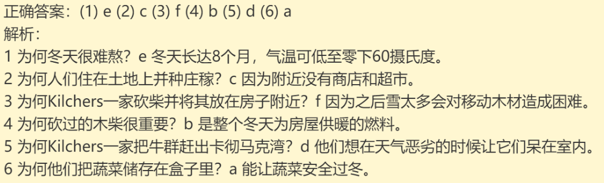

# Episode2

`习题A`

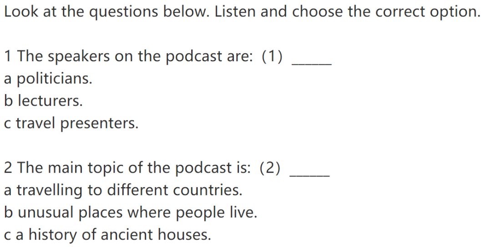

`习题B`

`习题C`

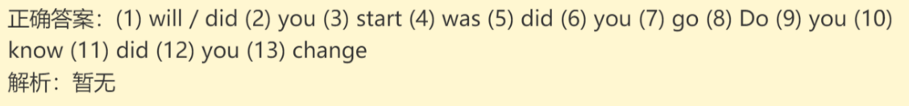

`习题D`

`习题E`

# Episode3

`习题A`

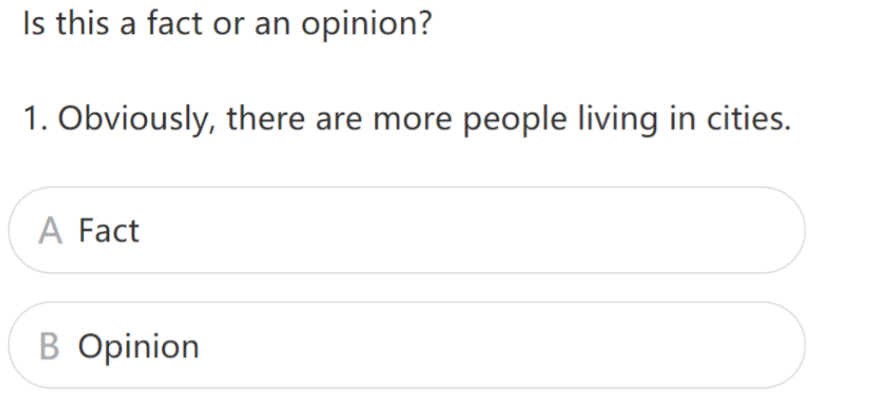

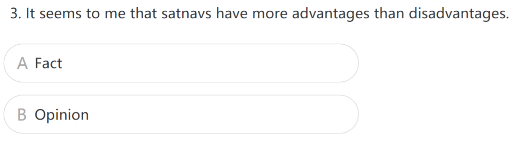

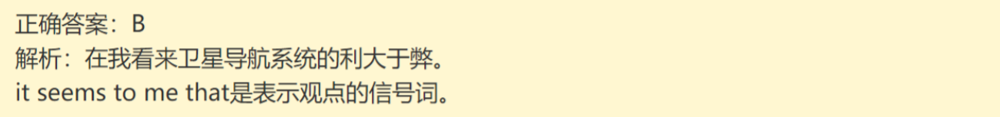

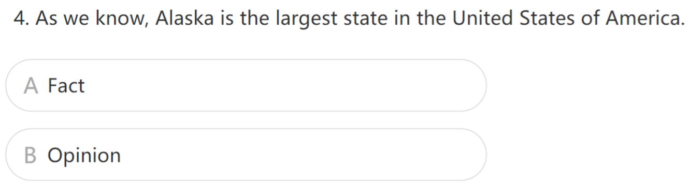

`习题B`

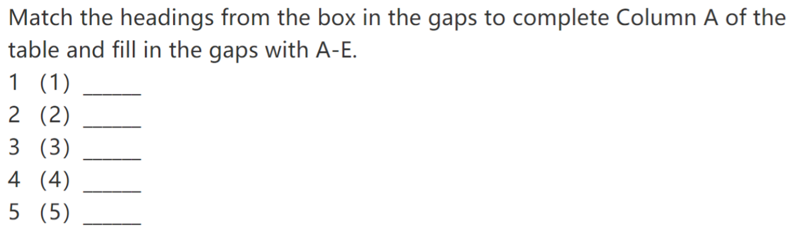

`习题C`

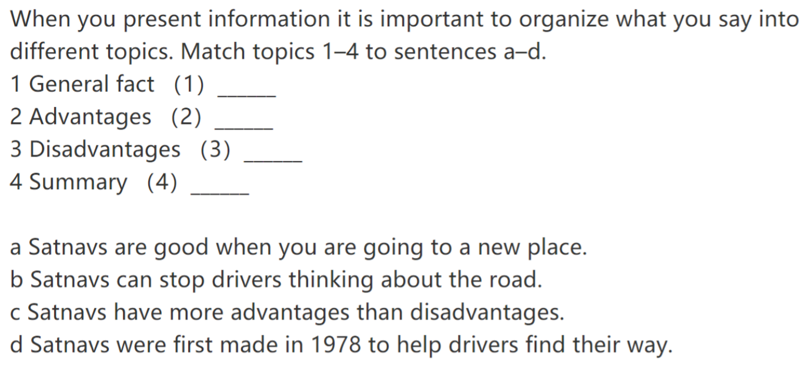

`习题D`

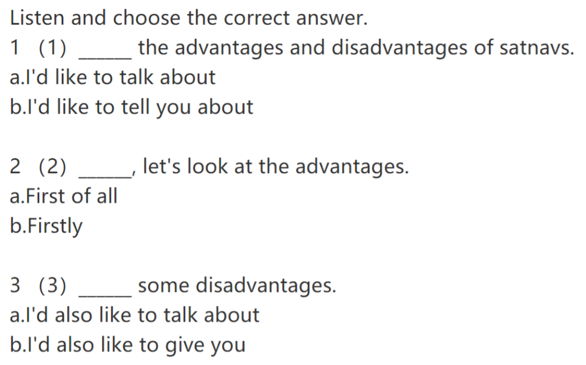

# Episode4

`习题A`

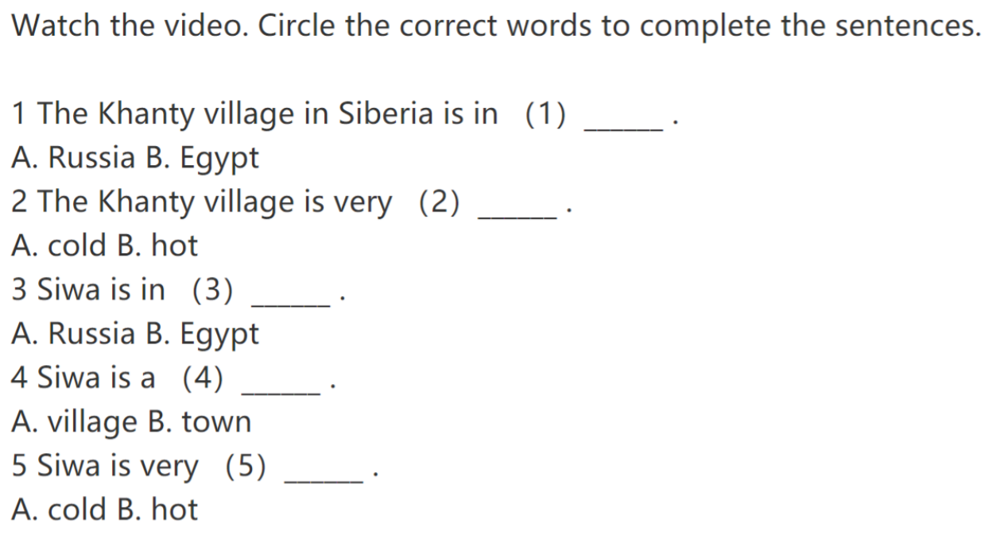

`习题B`

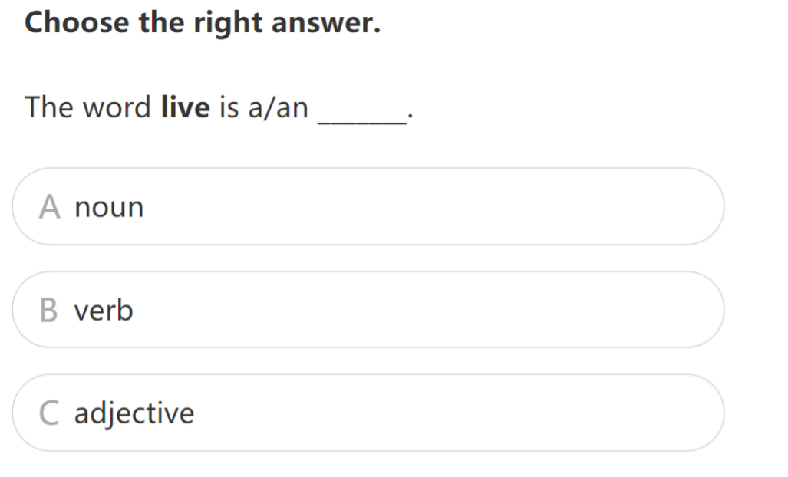

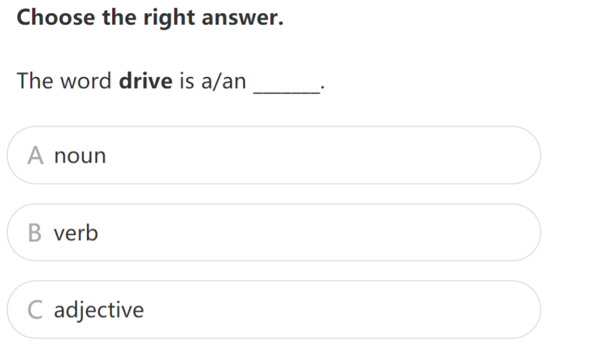

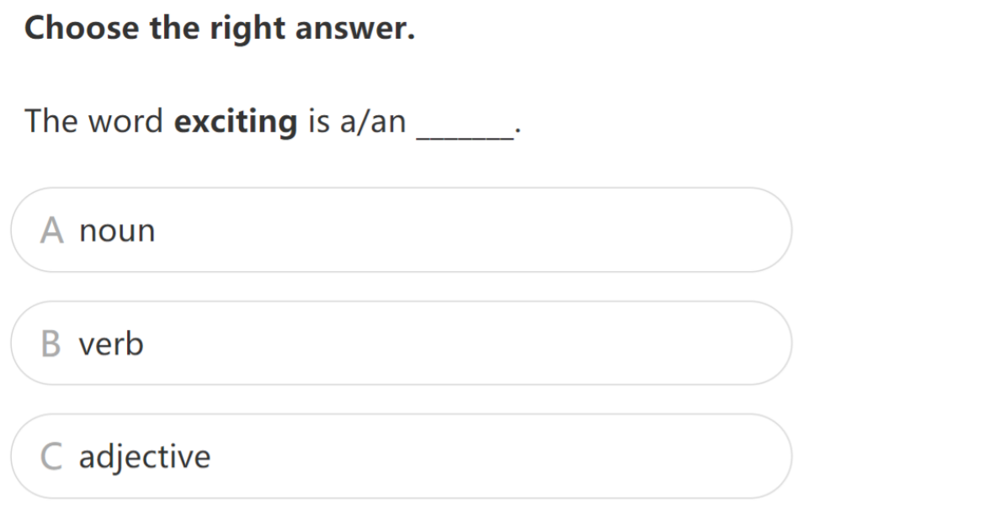

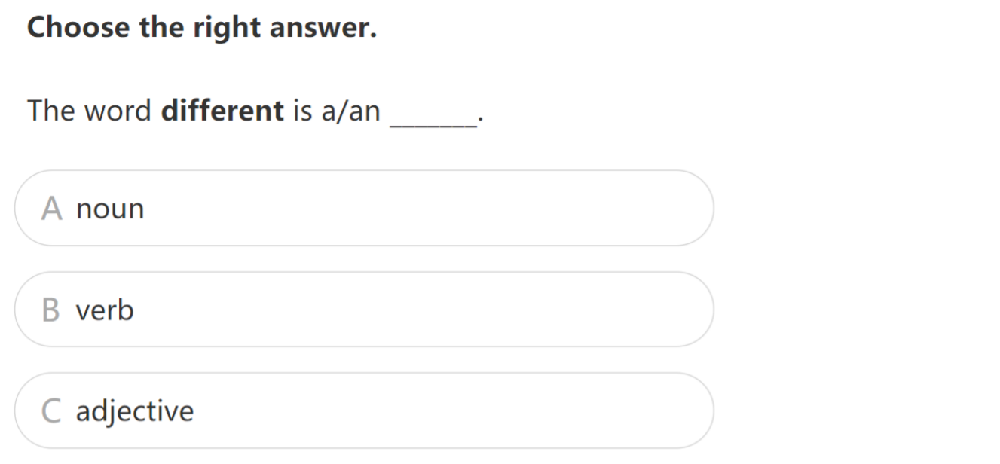

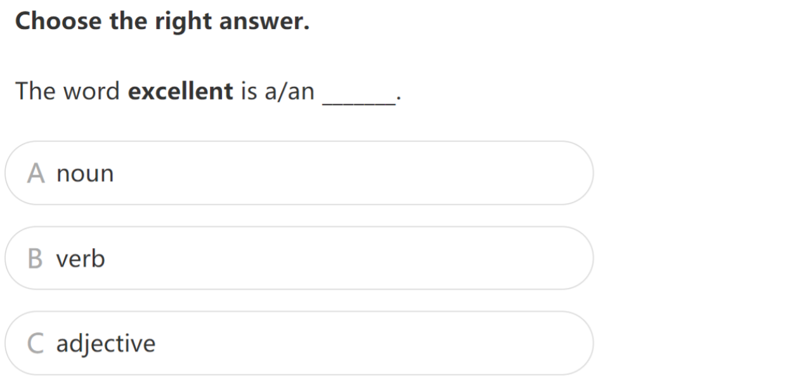

# Episode5

`习题A`

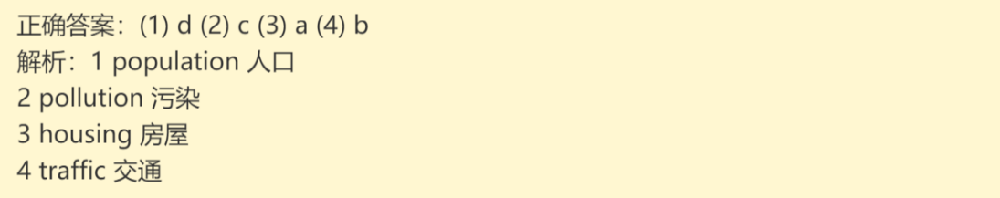

`习题B`

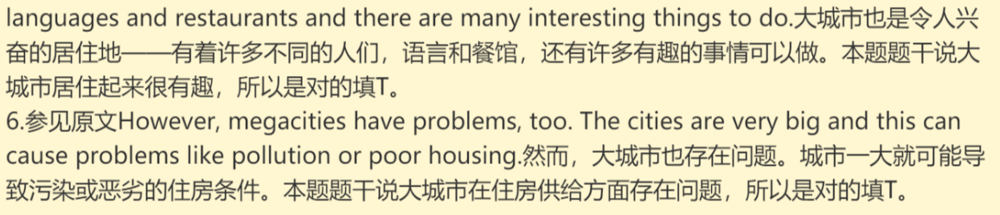

`习题C`

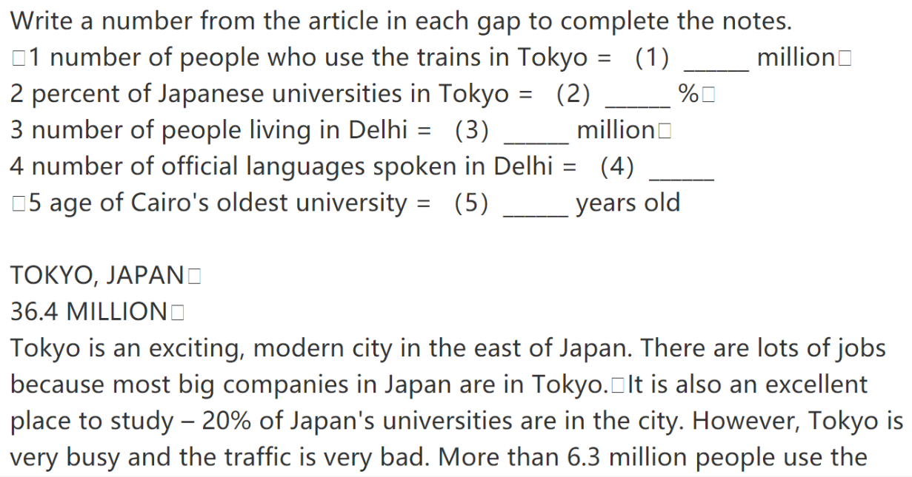

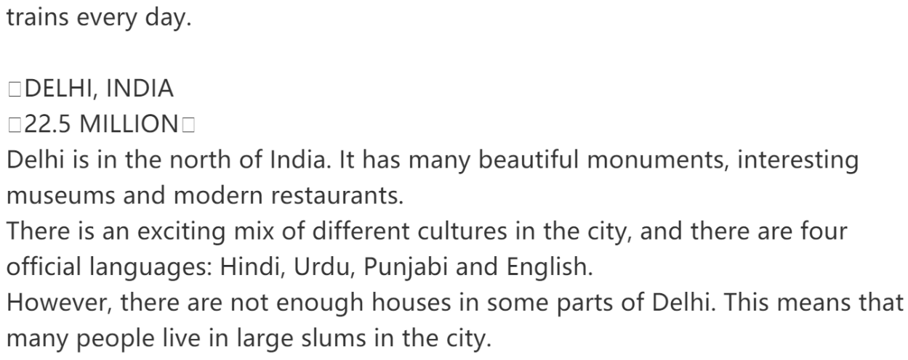

`习题D`

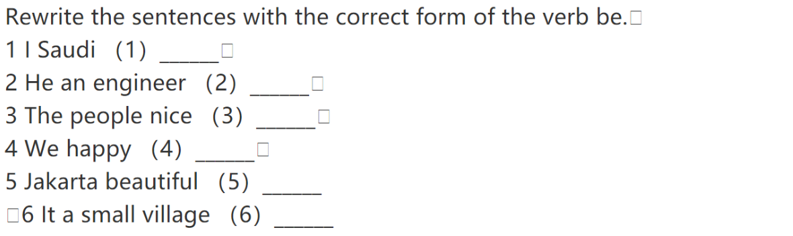

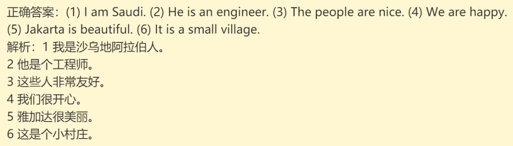

# Episode6

`习题A`

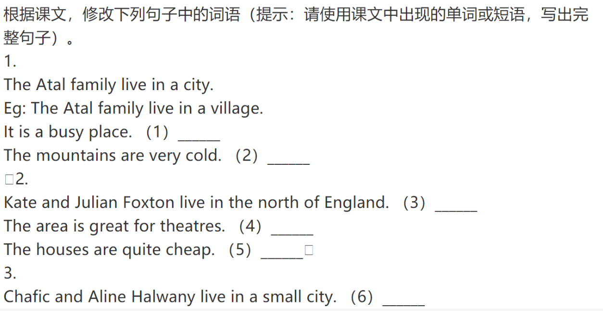

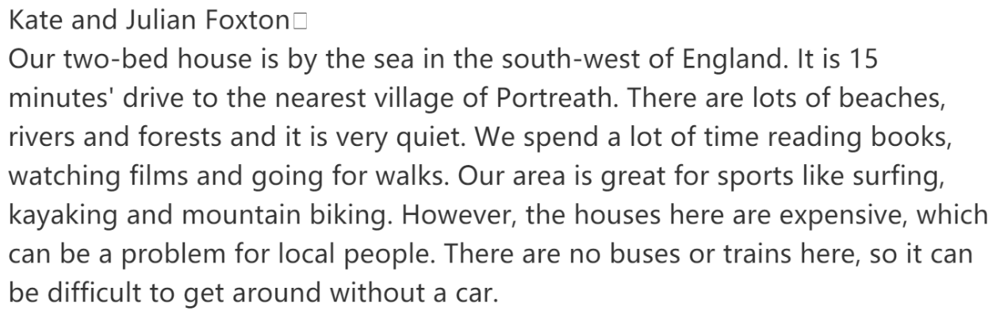

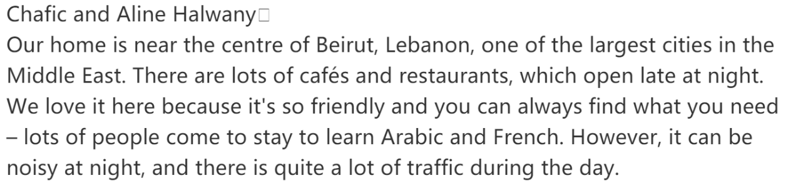

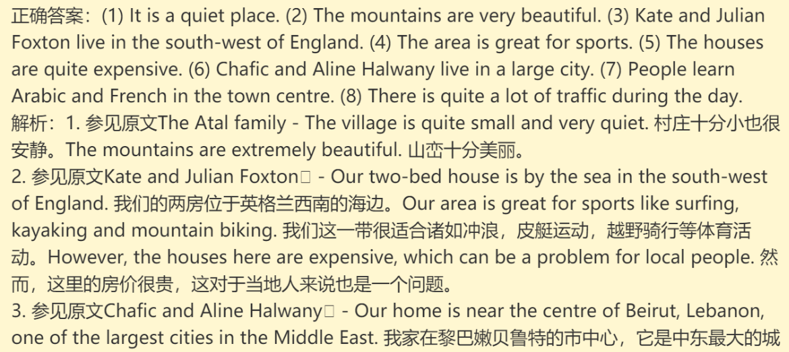

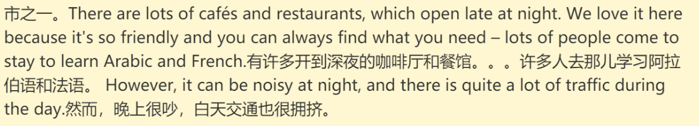
