# Episode1

`习题A`

`习题B`

`习题C`

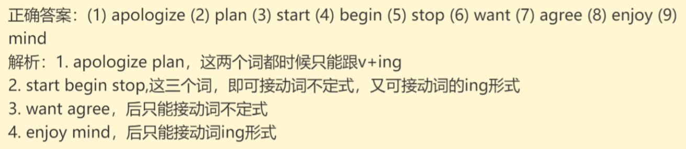

`习题D`

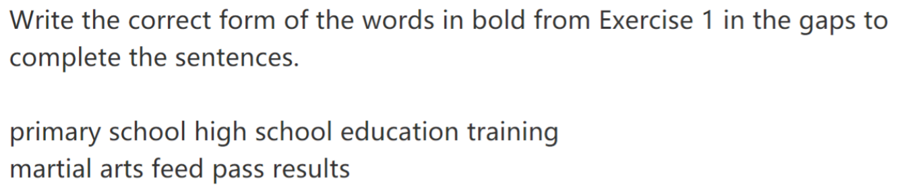

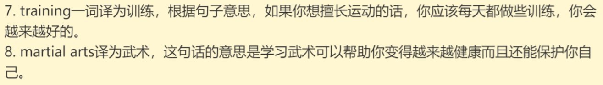

# Episode2

`习题A`

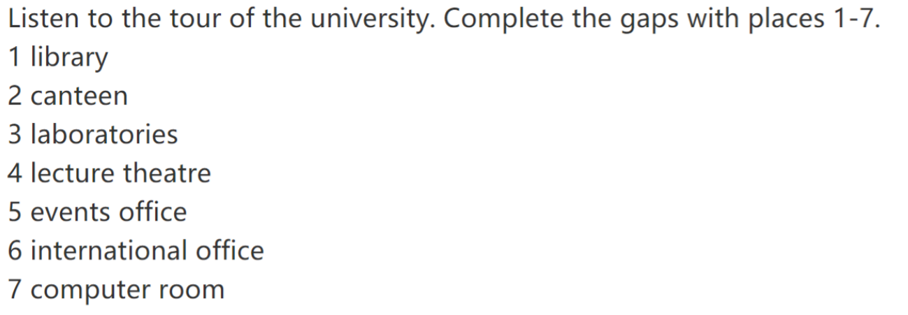

`习题B`

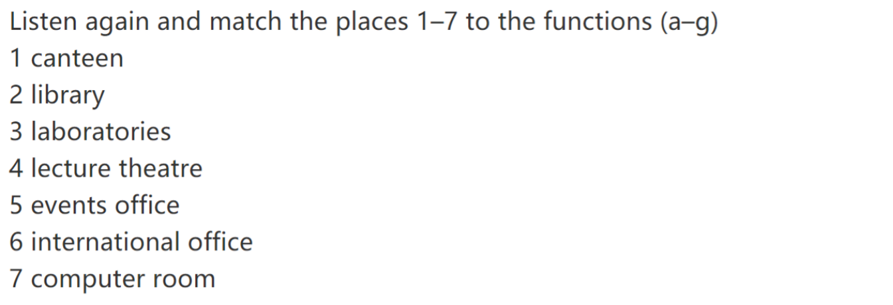

# Episode3

`习题A`

`习题B`

`习题C`

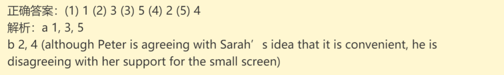

`习题D`

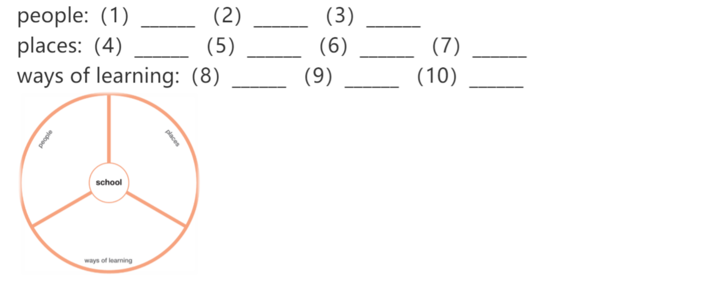

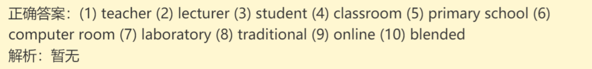

`习题E`

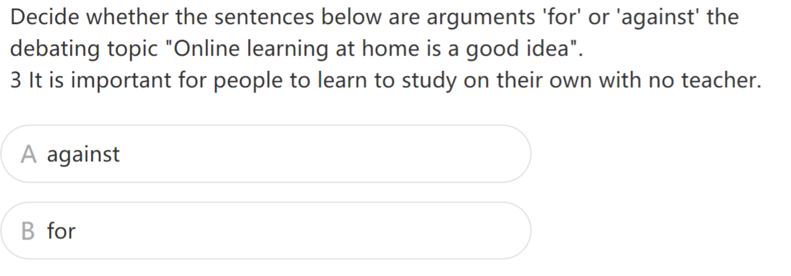

# Episode4

`习题A`

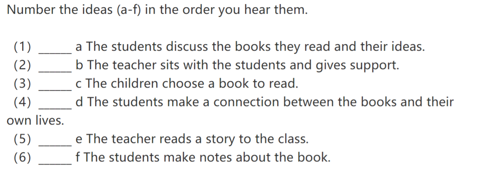

`习题B`

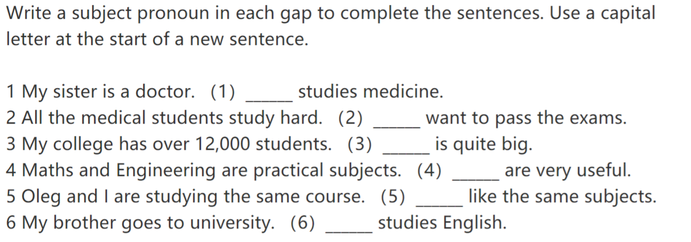

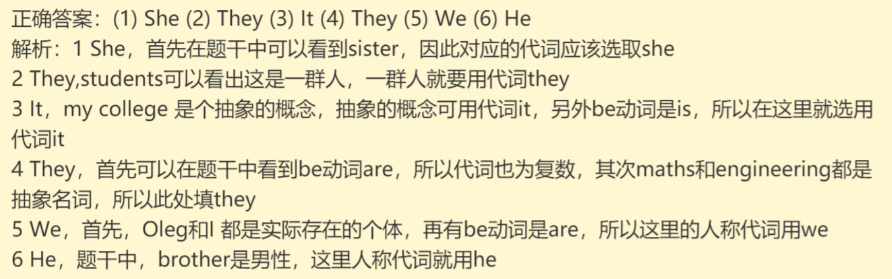

# Episode5

`习题A`

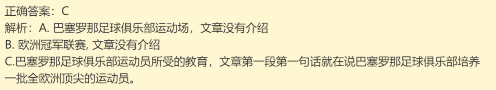

`习题B`

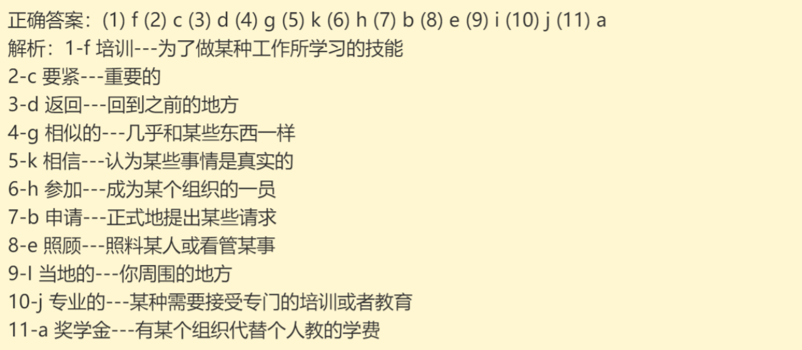

# Episode6

`习题A`

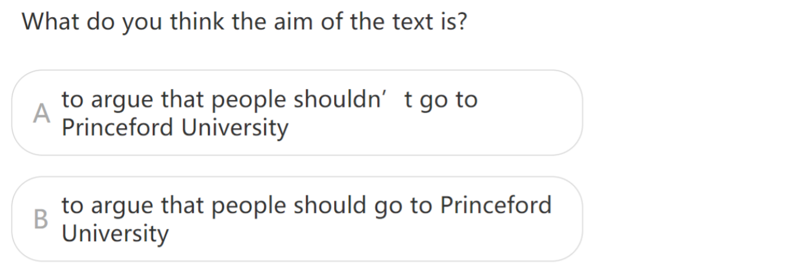

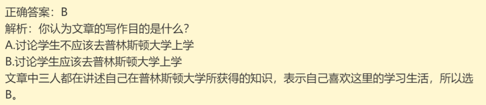

`习题B`

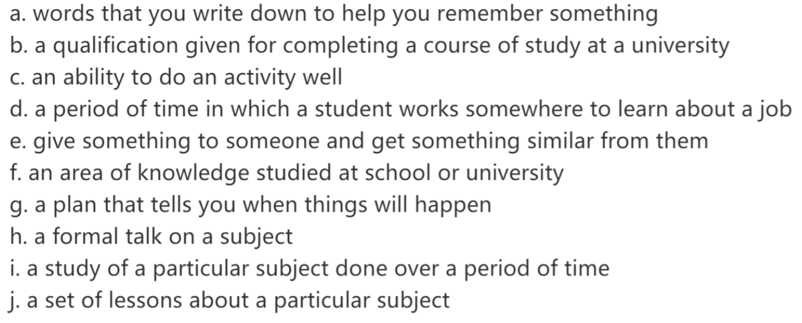

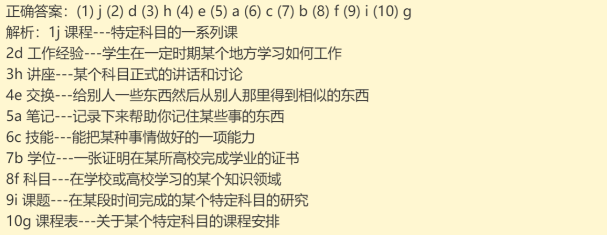
