# Episode1

`习题A`

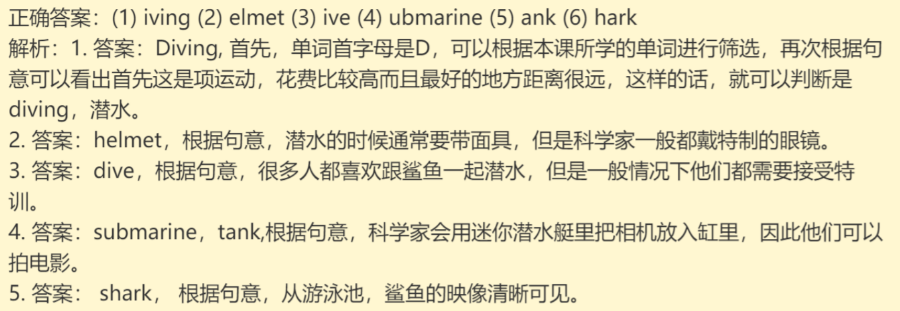

`习题B`

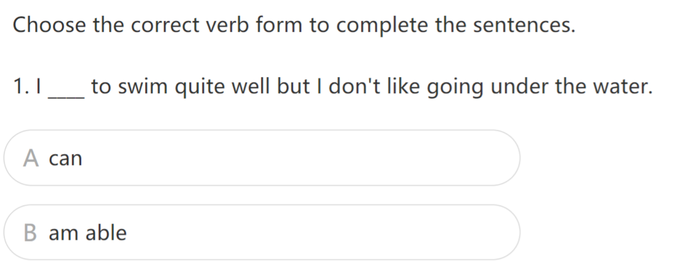

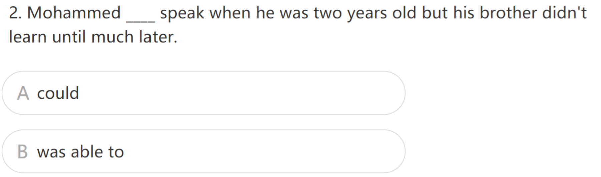

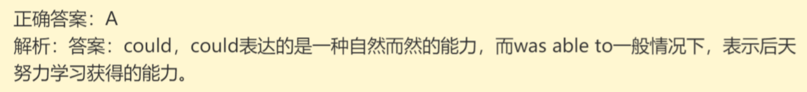

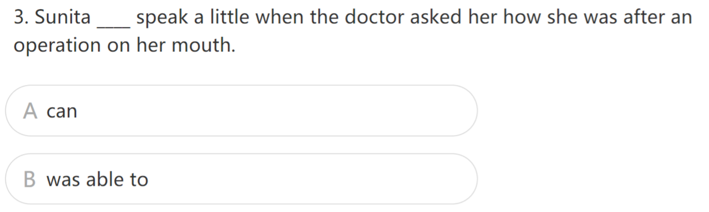

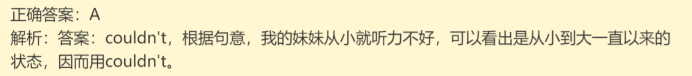

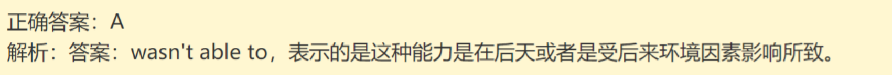

`习题C`

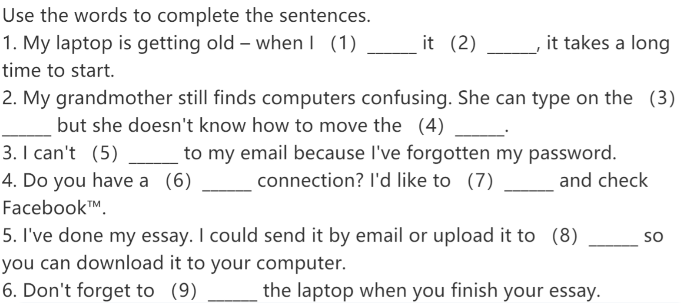

`习题D`

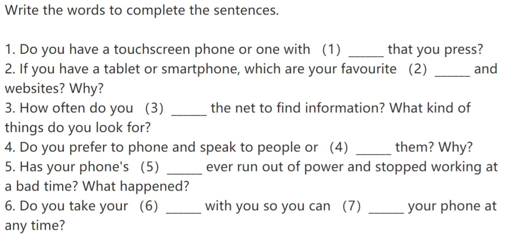

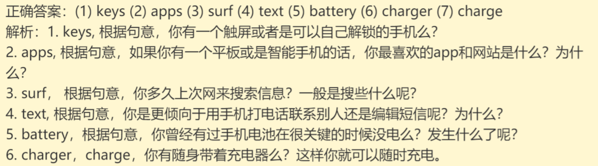

# Episode2

`习题A`

`习题B`

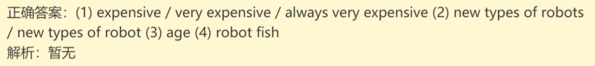

`习题C`

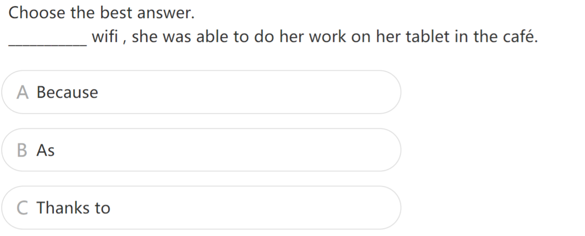

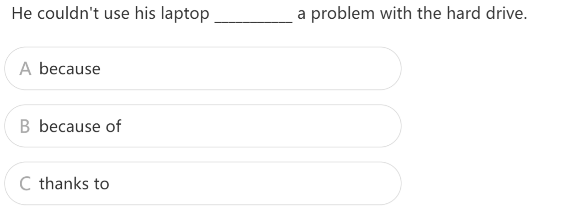

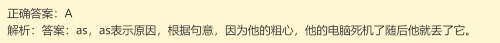

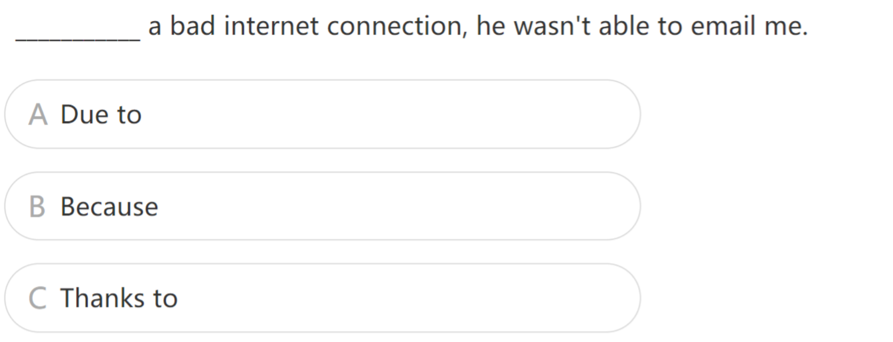

# Episode3

`习题A`

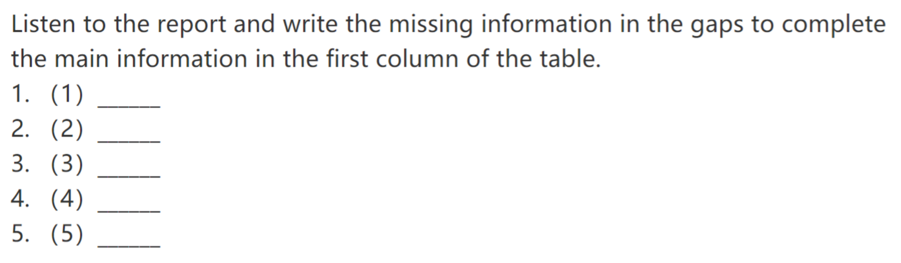

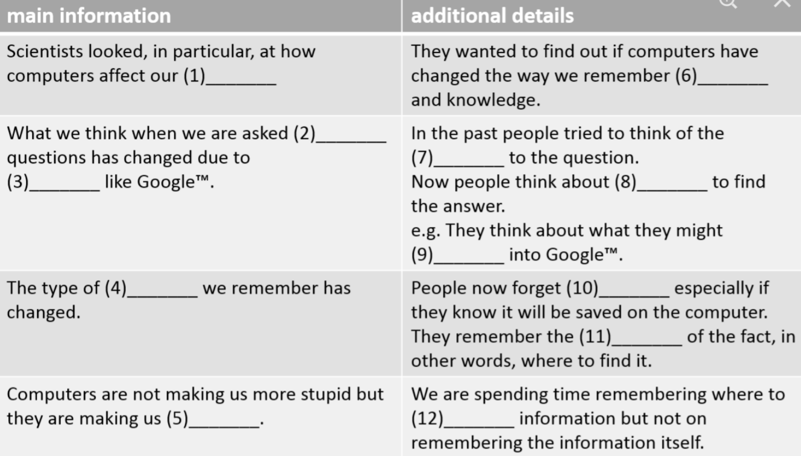

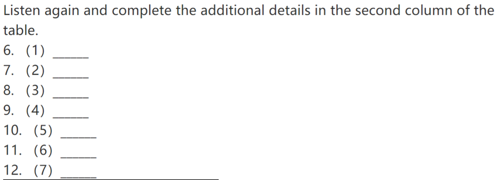

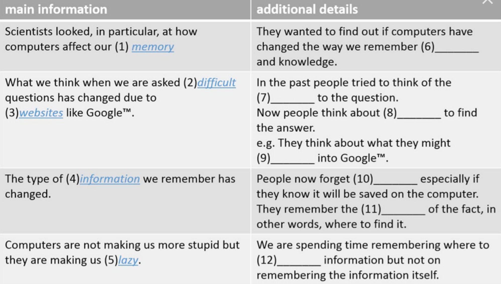

`习题B`

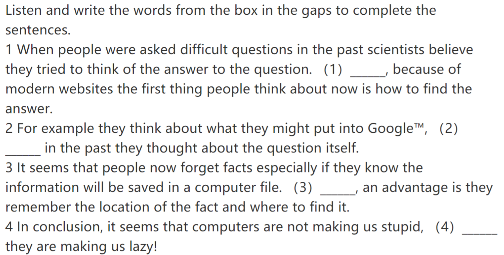

`习题C`

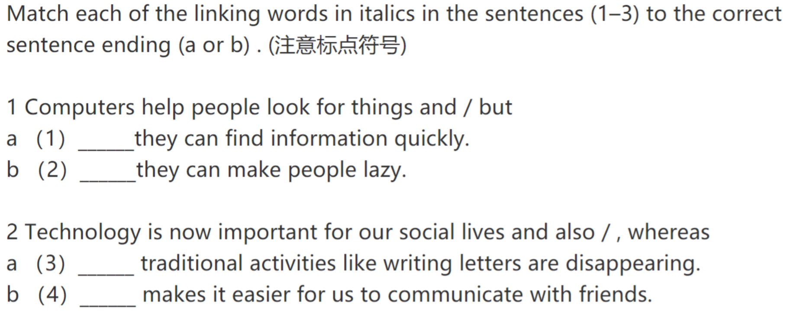

# Episode4

`习题A`

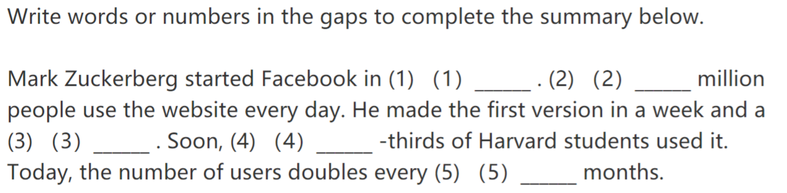

`习题B`

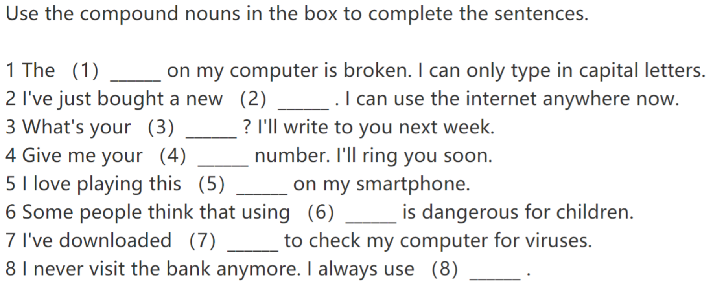

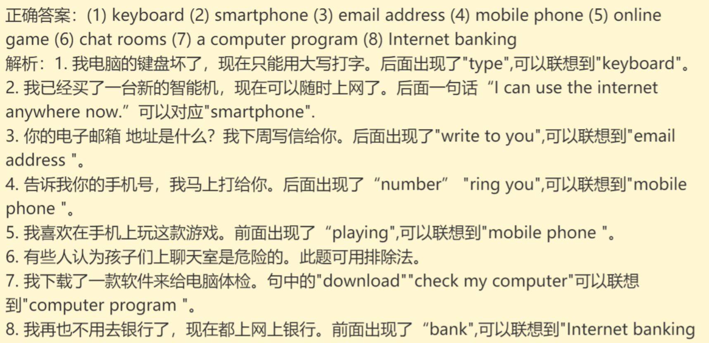

# Episode5

`习题A`

`习题B`

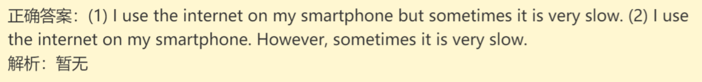

`习题C`

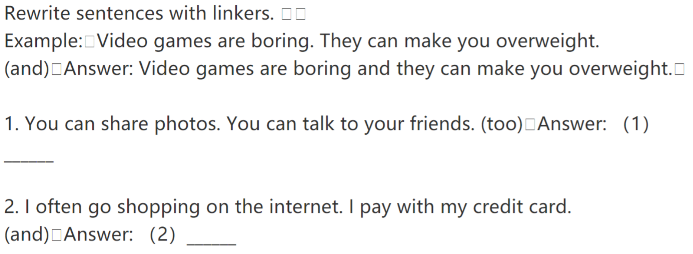

# Episode6

`习题A`

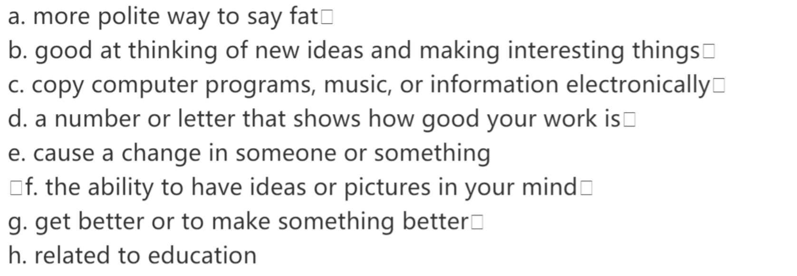

`习题B`

`习题C`

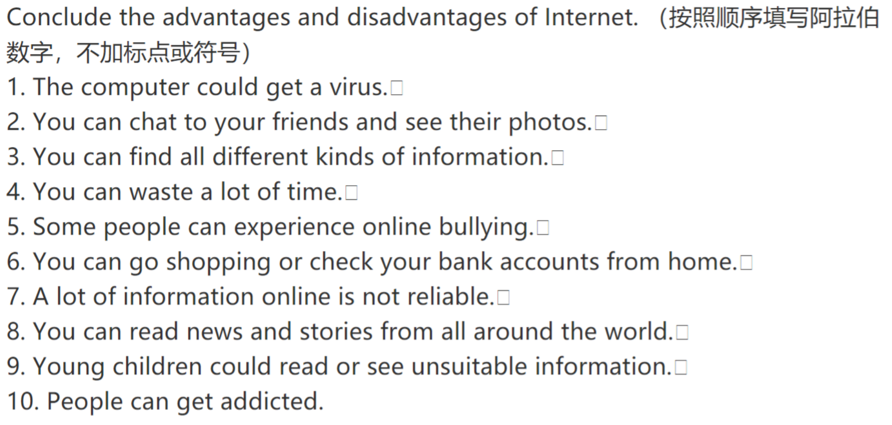

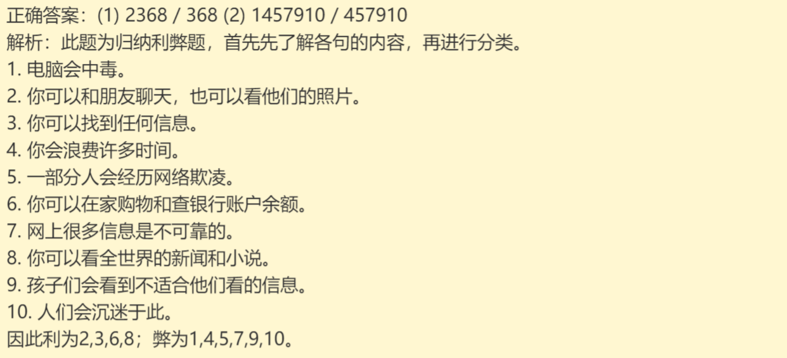
