# Episode1

`习题A`

`习题B`

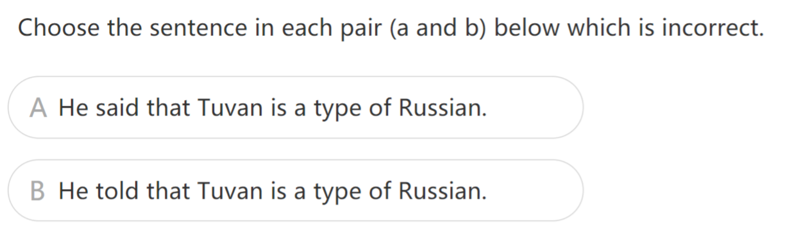

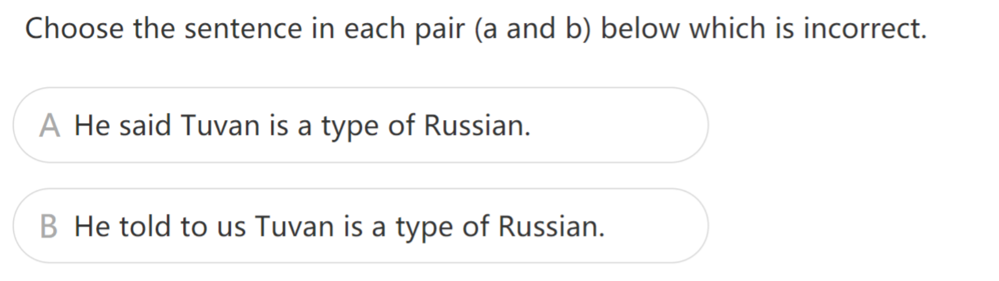

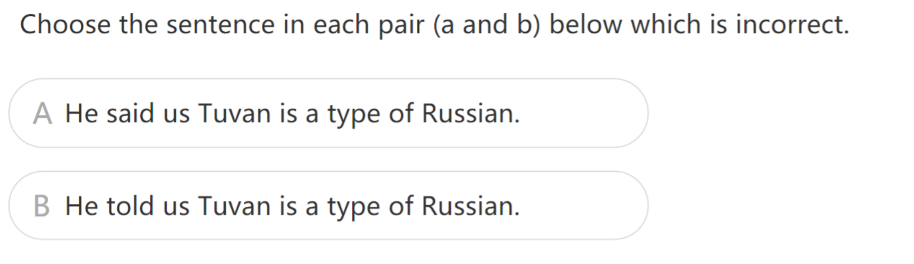

`习题C`

`习题D`

# Episode2

`习题A`

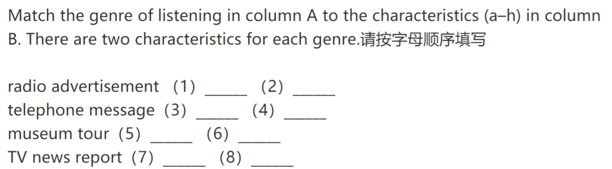

`习题B`

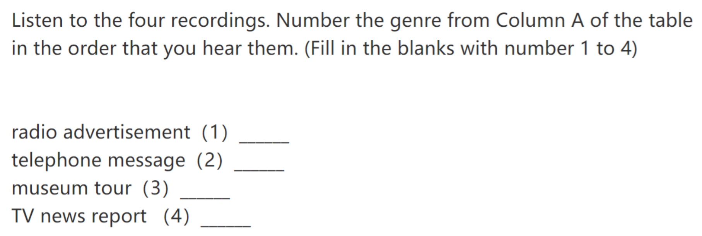

`习题C`

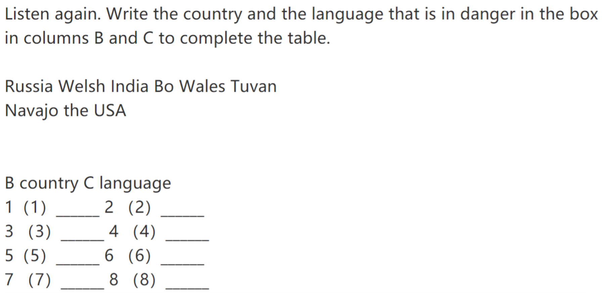

# Episode3

`习题A`

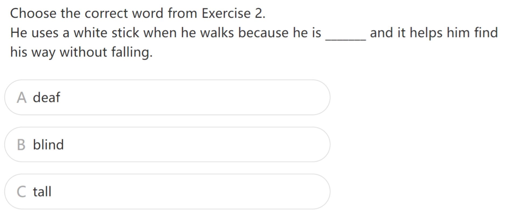

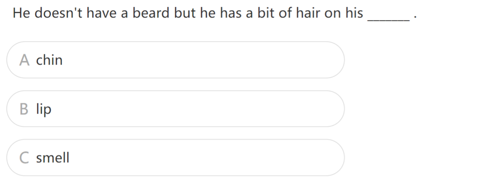

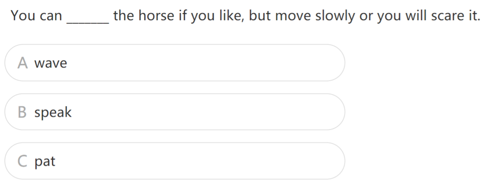

`习题B`

`习题C`

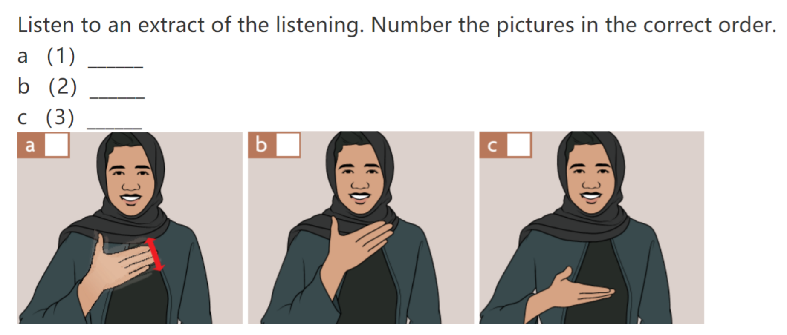

`习题D`

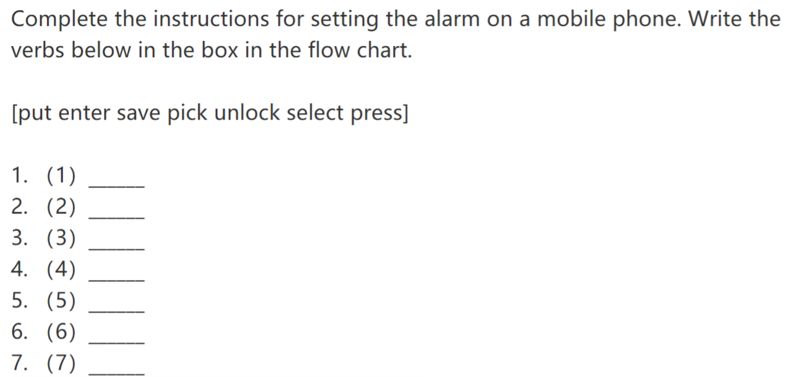

# Episode4

`习题A`

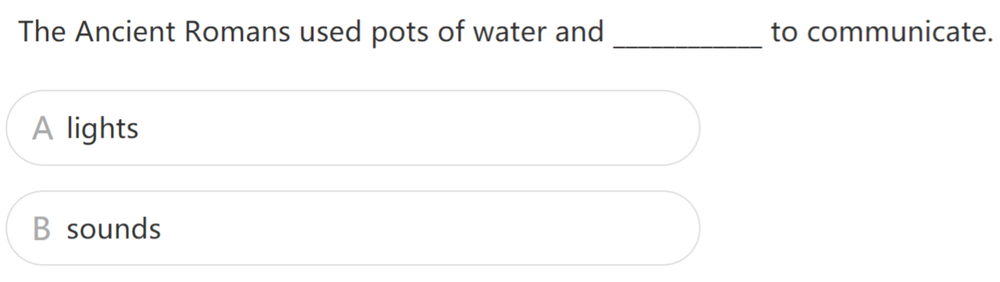

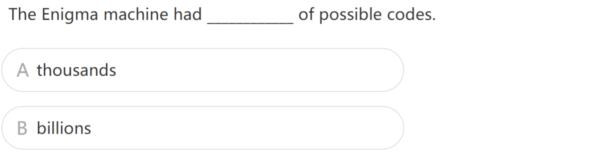

`习题B`

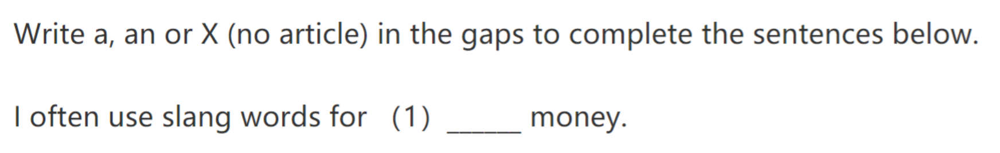

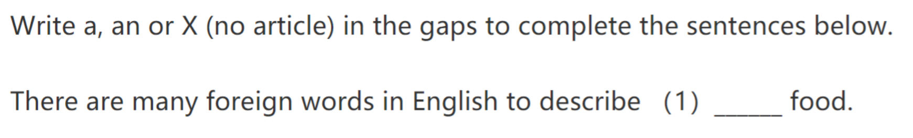

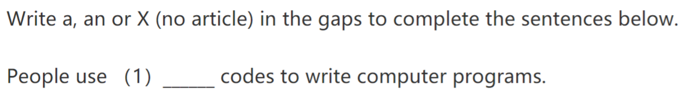

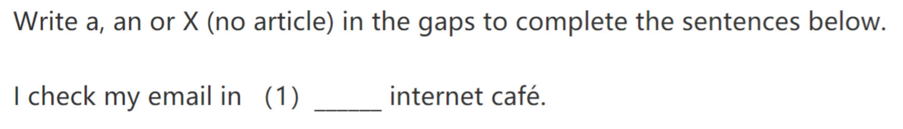

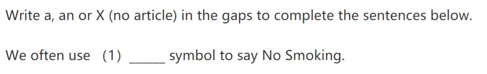

`习题C`

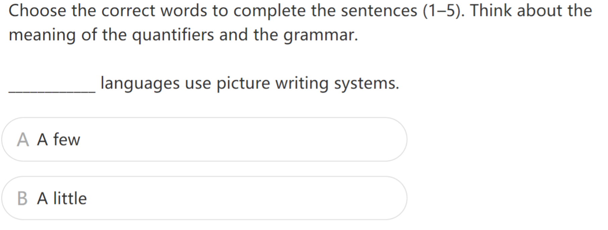

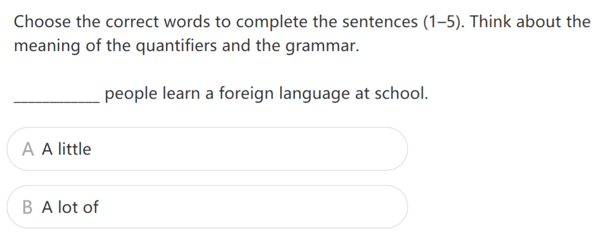

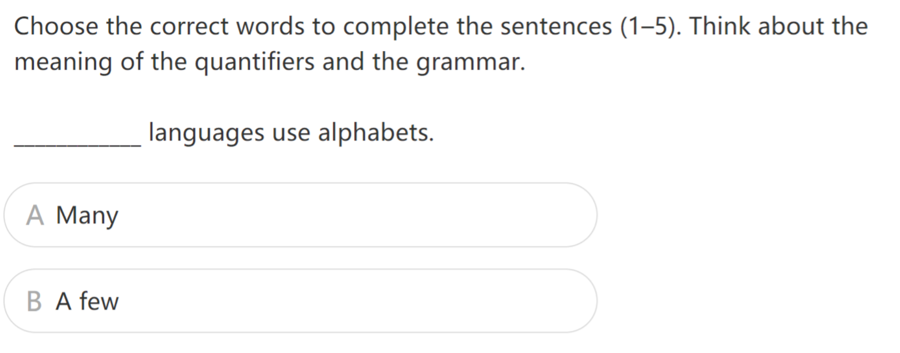

# Episode5

`习题A`

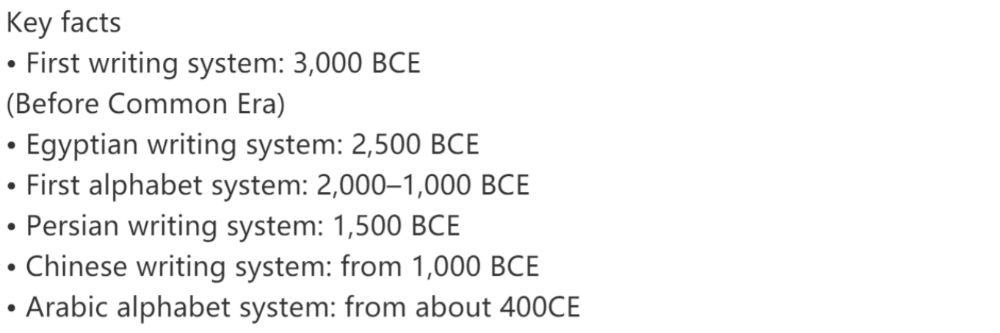

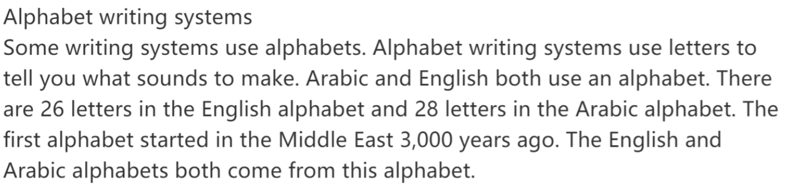

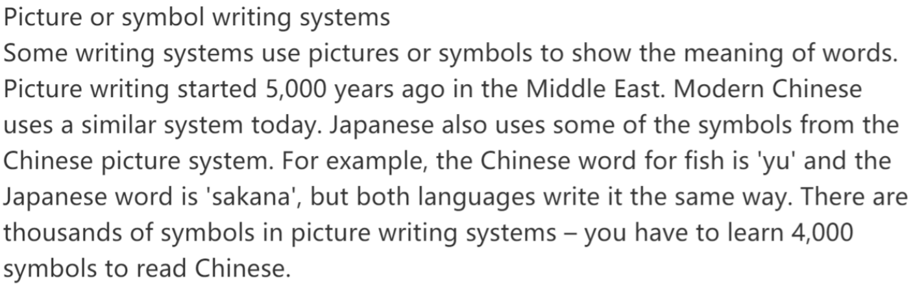

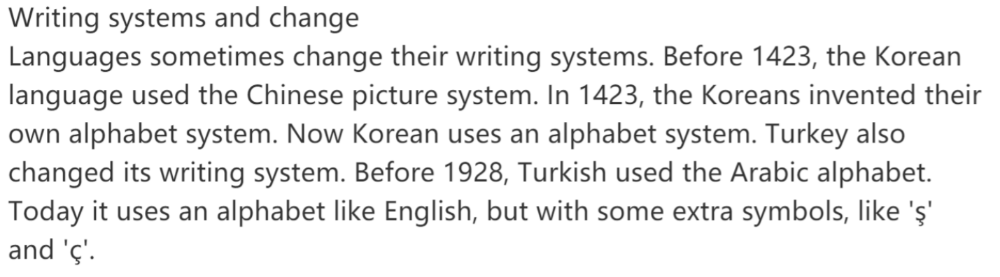

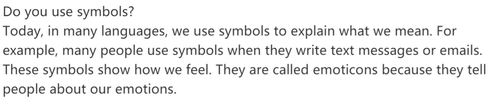

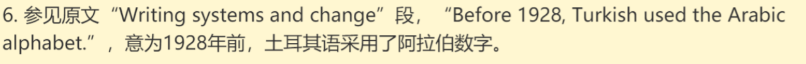

`习题B`

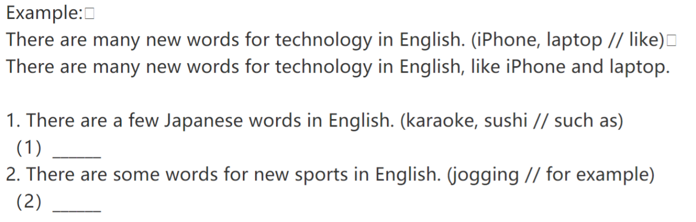

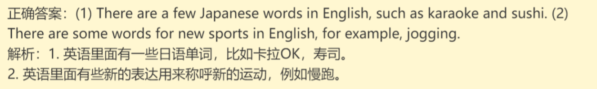

# Episode6

`习题A`

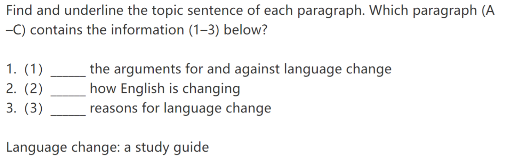

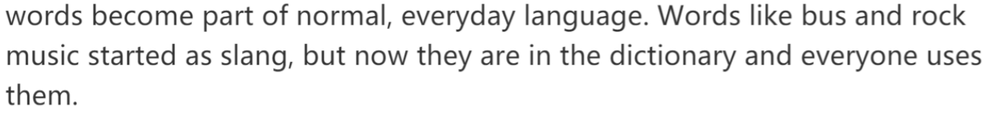

