# Episode1

`习题A`

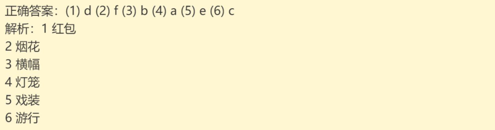

`习题B`

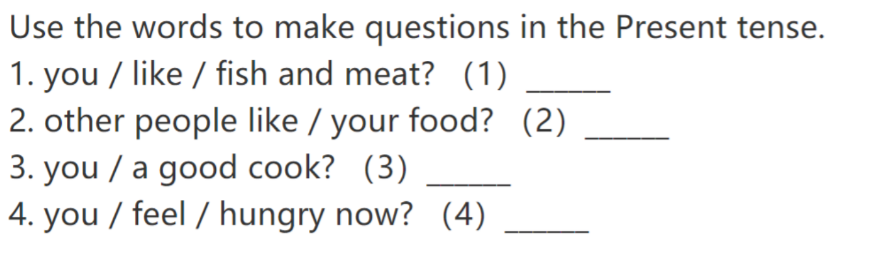

# Episode2

`习题A`

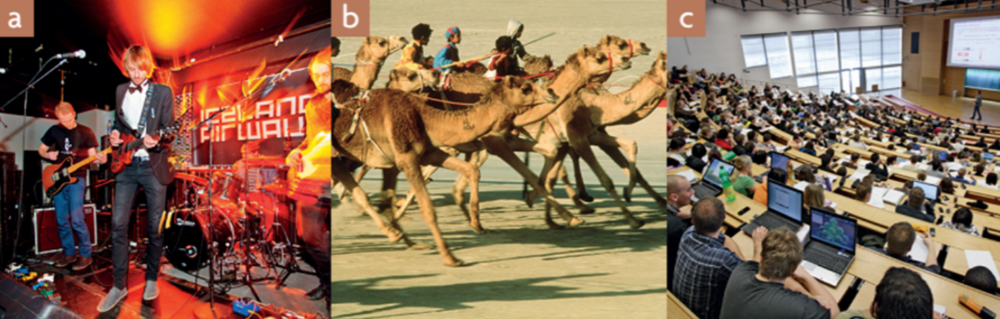

`习题B`

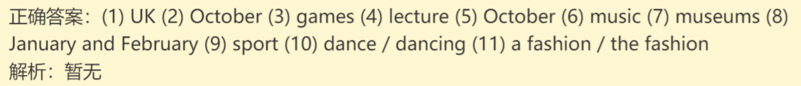

`习题C`

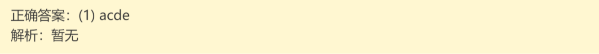

`习题D`

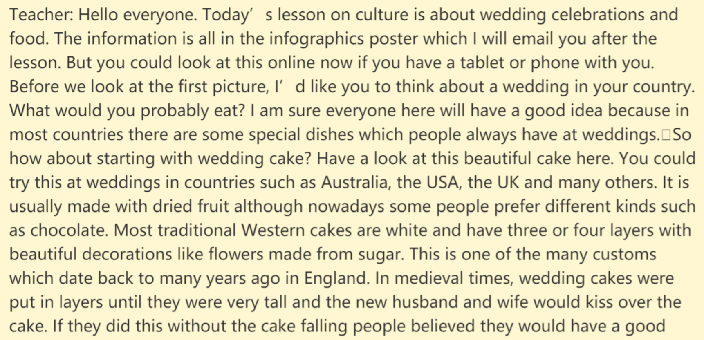

# Episode3

`习题A`

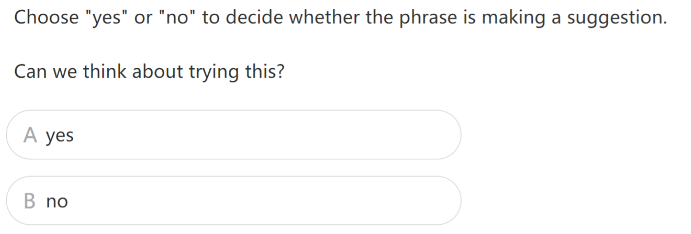

`习题B`

# Episode4

`习题A`

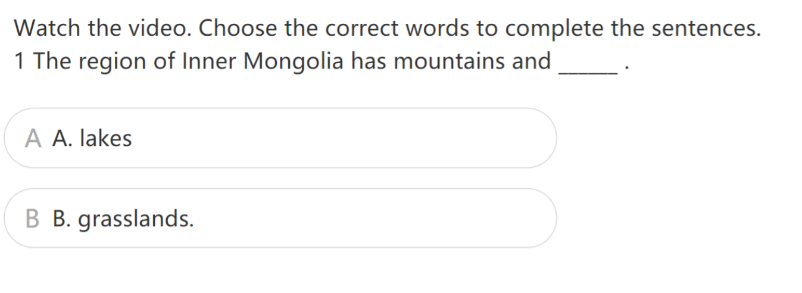

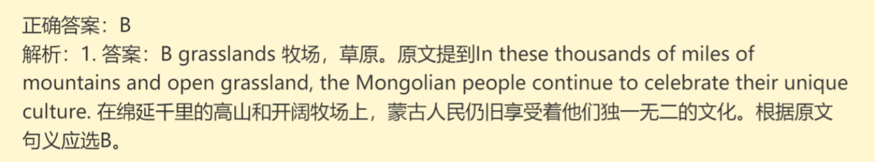

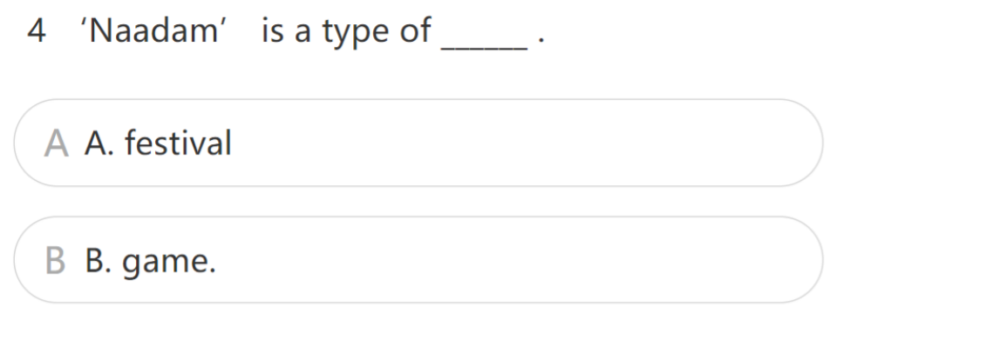

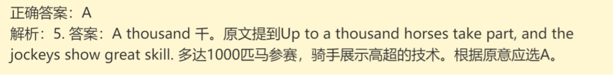

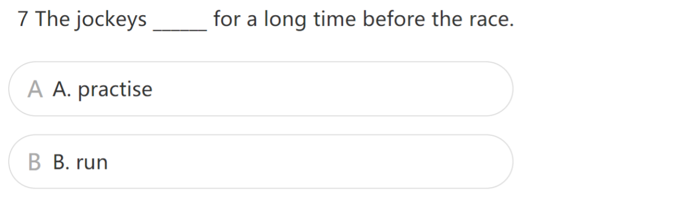

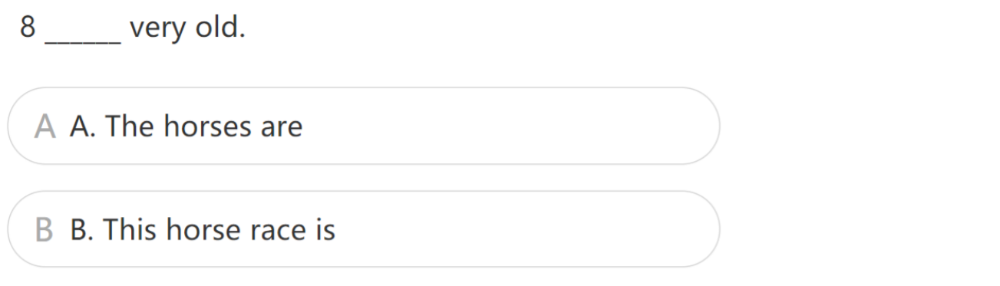

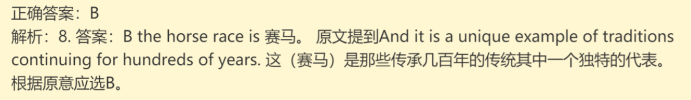

`习题B`

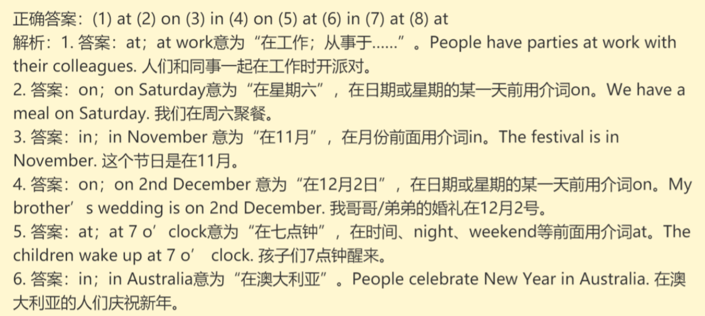

`习题C`

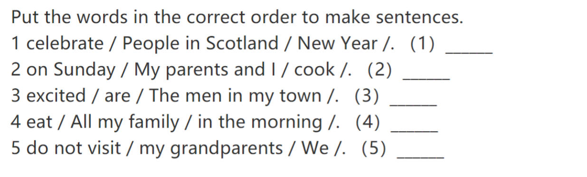

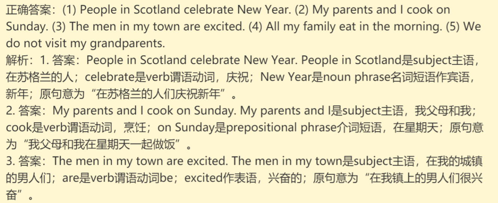

# Episode5

`习题A`

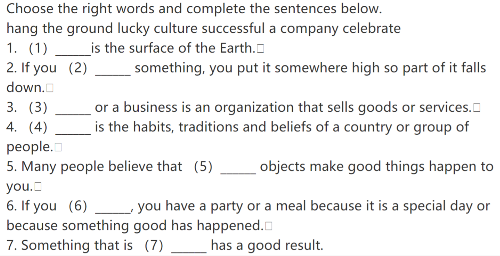

`习题B`

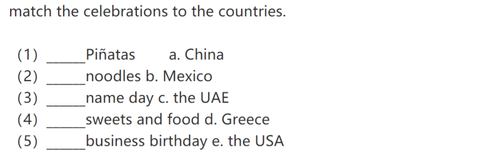

# Episode6

`习题A`

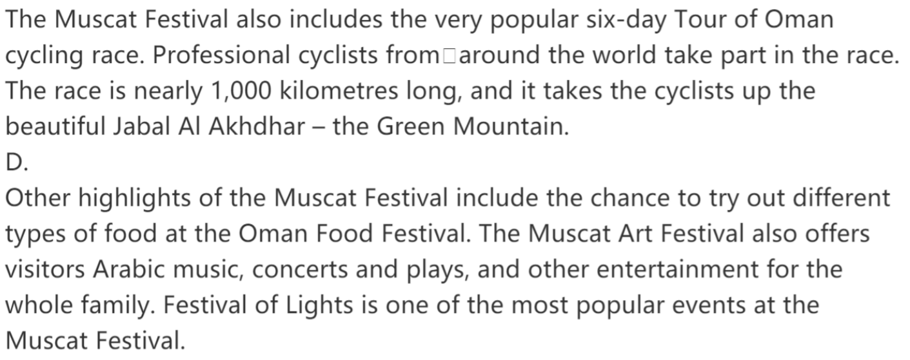

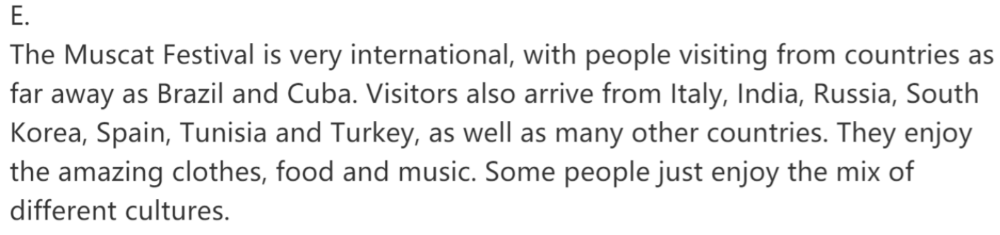

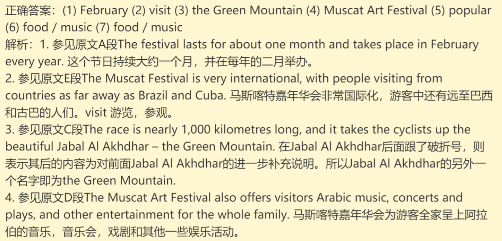

