# Episode1

`习题A`

`习题B`

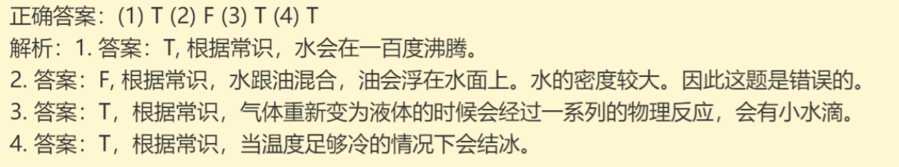

`习题C`

# Episode2

`习题A`

`习题B`

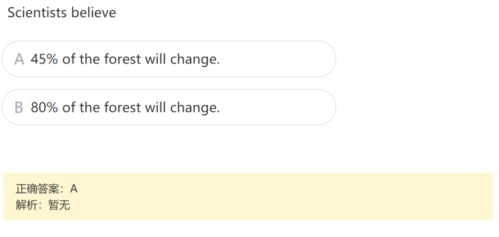

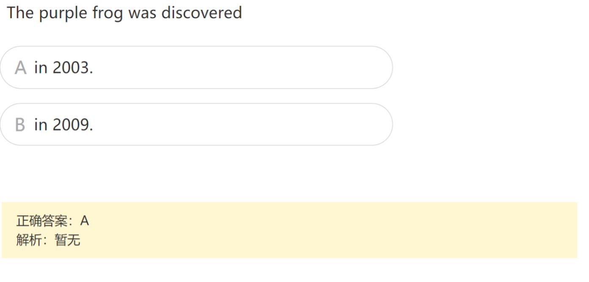

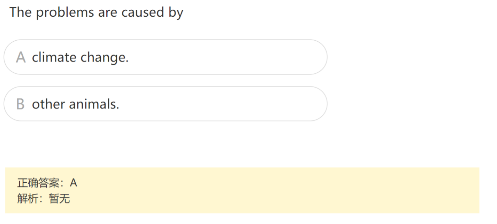

`习题C`

# Episode3

`习题A`

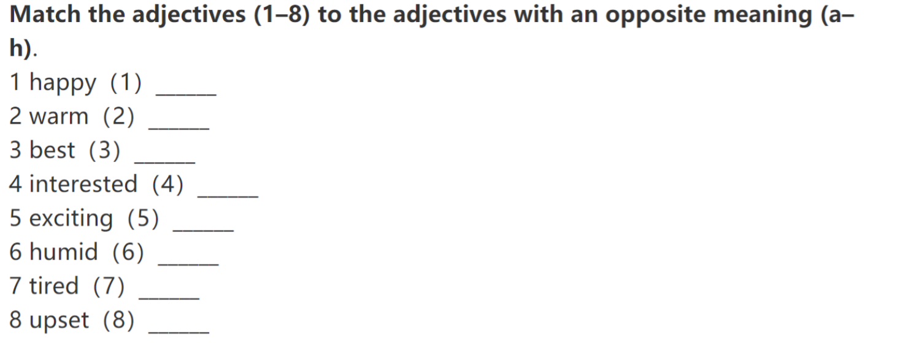

`习题B`

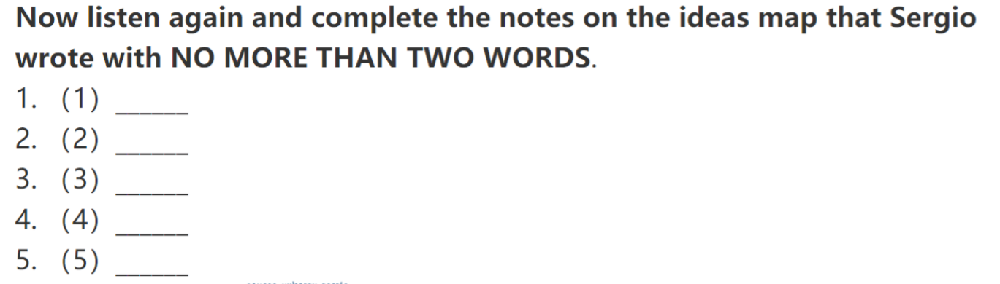

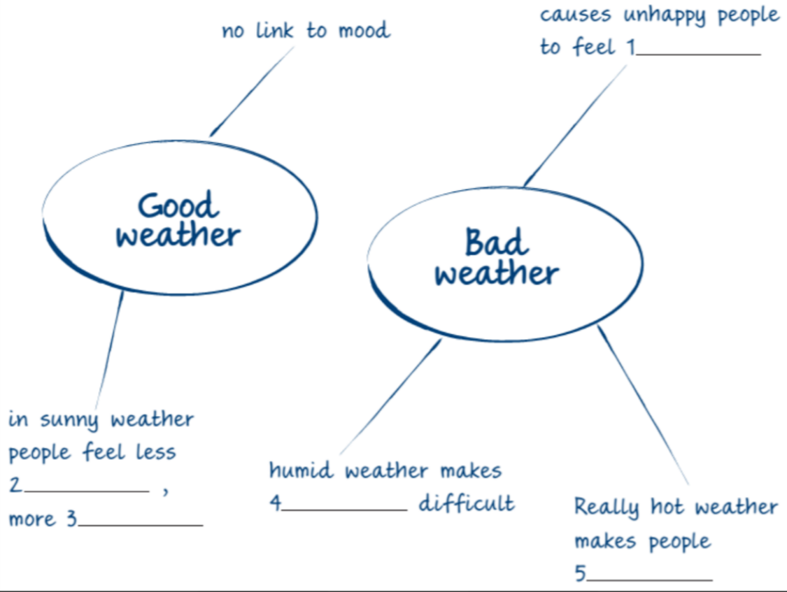

`习题C`

# Episode4

`习题A`

`习题B`

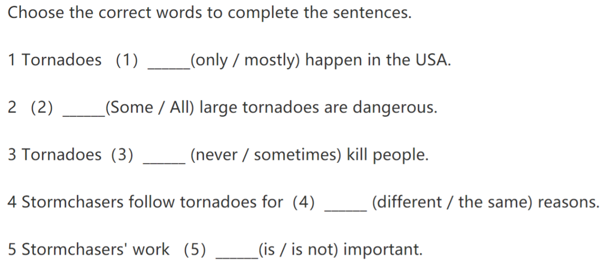

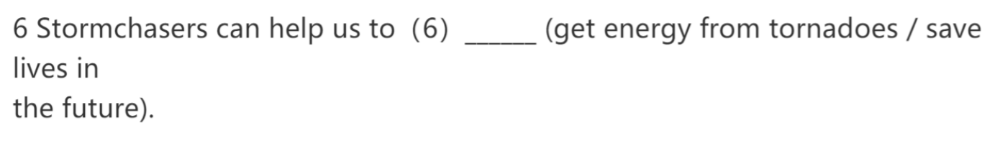

# Episode5

`习题A`

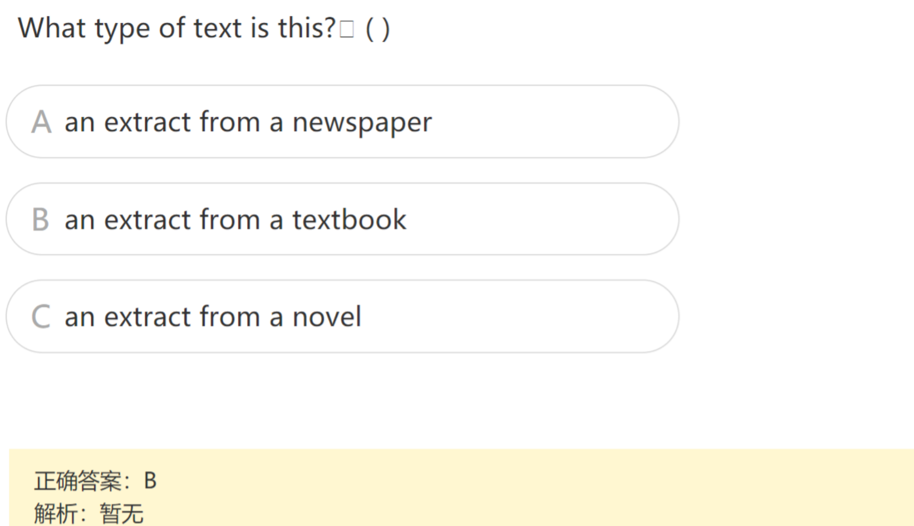

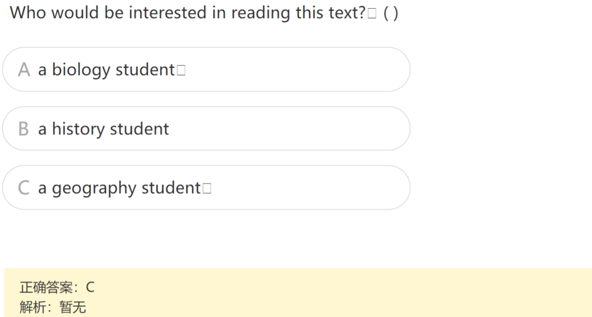

`习题B`

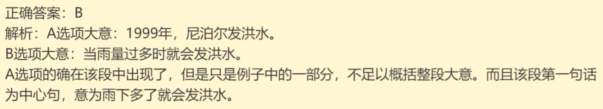

`习题C`

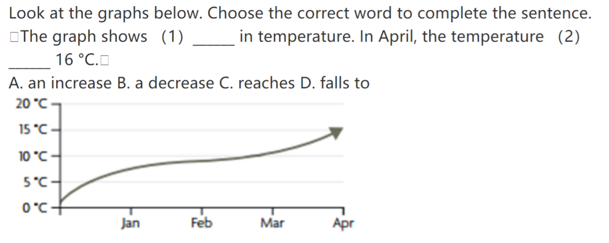

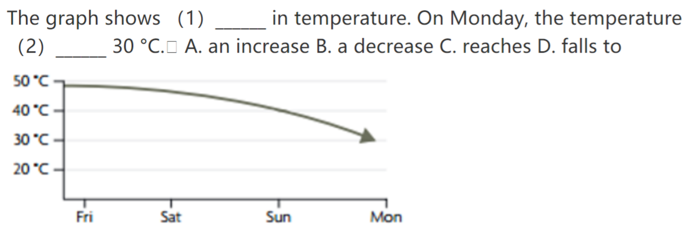

# Episode6

`习题A`

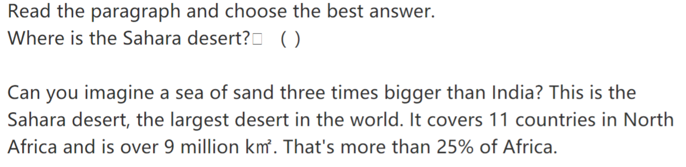

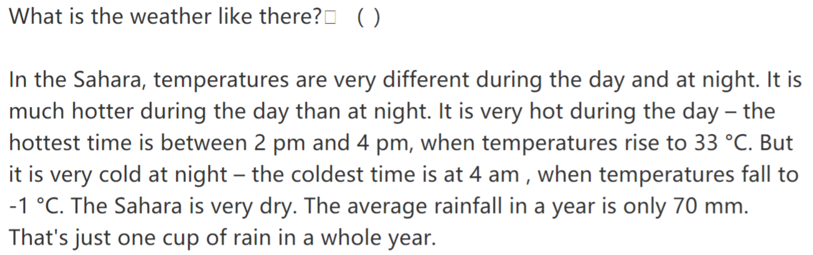

`习题B`

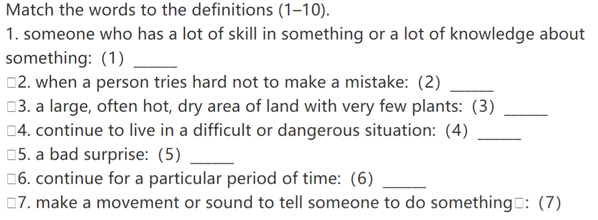

`习题C`

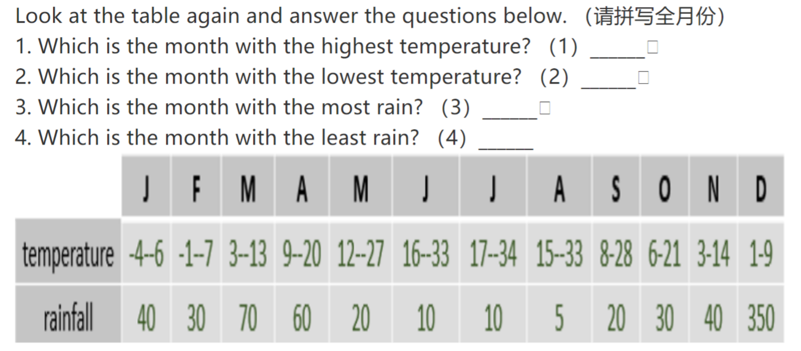

