# Episode1

`习题A`

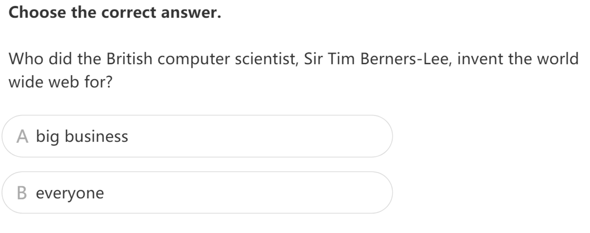

`习题B`

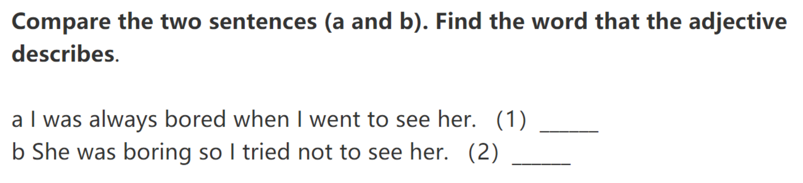

`习题C`

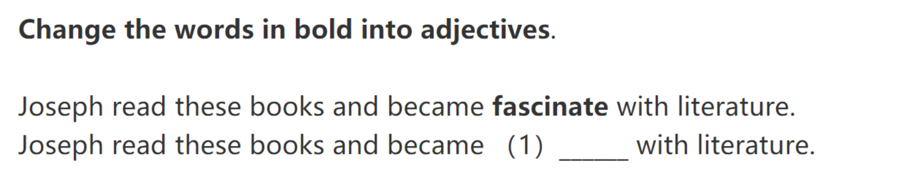

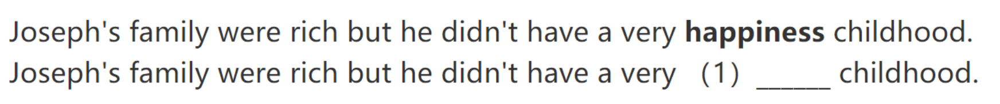

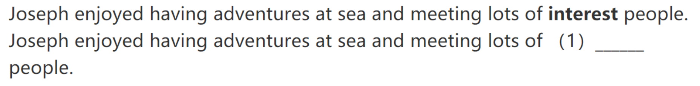

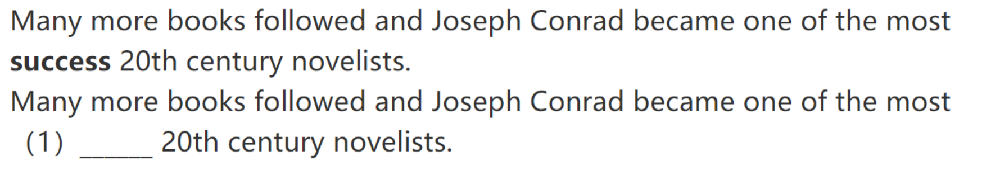

# Episode2

`习题A`

`习题B`

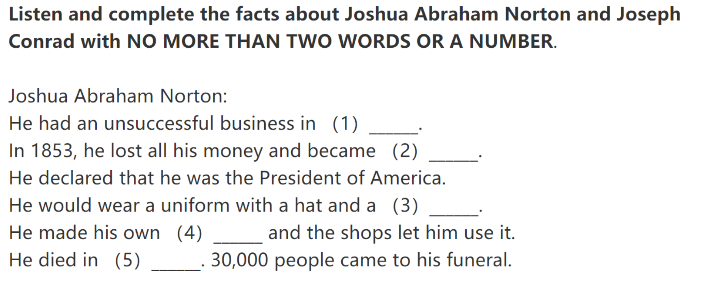

`习题C`

`习题D`

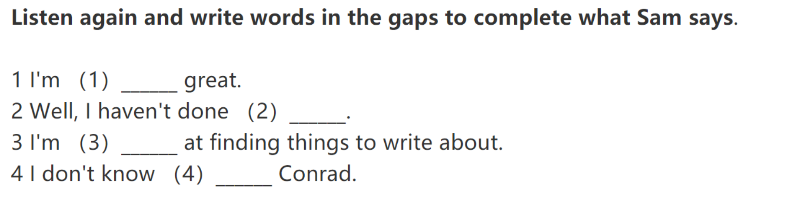

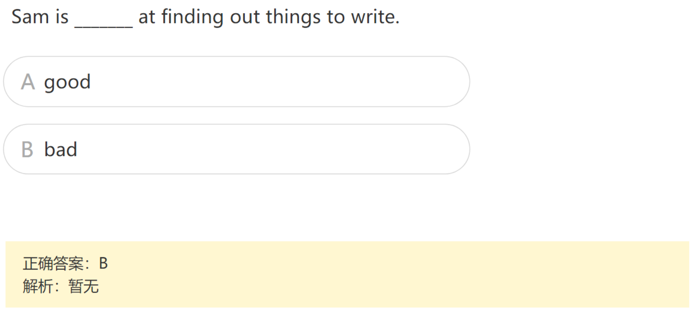

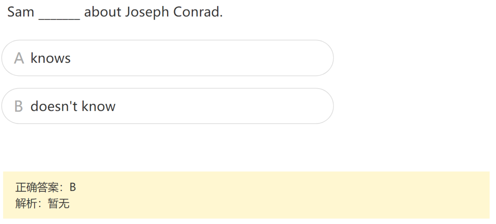

# Episode3

`习题A`

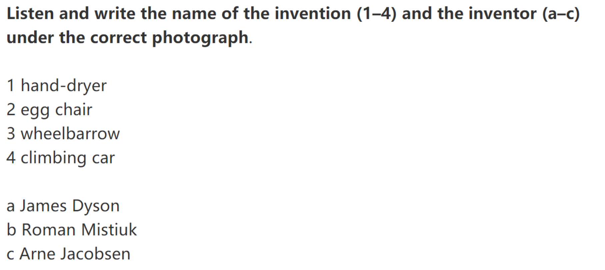

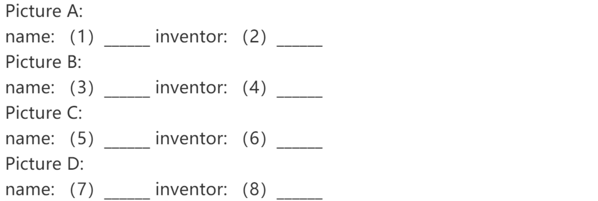

`习题B`

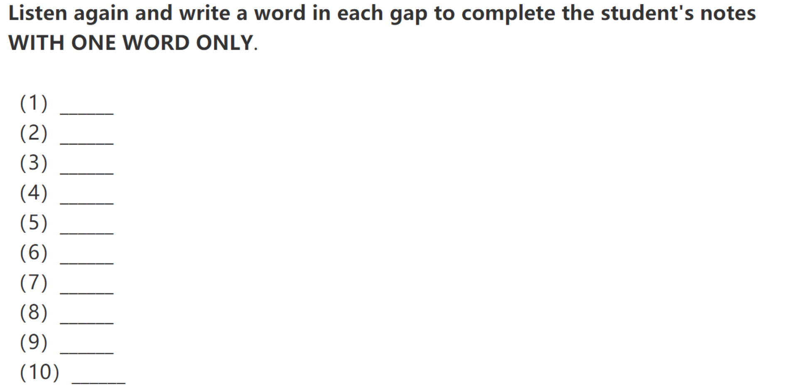

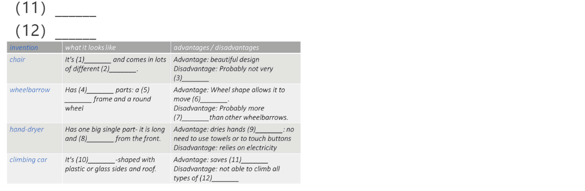

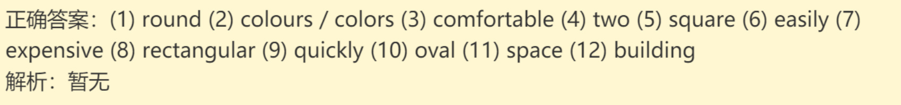

`习题C`

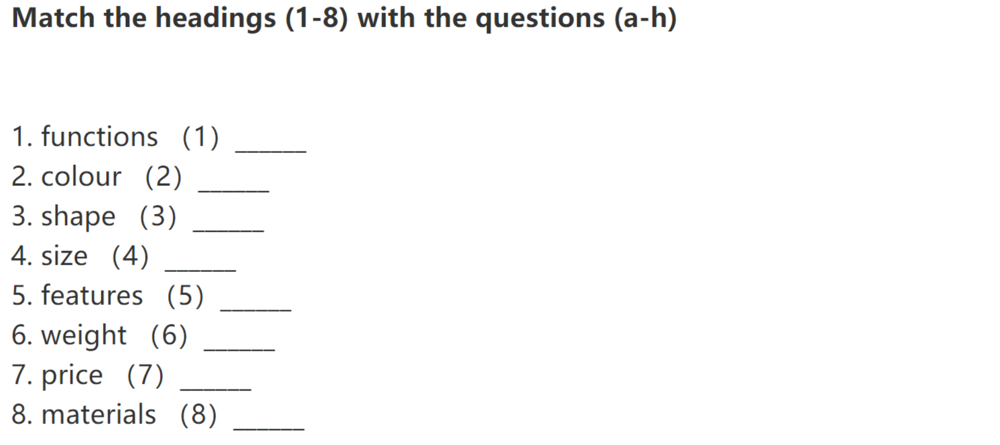

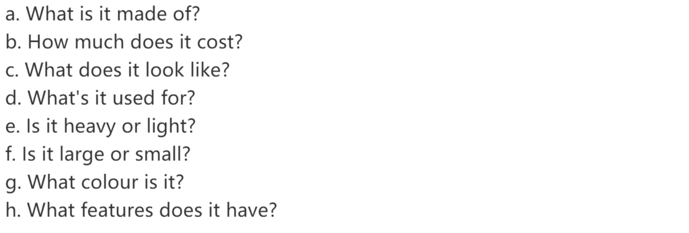

`习题D`

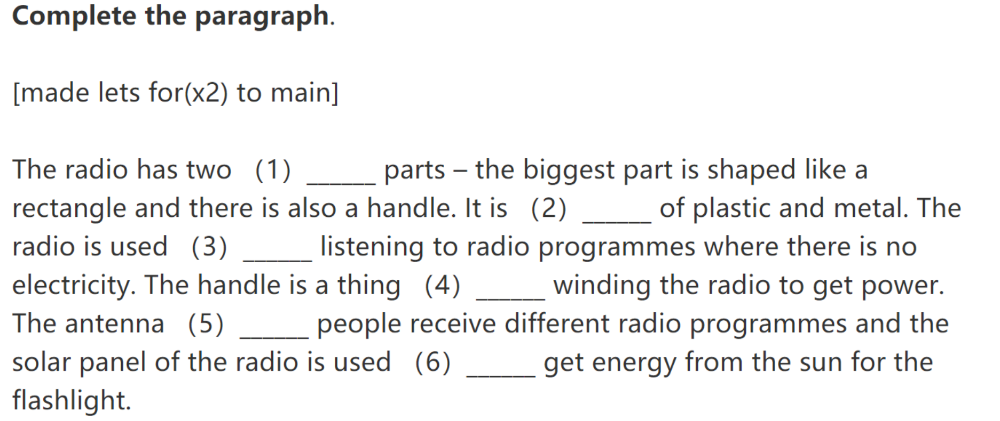

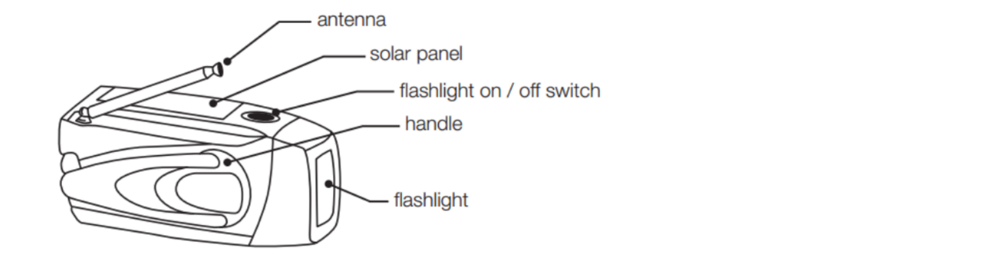

# Episode4

`习题A`

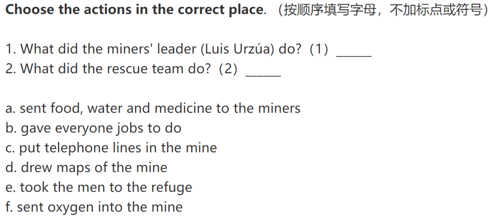

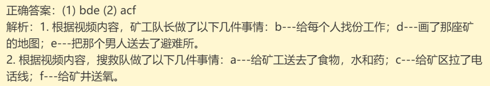

`习题B`

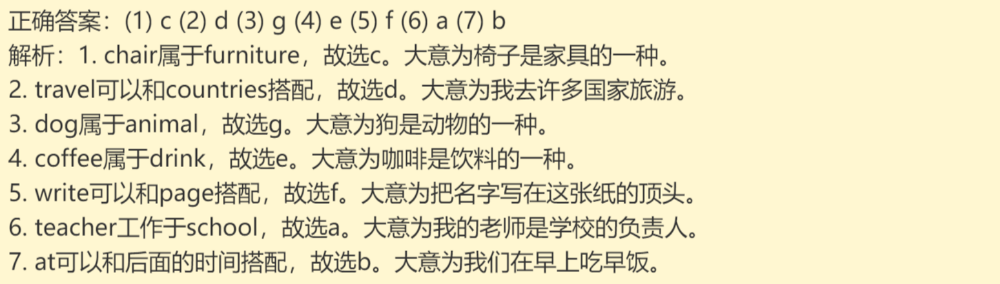

`习题C`

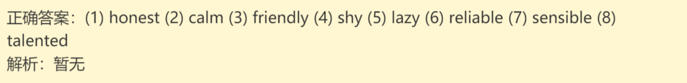

`习题D`

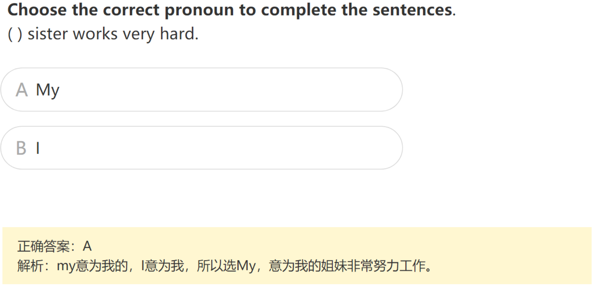

# Episode5

`习题A`

`习题B`

`习题C`

# Episode6

`习题A`

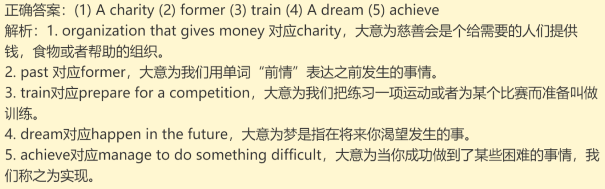