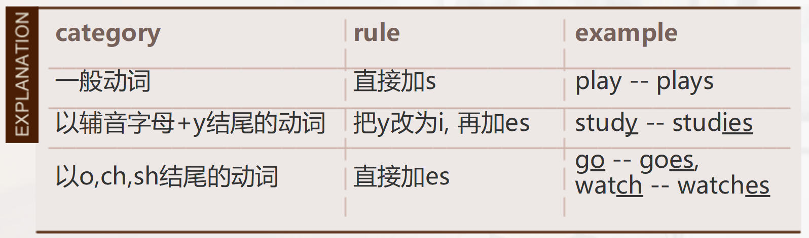

# Episode1

句子

```
1.  have  breakfast / lunch / dinner / coffee / a lesson / a lecture
2. watch films / TV
3. make breakfast / lunch / dinner / coffee 
4. play football / basketball / tennis / computer games
5. go home / to work / to university
6. get up (in the morning)
7. take a bus / a taxi / a train
```


```
play tennis every week.
He goes to work early. 
You study English.
It makes good coffee.
They study biology.
She takes the bus.  
We go home early on Tuesday. 
```

Add -s or -es to the verb after he / she / it



Use do not + verb or does not + verb in the negative. 

```
do not = don't                  does not = doesn't 
I don't watch films.            She doesn't take the bus.
We don't go home early today.   He doesn't go to work early.
```

Use do or does + subject + verb in questions.

```
Do you have dinner at home?
Where does she go every day?
特殊疑问句：特殊疑问词 + do or does + subject + verb 
★The verb have is irregular.   Use has with he / she / it.
```

句子

```
1. every + noun   (e.g. day, Saturday, Tuesday evening)
2. in the morning / the afternoon /  the evening
3. at + clock time (e.g. 7.30)
4. on + day of the week (e.g. Tuesday)
```


```
This is Elodie. She's from France. She takes the  bus to university every day. The bus comes at 7:30. Elodie arrives at 8:30. She has a biology lecture at nine on Tuesday and Thursday. She has lunch with her friends at 12:30. Elodie has an English class at three o'clock in the afternoon. She goes to the cinema with her family on Friday evening.
```

# Episode2

```
Aloha, Rookie, welcome to winter wonderland!
```

dialogues 

```
1. A: Excuse me! Can I ask you some questions?
   B: Yes, no problem. / I don't have time, I'm sorry.
```


```
2. A: I'd like to ask some questions – is that OK?
   B: Yes, sure. / I'm sorry, I'm very busy.
```


```
3. A: Good morning! I'm Sultan.
   B: Nice to meet you! / Good to see you! I'm Jack.
```


```
4. A: Do you drink a lot of coffee?
   B: Yes, I think so / No, not really.
```


```
5. A: I play football for my country.
   B: Really? / I see.
```


```
6. A: I watch a lot of films.
   B: Really? / I see.
```

QUESTIONNAIRE

Home/Family

```
Dou you live with your parents?
```

Work/Studies

```
Do you work or study?
What is your job? / What do you study?
```

Lifestyle

```
Do you have a busy life style?
How do you relax?
Do you like exercise?
Do you go to a gym?
Do you go to the cinema?
When do you go out with friends?
Where do you go with your friends? 
```

句子

```
Dear GeekyJack, nice to see you again! 
Welcome to Cambridge. It's beautiful here, isn't it? 
```

# Episode3

free time

```
• go out with friends
• watch TV
• go to the cinema
• do sport and exercise
• play computer games
• go to the gym
```

technology

```
• send texts 
  photographs
• post a video online
• chat online
• download apps
• follow a blog
• write a blog
```

food

```
• cook food for your
   family
• eat out at restaurants
• have coffee with friends
• eat at home
• have dinner with friends
• order fast food
```

Use do or does + subject + verb in questions.

```
Do you write a blog every day?
Do you often send texts?
Do you like posting a video online?
When do you usually chat online?
When do you usually chat online?
```

# Episode4

Abdullah

```
Abdullah is a serious student. 
He studies every evening. 
He has many classes, seminars and lectures every week.
Abdullah reads books every morning. 
In the evening, Abdullah studies in the library. 
In his free time, Abdullah relaxes with friends. 
Sometimes, Abdullah goes to the cinema. 
He is in the University Camera Club.
```

Abdullah Taha

```
Abdullah Taha is a student in my class. This is his timetable.
Abdullah studies Engineering at Cairo University. Abdullah takes
five courses. They are Physics, Maths, English, Engineering and
Arabic History. His favourite subjects are Physics and Maths.
Abdullah is a serious student. He gets up at 6 am every day.
He studies every evening. He has many classes, seminars and
lectures every week.

Abdullah has three classes every morning. He has Physics from
8 am to 9 am, Maths from 9.15 am to 10.15 am, and Engineering
from 10.30 am to 11.30 am.

On Sunday, he meets his study group. His study group is from
12.30 pm to 1.30 pm. On Monday and Wednesday, he has English.
His English class is from 2 pm to 3 pm. On Thursday afternoon,
he has Arabic History from 2 pm to 3 pm.

In the evening, Abdullah studies in the library. In his free time,
Abdullah relaxes with friends. Sometimes, Abdullah goes to the
cinema. Abdullah likes taking photographs. He is in the University
Camera Club.

Abdullah says, "My university life is very busy. I have a lot of
exams and projects, but I always have time to relax with friends
and family."
```

# Episode5

句子

```
1) I like reading books, not watching movies. I like to imagine 
     how the people look in the story.
```


```
2) Pizza is a traditional meal in Italy.
```


```
3) His daughters are different. Hande is tall but Adile is short.
```


```
4) I love this book! The story is amazing!
```

文章

```
Kombai men hunt in the jungle. They can hunt 
in the jungle for 12 hours. They bring meat to 
the village. The Kombai also eat cucumbers, 
mushrooms and green bananas. The women 
cook. There is no school for the children. 
Parents teach their children the traditional 
lifestyle of their people.
```


```
The most important part of Kombai life is 
building their amazing tree houses. The men, 
women and children all help to build a tree 
house. Each house is 20m high. The stories of 
the Kombai people are amazing.
```

# Episode6

Facts about the lifestyle :

```
1. Who are you?
2. What subjects do you study?
3. When are your classes?
4. When do you go to the library?
5. When do you relax with friends?
```


```
1. I am a student. I live in London. Abdullah is my friend.
2. I study English. Abdullah studys physics and maths.
3. My classes are from Monday to Friday.
     His classes are from Sunday to Thursday.
4. I go to library on Wednesday.
     Abdullah gos to library from Sunday to Wednesday.
5. I relax with my friend on Saturday.
     Abdullah relaxs with his friend on Thursday.
```

every + a noun for time

```
· I read a book every week. 
· They play football every morning.
```

a prepositional phrase for time

```
• at + clock time: at 10 am, at 3 pm
• in + part of the day: in the morning, in the afternoon, in the evening
• on + day of the week: on Monday, on Tuesday
• on + day of the week + part of the day: 
```


```
I am a student. I live in London. Abdullah is my friend. I study English. 
Abdullah studies physics and maths.

My classes are from Monday to Friday. His classes are from Sunday to 
Thursday. I go to library on Wednesday.  Abdullah goes to library from 
Sunday to Wednesday.

I relax with my friend on Saturday.  Abdullah relaxes with his friend on 
Thursday.

I get up at 8 o'clock every morning. He gets up at 6 am every day. We 
like our life in school.
```


```
We read your book about the lifestyle of Kombai people, and we are very 
interested in this traditional clan. They hunt in the jungle and build tree 
houses. 
There are several ways to improve the lifestyle of the Kombai people. From 
the book, we can see children do not go to school, so we advise that people 
should set up schools and teach children different kinds of courses.
Besides, a hospital or medical care is necessary, because people may have 
accident when they hunt in the jungles or fall down from the treehouse.
We are very interested in the lifestyle of the traditional group. Can you tell 
us more about these people? 
```

