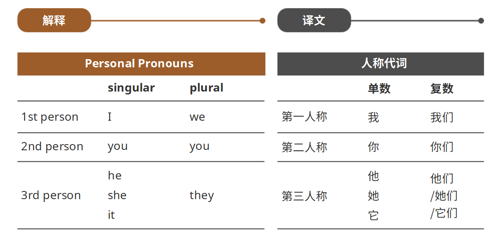
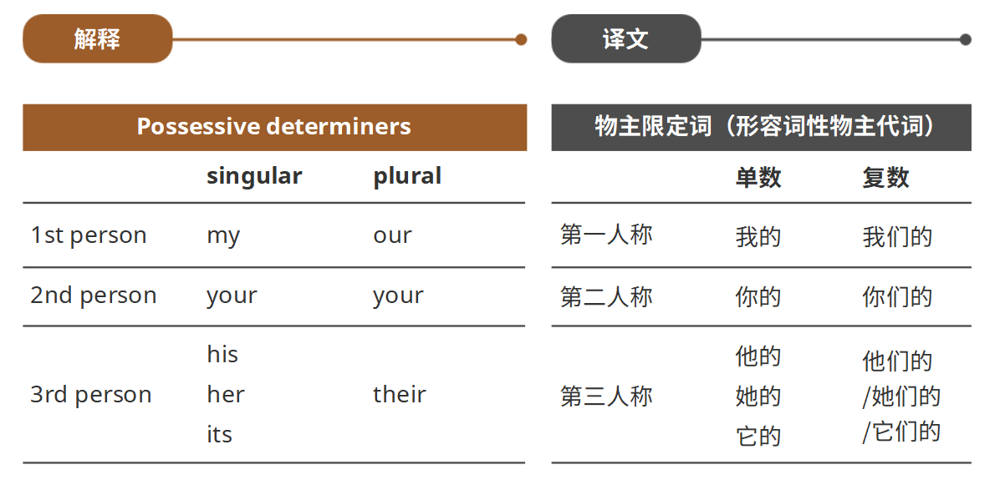
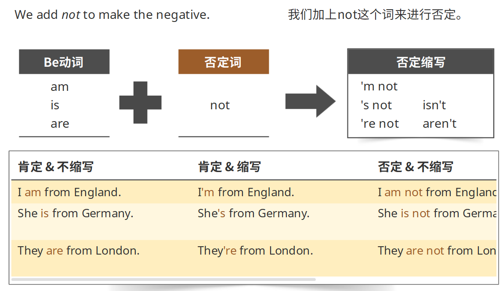
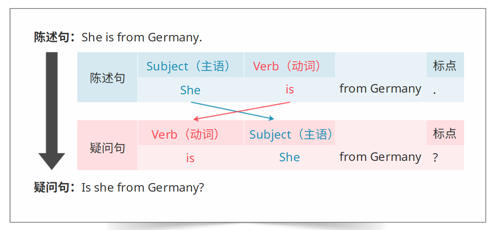
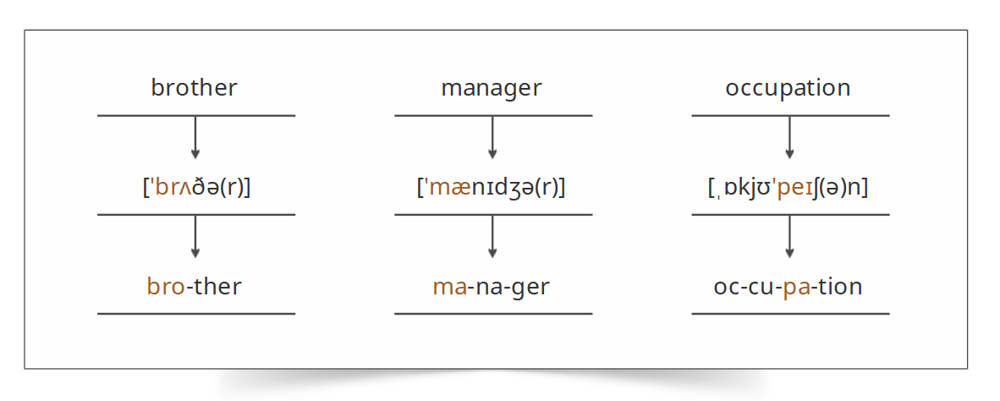
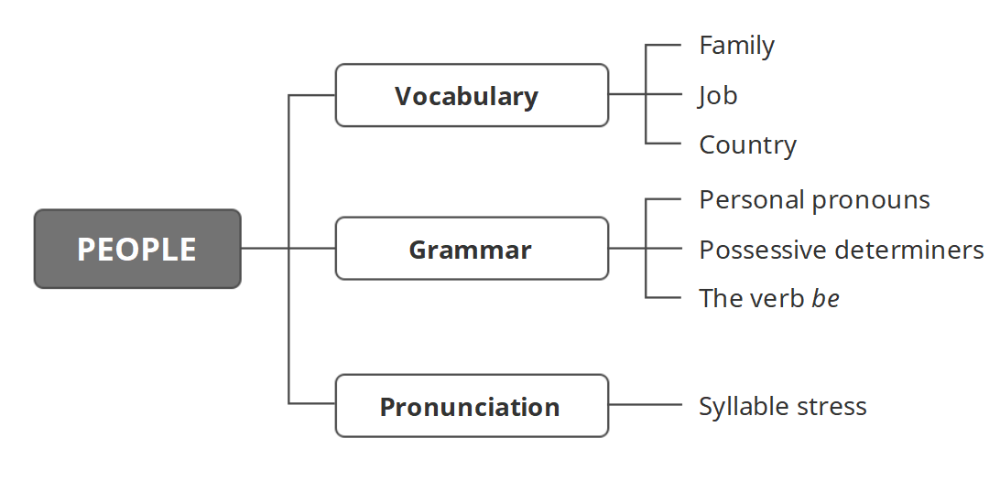

# 必备语法

**名词(Nouns)&动词(Verbs)**

名词：表示人、地点或事物名词的词汇

动词：表示动作或者状态的词汇

**单数(Singular)&复数(Plural)**

名词=单数名词+复数名词

单数=1

复数>1

我们在复数名词的最后加上s

**人称代词**

我们把人称代词放在动词之前

人称代词he，she，it和they可替换名词

**物主限定词**

我们把物主限定词放在名词之前

**be动词**

be动词在一般现在时态中有三种形态：am，is。are

be动词亦可缩写为'm，'s，和're的形式

我们加上not这个词来进行否定

在疑问句中，动词出现在主语之前

**音节重音**

音节：一个单词的一部分，其中包含一个元音和若干个辅音

当一个单词有多个音节的时候，会强调其中一个音节的发音。我们在发这个音节的时候，会比其他音节的发音更长、更响亮。

**总结**

