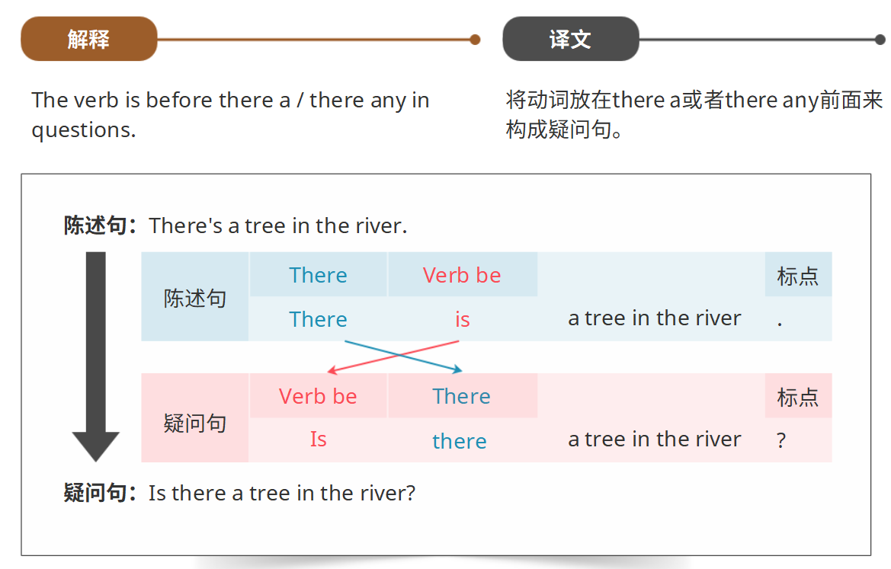
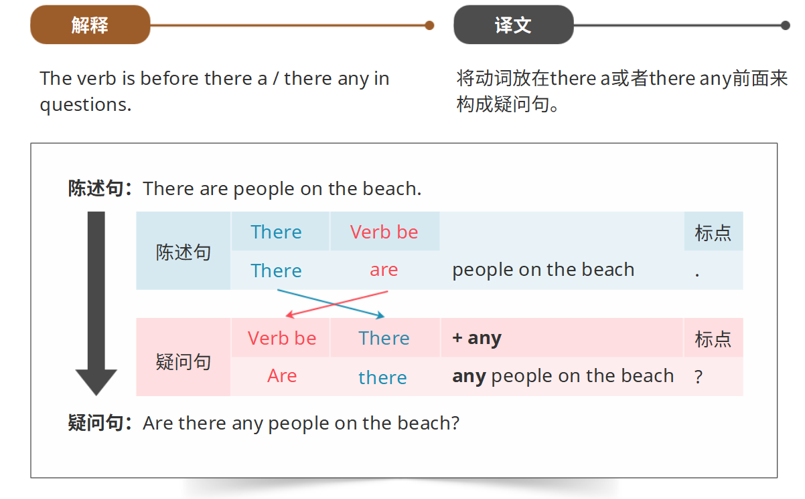
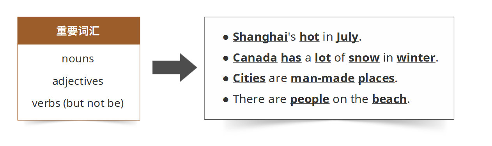
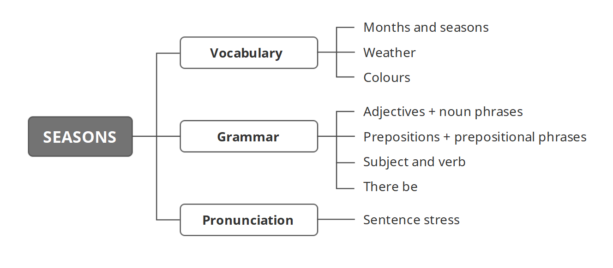

# 必备语法

**形容词**

用来形容人、地点和事物的词。

形容词跟在be动词(am/is/are)后面。或位于名词前面。通常重音在形容词上。

**名词短语**

名词短语的其中一种结构：形容词+名词

**介词**

像at、in、from和to这样的词都是介词

**介词短语**

介词短语的结构：介词+名词(或者名词短语)

**主语和动词**

一句句子是关于一个主语(一个代词、名词或名词短语)的。

在一句句子中，动词(谓语)位于主语之后。

**there be**

用there is ... (There's...)或There are ... (There're...)结构来谈论看得见的事物。

加上no或者not any来构成否定句

将动词放在there a或者there any前面来构成疑问句

**句子重音**

我们重读句子中的重要词汇

**总结**

