**Time**

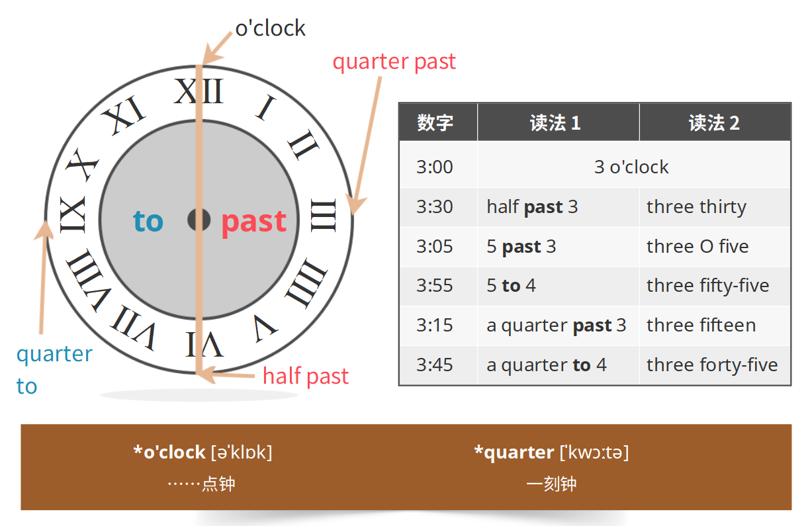

**svo**

谓语(动词)后面的介词短语不是宾语

在be动词后面的代词、名词或名词短语不是宾语

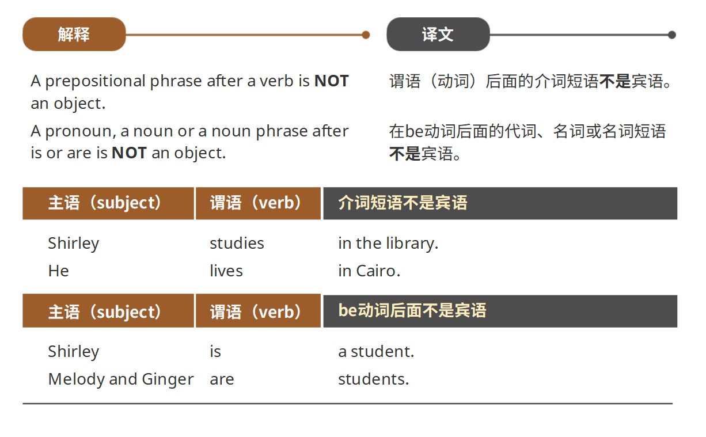

**Time expressions**

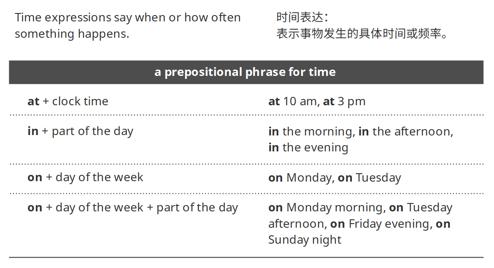

时间表达：表示事物发生的具体时间或频率

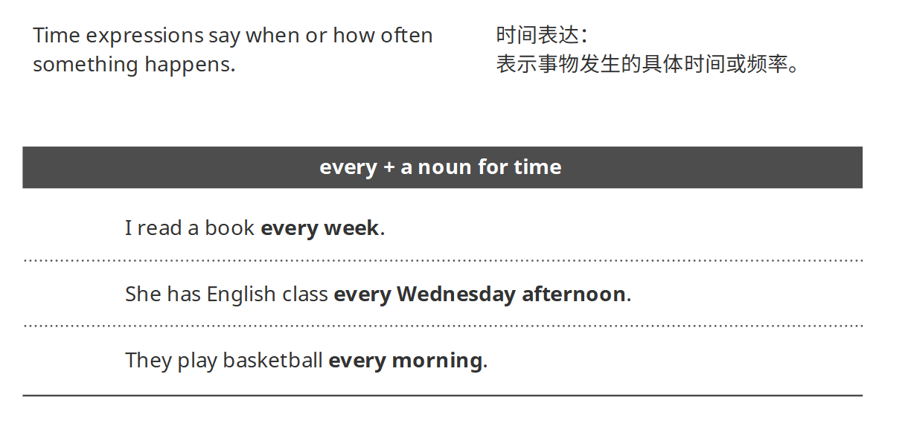

**Present simple**

我们用一般现在时态用来谈论我们一贯的生活方式或规律性活动

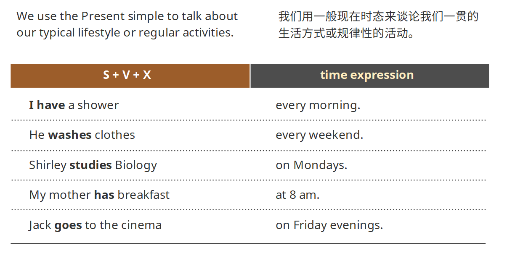

如果句子的主语是第三人称单数形式，比如：he，she，it，jack，Shirley，my，mother等，我们一般在动词后面加-s。

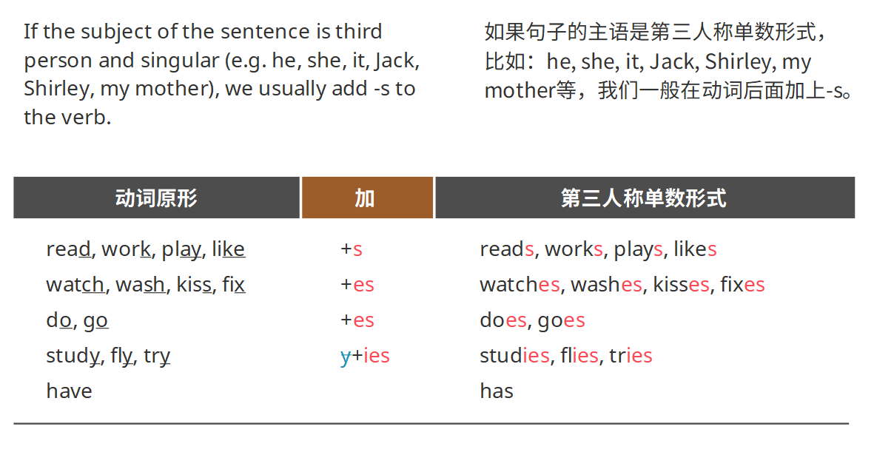

`do/does`

do：第一人称，第二人称及复数形式

does：第三人称单数

用do not+verb或者does not+verb来构成否定形式。

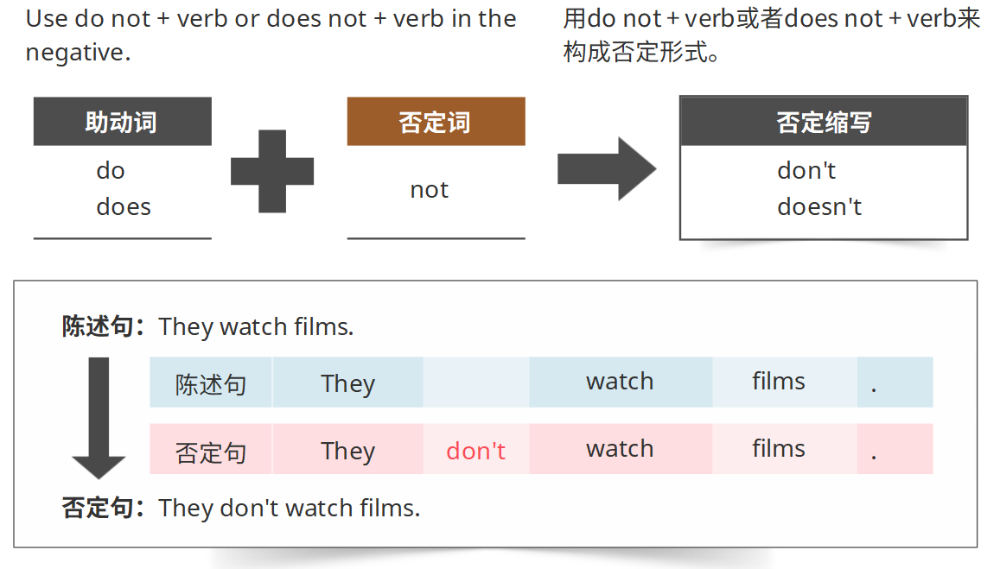

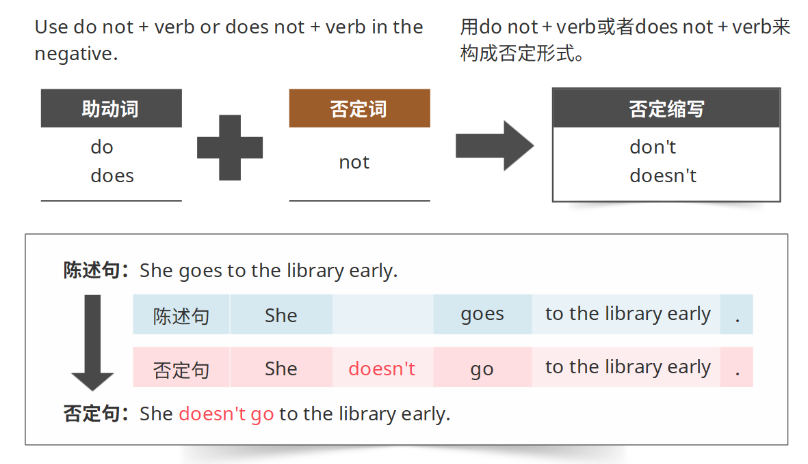

用do(does) + subject + verb结构来构成疑问形式。

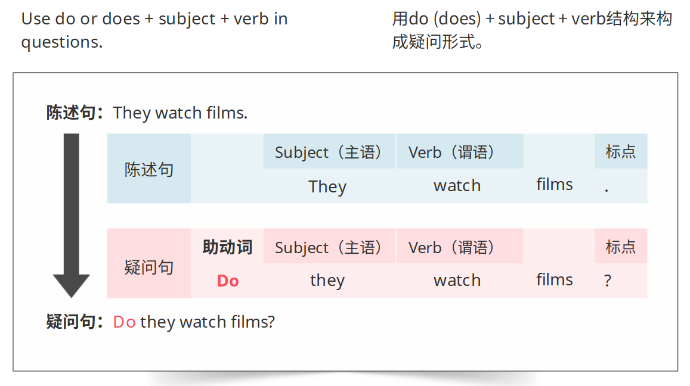

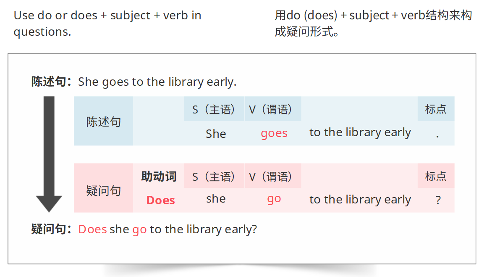

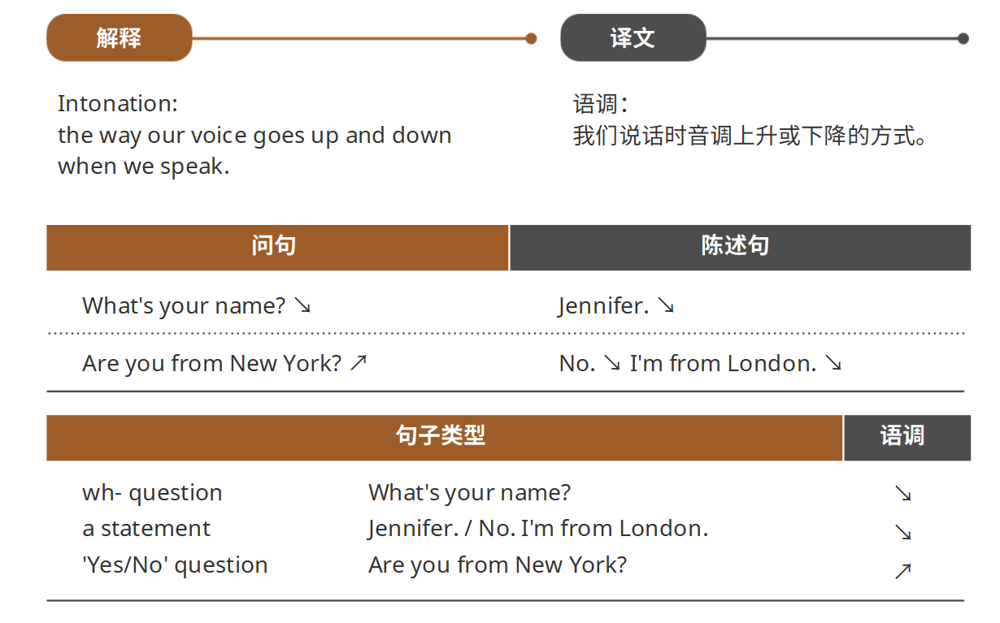

**总结**

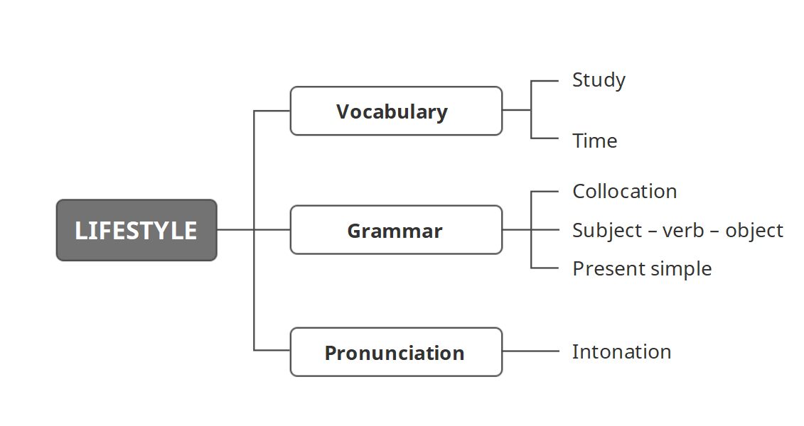