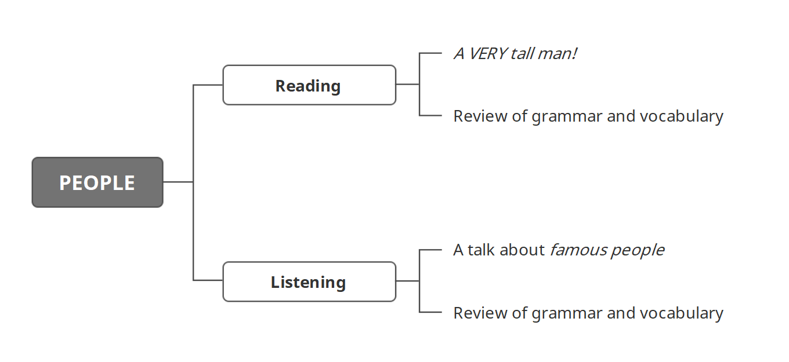

> 学习目标

> Read and understand A VERY tall man!
>
> 精读并理解短文：A VERY tall man!

> Listen to and understand a talk about famous people
>
> 精听并理解一段关于名人的对话

### Reading: A VERY tall man!

Sultan Kösen is from Turkey. He lives in Mardin in Turkey. He lives with his family. Sultan lives with his mother, his three brothers and his sister. 

> 译文

一个非常高的人！ 

Sultan Kösen来自土耳其。他住在土耳其的马尔丁市。他和他的家人住在一起。Sultan和他的母亲、三个兄弟和一个姐姐（妹妹）住在一起。 

Sultan is a typical farmer. His hobby is watching TV. He is interested in music. His height is unusual. He is 251 cm tall – that is very tall. Sultan is the tallest man in the world. His mother, brothers and sister are normal height. 

> 译文

Sultan是一名典型的农夫。他的爱好是看电视。他对音乐感兴趣。他的身高不一般。他身高251cm，非常高。Sultan是世界上最高的人。他的母亲和兄弟姐妹都是正常身高。 

#### 复习

> Nouns（名词）: Words for people, places or things are nouns. 
>
> Nouns are singular（单数） or plural（复数）. 

> Personal pronouns（人称代词）: *I, you, he, she, it, we, they* 
>
> The pronouns he, she, it, and they can also replace nouns. 

> Verbs（动词）: Words for states or actions are verbs. 
>
> The verb be（be动词）: am, is, are（一般现在时） 
>
> • I + am 
>
> • we/you/they + are 
>
> • he/she/it + is 

> Possessive determiners（物主限定词）: 
>
> my, your, his, her, its, our, their

### Listening: A talk about famous people

Listen to Marie's talk about famous people from her country. 

Try to answer two questions: 

1 Where's Marie from? 

2 Which two people does she talk about? 

> Hi! Good morning, everybody!
>
> Morning. / Hi. / Hello.

> I'm going to tell you about two famous people from the United States. One person is a famous man and one person is a famous woman. So … picture one. Who's this? In the photograph? Do you know?
>
> Um, is he an actor?

> Uh, no, no, he isn't an actor. Anybody? No? OK, well, this is Larry Page. And he has a famous company: Google. I'm sure you know it! Larry's father's name is Carl and his mother's name is Gloria. They're computer scientists. 
>
> And, OK, now this photograph. This is Ursula Burns. She's a famous businesswoman. She's from New York but her family's Latin American. They're from Panama. She's famous for her work with Xerox. She's the first … 

#### 复习

> The verb be（be动词）: Three present forms 
>
> • 'm = am 
>
> • 's = is 
>
> • 're = are 

> The verb be（be动词）: Add not to make the negative 
>
> • 'm not = am not 
>
> • 's not / isn't = is not
>
> • 're not / aren't = are not 

### 小结

