学习目标

> Understand key vocabulary about months, seasons, weather
>
> and colours 
>
> 理解关于月份、季节、天气与颜色的词汇 

> Understand adjectives, prepositions, subject and verb,
>
> there be
>
> 理解形容词、介词、主谓结构与there be结构

> Pronounce sentence stress correctly 
>
> 正确发出句子重音

### Key vocabulary: months, seasons, weather and colours 

> winter [ˈwɪntə]    冬季 
>
> December[dɪˈsɛmbə]十二月
>
> January[ˈdʒænjʊərɪ]一月
>
> February [ˈfɛbrʊərɪ]二月

> spring [sprɪŋ]    春季 
>
> March[mɑːtʃ]三月
>
> April[ˈeɪprəl]四月
>
> May[meɪ]五月

> summer [ˈsʌmə]    夏季 
>
> June[dʒuːn]六月
>
> July[dʒuˈlaɪ]七月
>
> August[ˈɔːɡəst]八月

> autumn [ˈɔːtəm]    秋季
>
> September [sɛpˈtɛmbə] 九月
>
> October [ɒkˈtəʊbə] 十月
>
> November [nəʊˈvɛmbə]十一月

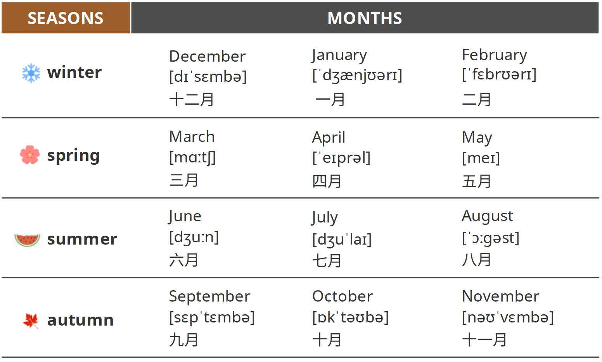

> cold [kəʊld]adj. 寒冷的
>
> warm [wɔːm]adj. 温暖的
>
> hot [hɒt]adj. 热的

> sun [sʌn]    太阳 sunny [ˈsʌnɪ]    晴朗的
>
> cloud [klaʊd]    云 cloudy ['klaʊdi]   多云的
>
> wind [wɪnd]    风 windy ['wɪndi]    风大的
>
> rain [reɪn]    雨 rainy [ˈreɪnɪ]    阴雨的
>
> snow [snəʊ]    雪 snowy [ˈsnəʊɪ]    下雪的
>
> storm [stɔːm]    暴风雨 stormy [ˈstɔːmɪ]    有暴风雨的

> white [waɪt]白色（的）
>
> black [blæk]黑色（的）
>
> red [rɛd]红色（的）
>
> blue [bluː]蓝色（的）
>
> yellow [ˈjɛləʊ]黄色（的）
>
> green [ɡriːn]绿色（的）
>
> orange [ˈɒrɪndʒ]
>
> 橙色（的）
>
> purple [ˈpɜːpəl]
>
> 紫色（的）

### Key grammar: adjectives, prepositions, subject and verb, there be

#### Adjectives

> words that describe people, places and
>
> things are adjectives.
>
> 形容词：
>
> 用来形容人、地点和事物的词。
>
> The man is tall.  The climate is good.  Life is difficult.

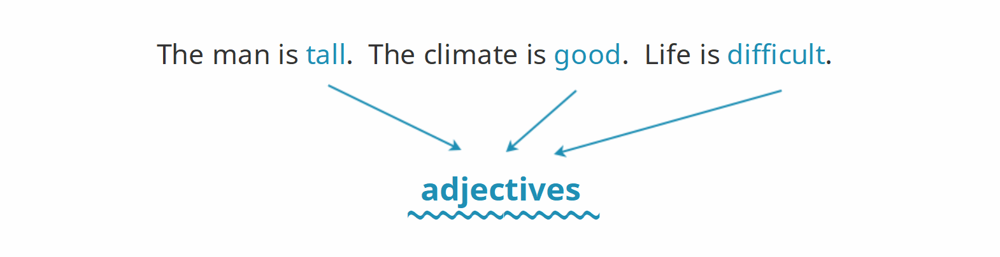

> Adjectives go after the verb be (am/is/are) or before a noun.
>
> We often stress adjectives.
>
> 形容词跟在be动词（am/is/are）后面，
>
> 或位于名词前面。
>
> 通常重音在形容词上。

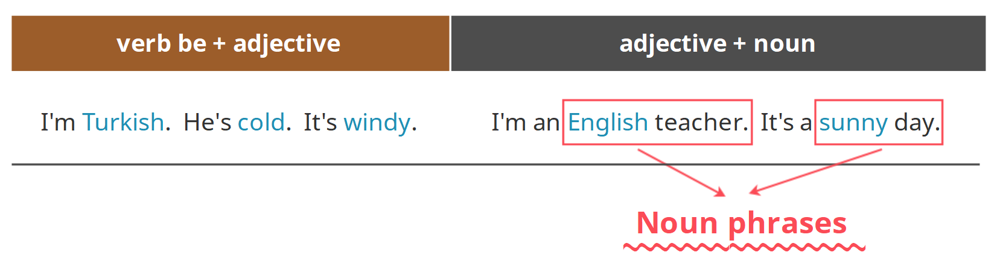

> One type of noun phrase is an adjective + a noun.
>
> 名词短语的其中一种结构：形容词+名词。
>
> He is a tall man.
>
> Spain has a good climate.
>
> Egypt has dry weather.
>
> The average rainfall is 62 mm.
>
> The young lady is from Italy.

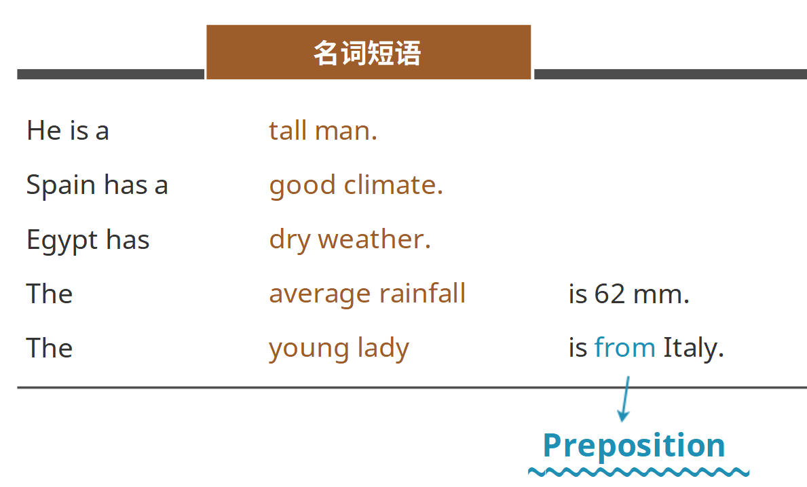

#### Prepositions

> The words at, in, from and to are examples of prepositions.
>
> 像at、in、from和to这样的词都是介词。

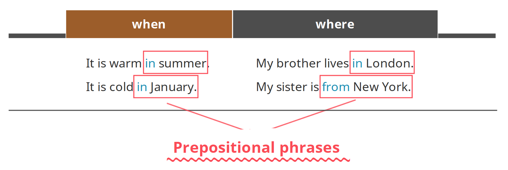

> A prepositional phrase is a preposition + a noun (noun phrase).
>
> 介词短语的结构为：介词+名词（或者名词短语）。

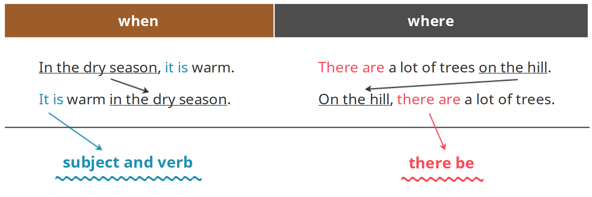

#### Subject and verb 

> A sentence is about a subject (a pronoun, a noun or a noun phrase).
>
> 一句句子是关于一个主语（一个代词、名词或名词短语）的。
>

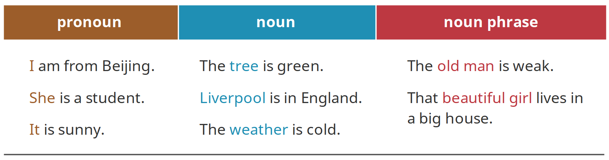

> The verb is after the subject in a sentence.
>
> 在一句句子中，动词（谓语）位于主语之后。
>
> That beautiful girl lives in a big house.

#### There be

> Use There is ... (There's ...) / There are ... (There're ...) to talk about things you can see.
>
> 用There is ...（There's ...）或There are ...（There're ...）结构来谈论看得见的事物。
>
> There's a tree in the river.
>
> There are people on the beach.

> Add no or not any in the negative.
>
> 加上no或者not any来构成否定句。
>

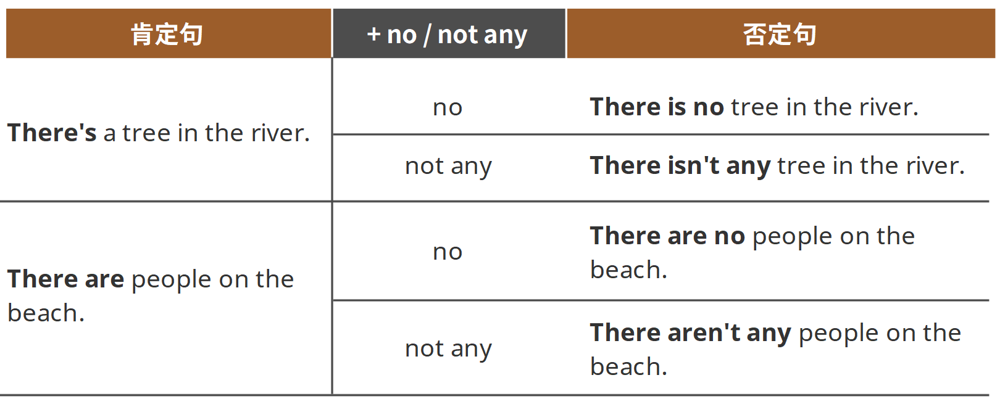

> The verb is before there a / there any in questions.
>
> 将动词放在there a或者there any前面来构成疑问句。
>

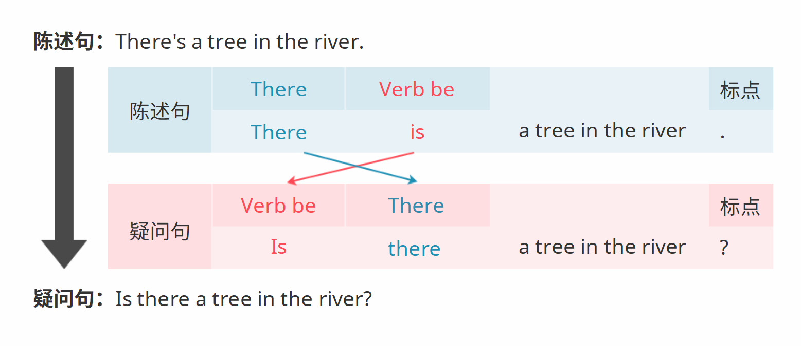

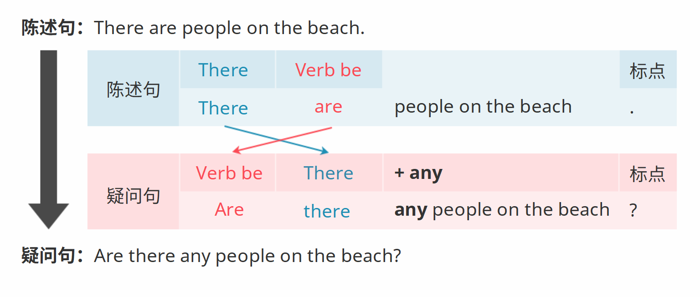

#### Correct Pronunciation: sentence stress

> Sentence stress: we stress important words in a sentence.
>
> 句子重音：我们重读句子中的重要词汇。 
>

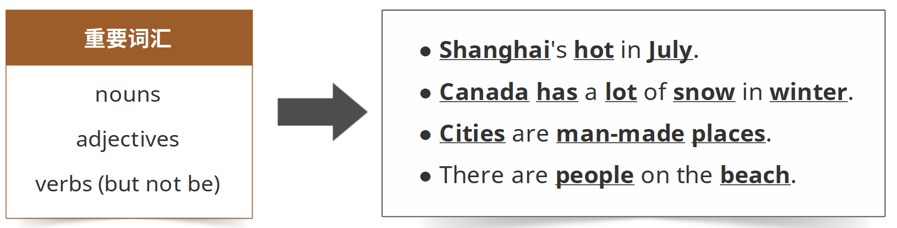

`习题A`

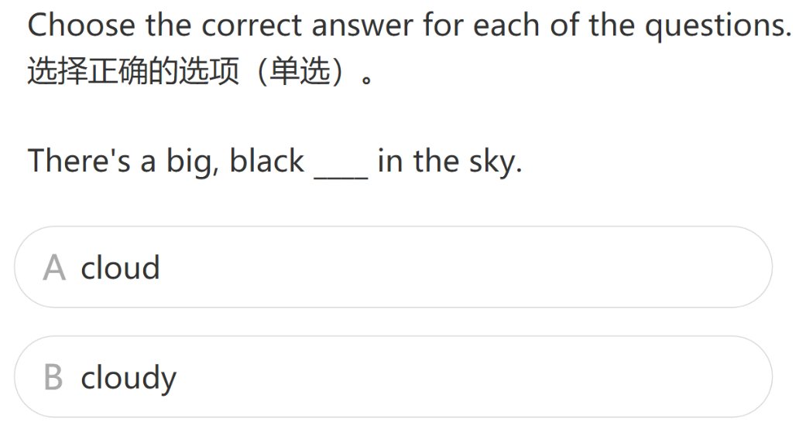

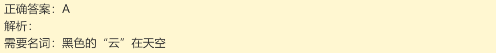

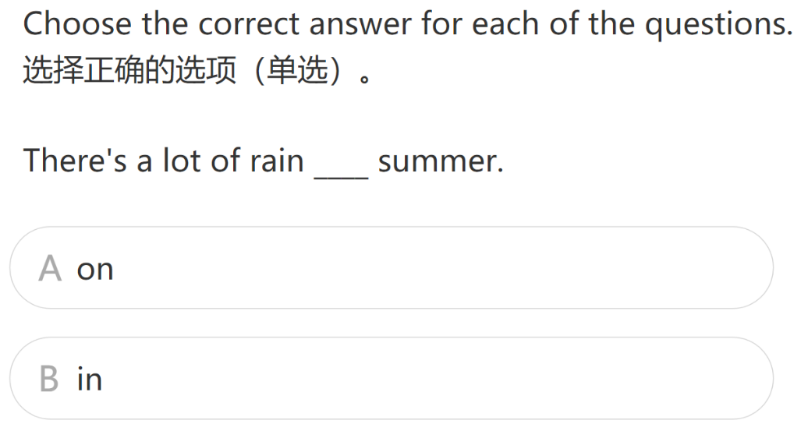

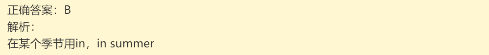

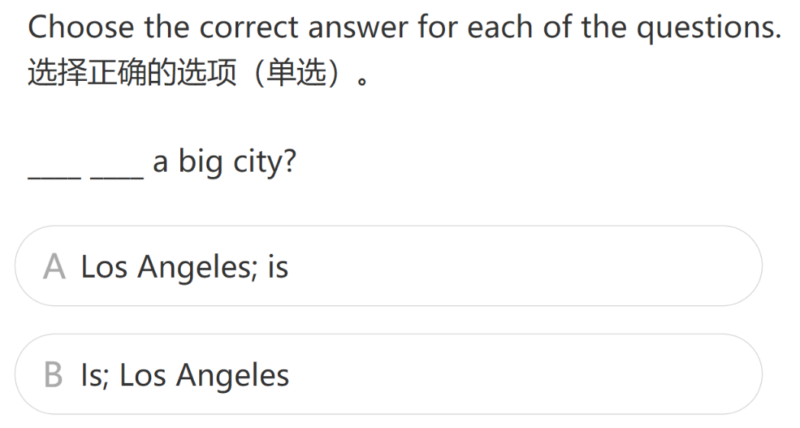

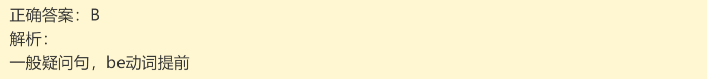

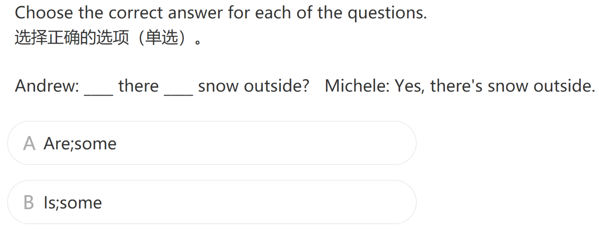

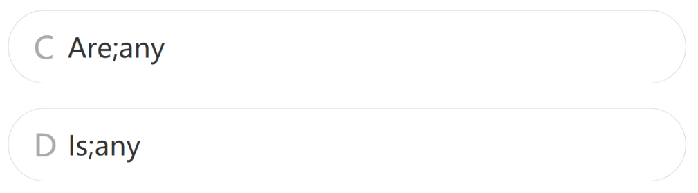

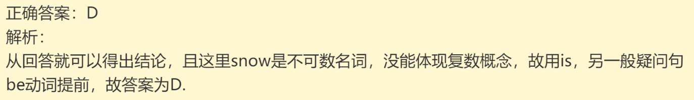

### 小结

