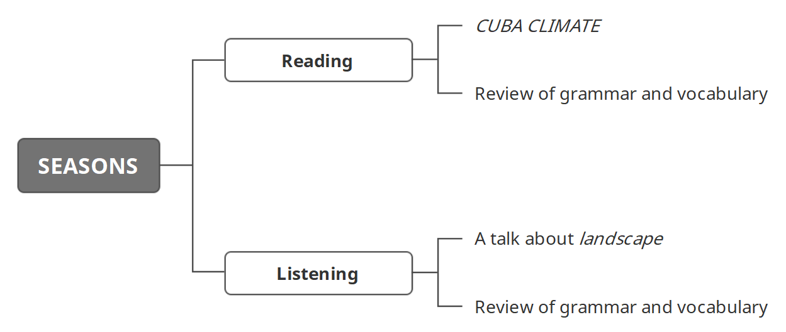

学习目标

> Read and understand CUBA CLIMATE
>
> 精读并理解短文：CUBA CLIMATE

> Listen to and understand a talk about landscape
>
> 精听并理解一段关于风景的对话

### Reading: CUBA CLIMATE

#### CUBA CLIMATE

Cuba is in the Caribbean. The climate in Cuba is good. It has two seasons in Cuba: the dry season and the rainy season. The dry season and the rainy season last for six months. 

The dry season is from November to April. The average temperatures are between 22 °C and 25 °C in the dry season. The average rainfall is 62 mm in the dry season. It is windy in the dry season. 

The rainy season is from May to October. In the rainy season, the average temperatures are between 26 °C and 28 °C. The average rainfall in the rainy season is 146 mm. The best time to visit Cuba is April or May.

#### 复习

> Adjectives（形容词）: 
>
> Words that describe people, places and things are adjectives.

> Noun phrase（名词短语）: an adjective + a noun

> Prepositions（介词）: 
>
> The words at, in, from and to are examples of prepositions.

> Prepositional phrase（介词短语）: 
>
> a preposition + a noun (noun phrase)

> Subject and verb（主谓结构）:
>
> The verb is after the subject in a sentence.

### Listening: A talk about landscape

Listen to Daniela's description about the landscape in her photographs. 

Try to answer three questions:

> 1 What is the name of the country in her photographs? 
>
> 2 What season is it in her photographs? 
>
> 3 What colours can you see?

OK, so, good morning, everybody. I'm Daniela. 

OK, so, uh, I'm going to talk about two photographs of a place in spring. I'm from Naples in Italy and I don't like to talk about cold places or places in winter – no, really, it's true!

OK, so here's my first photograph. This isn't in Italy. It's in Turkey. It's actually an island. And there's a town here. You can see there are a lot of white buildings. It's a beautiful day in spring; very sunny, very nice.

There's a nice forest there and ... my next photograph ... is from the forest. There's a park and it's good to go there when it's a hot day.

And there's the town ... and the sea, which is beautiful and blue. 

OK, so I chose these photographs because ...

#### 复习

> There be（There be结构）: 
>
> Use There is ... (There's ...) / There are ... (There're ...) to talk about things you can see.

### 小结

