学习目标

> Understand key vocabulary about study and time
>
> 理解关于学习与时间的词汇

> Understand collocation, subject – verb – object 
>
> and present simple
>
> 理解词组、主谓宾结构与一般现在时态

> Use intonation correctly
>
> 正确使用音调

### Key vocabulary: study and time

#### study

> Language[ˈlæŋɡwɪdʒ]
>
> English[ˈɪŋɡlɪʃ]
>
> Arabic[ˈærəbɪk]

> Business [ˈbɪznɪs] 
>
> Economics[ˌiːkəˈnɒmɪks]
>
> Management[ˈmænɪdʒmənt]
>
> Marketing[ˈmɑːkɪtɪŋ]

> Humanities [hjuːˈmænɪtɪz] 
>
> Literature[ˈlɪtərɪtʃə]
>
> History[ˈhɪstərɪ]
>
> Geography[dʒɪˈɒɡrəfɪ]

> Science [ˈsaɪəns] 
>
> Maths [mæθs]
>
> Physics[ˈfɪzɪks]
>
> Chemistry[ˈkɛmɪstrɪ]
>
> Biology[baɪˈɒlədʒɪ]

#### time

> weekdays [ˈwiːkˌdeɪz]
>
> Monday[ˈmʌndeɪ]
>
> Tuesday[ˈtjuːzdeɪ]
>
> Wednesday[ˈwɛnzdeɪ]
>
> Thursday[ˈθɜːzdeɪ]
>
> Friday[ˈfraɪdeɪ]
>
> weekend [ˌwiːkˈɛnd]
>
> Saturday[ˈsætədeɪ]
>
> Sunday[ˈsʌndeɪ]

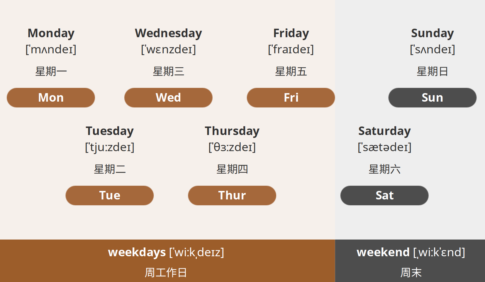

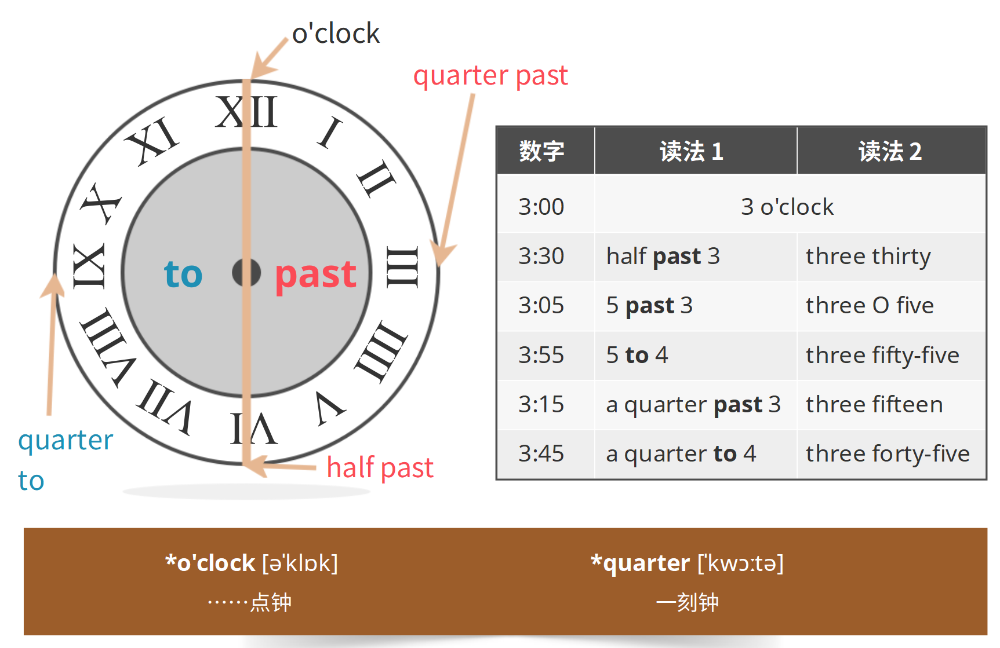

### Key grammar: collocation, subject – verb – object and present simple

> Collocation: 
>
> a pair or small group of words which are often used together. 
>
> 词组：
>
> 一对或者一群经常搭配在一起使用的词汇。 

> a verb + a noun (noun phrase)
>
> Shirley has breakfast. 
>
> Shirley studies English. 
>
> Shirley and Jack play video games.

> a verb + a prepositional phrase
>
> Jack goes to the cinema. 
>
> Shirley studies in the library. 
>
> Shirley relaxes with friends.

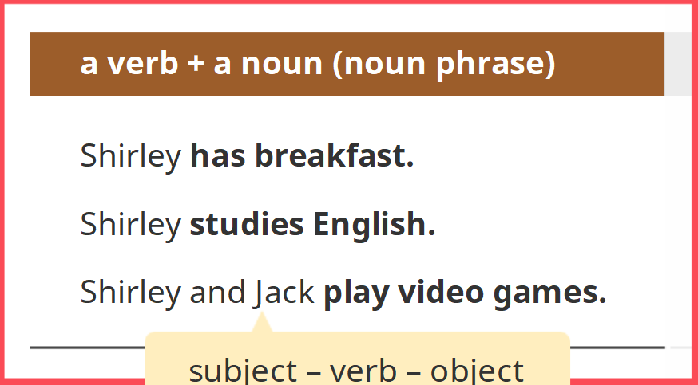

#### SVO

> A sentence is about a subject: a pronoun, a noun or a noun phrase. 
>
> The verb is after the subject in a sentence. 
>
> 一句句子是关于一个主语（一个代词、名词或名词短语）的。 
>
> 在一句句子中，动词（谓语）位于主语之后。

A prepositional phrase after a verb is NOT an object.

A pronoun, a noun or a noun phrase after is or are is NOT an object. 

谓语（动词）后面的介词短语不是宾语。 

在be动词后面的代词、名词或名词短语不是宾语。 

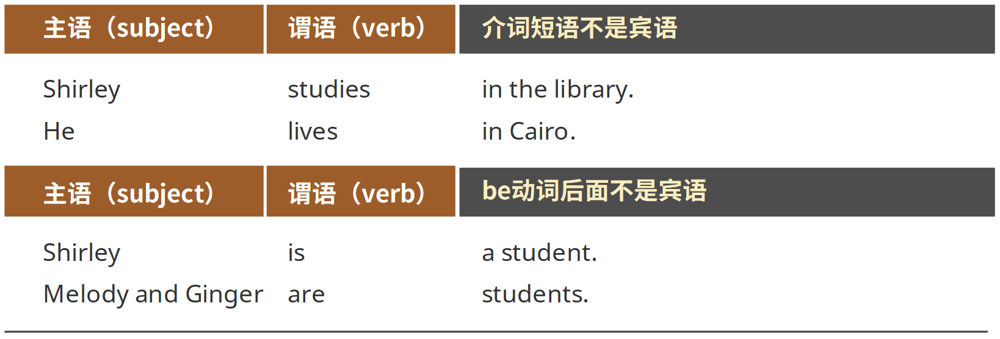

#### Time expressions

> Time expressions say when or how often something happens.
>
> 时间表达：表示事物发生的具体时间或频率。 

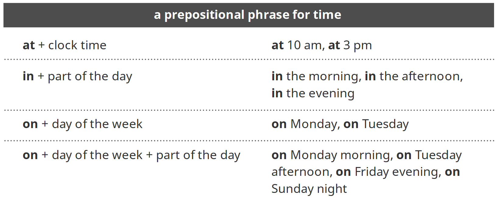

> Time expressions say when or how often something happens.
>
> 时间表达：表示事物发生的具体时间或频率。 

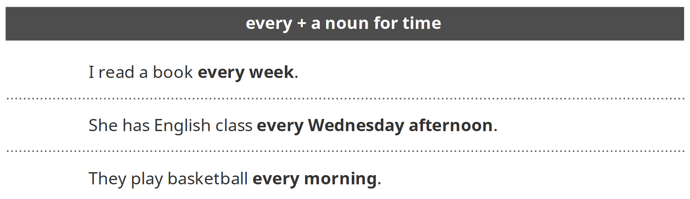

#### Present simple

> We use the Present simple to talk about our typical lifestyle or regular activities.
>
> 我们用一般现在时态来谈论我们一贯的生活方式或规律性的活动。 

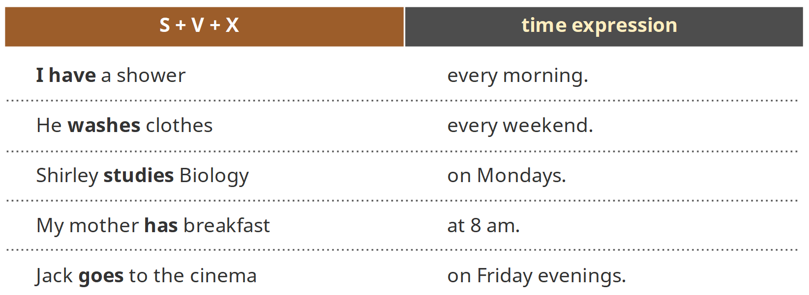

> If the subject of the sentence is third person and singular (e.g. he, she, it, Jack, Shirley, my mother), we usually add -s to the verb. 
>
> 如果句子的主语是第三人称单数形式，比如：he, she, it, Jack, Shirley, my mother等，我们一般在动词后面加上-s。 

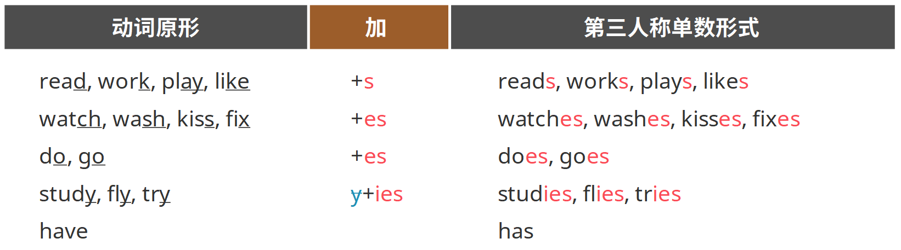

Use do not + verb or does not + verb in the negative. 

用do not + verb或者does not + verb来构成否定形式。 

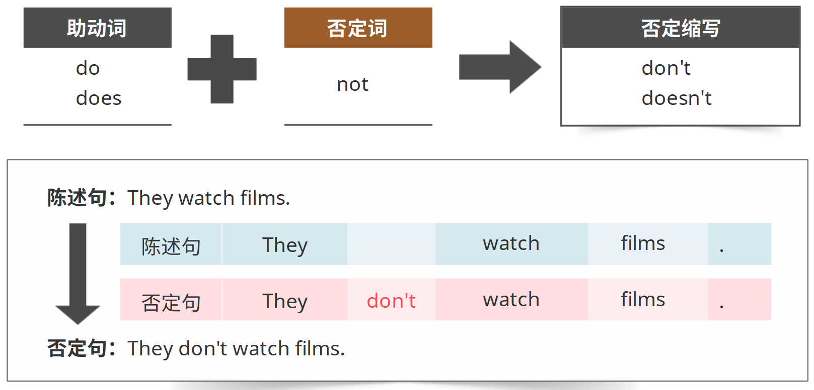

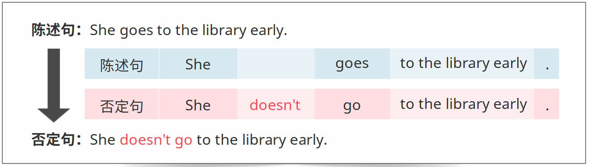

> Use do or does + subject + verb in questions. 
>
> 用do (does) + subject + verb结构来构成疑问形式。 

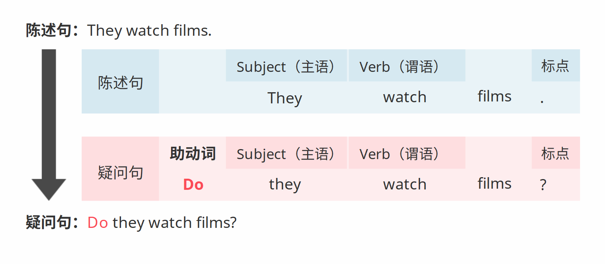

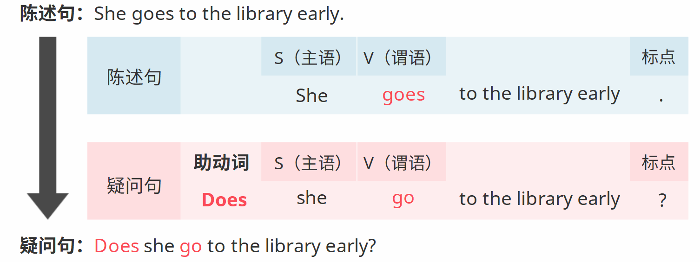

### Correct Pronunciation: intonation

> Intonation: the way our voice goes up and down when we speak. 
>
> 语调：我们说话时音调上升或下降的方式。 

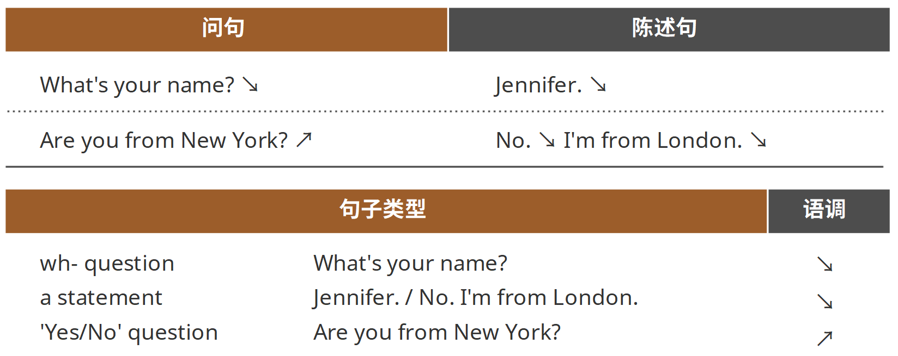

### 小结

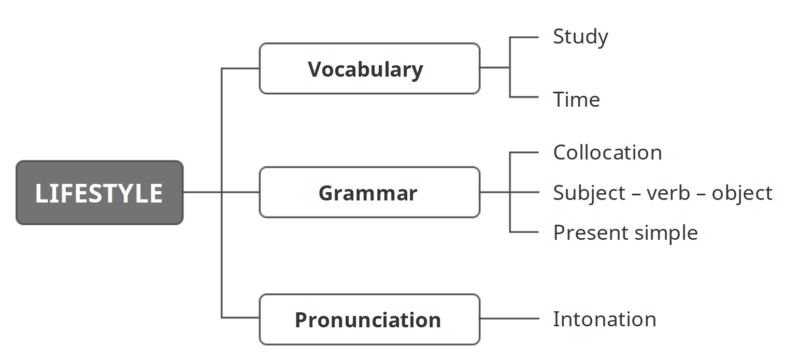