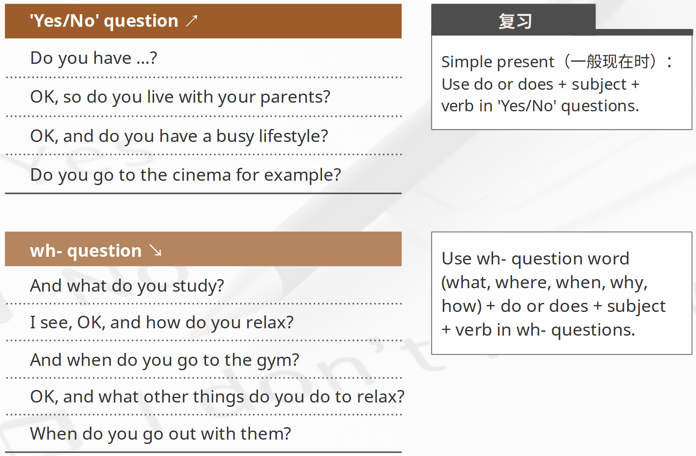
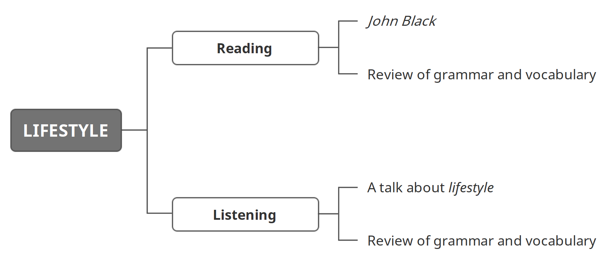

学习目标

> Read and understand John Black
>
> 精读并理解短文：John Black
>
> Listen to and understand a talk about lifestyle
>
> 精听并理解一段关于生活方式的对话

### Reading: John Black

John Black is a student in our department. John takes eight courses. They are Physics, Maths, Economics, Management, Literature, History, Geography and Marketing. His favourite subjects are Maths and Economics. 

John is a serious student. He gets up at 6 am every day. He studies every evening. He has many classes, seminars and lectures every week. 

John has three classes every morning. He has Maths from 8 am to 9 am, Economics from 9.15 am to 10.15 am, and Management from 10.30 am to 11.30 am. 

On Sunday, he meets his study group. His study group is from 12.30 pm to 1.30 pm. On Monday and Wednesday, he has Marketing. His Marketing class is from 2 pm to 3 pm. On Thursday afternoon, he has History from 2 pm to 3 pm. 

### Listening: A talk about lifestyle

> Listen to a conversation. Try to think about three questions:
>
> 1 Are the speakers in a university? 
>
> 2 Are the speakers good friends? 
>
> 3 What is the conversation mainly about? 

> Good morning! Can I ask you …?
>
> Sorry, sorry, no time! no time!

> Excuse me! Do you have …?
>
> Sorry! Can't stop! That's my bus! 

> Excuse me! Can I have a few minutes of your time? 
>
> Uh, yes, sure. 

> Great! My name's April. I'm a student at the university and I'm asking people questions about their lifestyle. I'd like to ask you some questions – is that OK? 
>
> Yes, no problem. I'm Jasvinder.

> Great! Nice to meet you, Jasvinder! OK, so, uh, well, I'll just start, then? OK, so do you live with your parents? 
>
> Yes.

> And do you work or study? 
>
> Oh, study – I'm a student. 

> And what do you study? 
>
> I study biology. I'd like to be a scientist. 

> Hmm. OK, and do you have a busy lifestyle? 
>
> Yes, I think so. I have a lot of homework. 

> I see, OK, and how do you relax? 
>
> Hm. Well, I go to a gym. I do a lot of exercise. 

> Really? 
>
> Yes. I feel happy when I do exercise. 

> Yes, I know what you mean. And when do you go to the gym? 
>
> Oh, every day. 

> Every day? Wow. OK, and what other things do you do to relax? Do you go to the cinema for example? 
>
> No, not really. I watch films on my laptop at home. 

> I see. And what about your friends? When do you go out with them? 
>
> Oh, well, I have some friends at the gym. But I also go out on Saturday afternoons. We go to a café and have a coffee and talk about … well, we talk about life, people we know, that kind of thing. 

> I think I know what you mean! OK, so … 

### 小结

