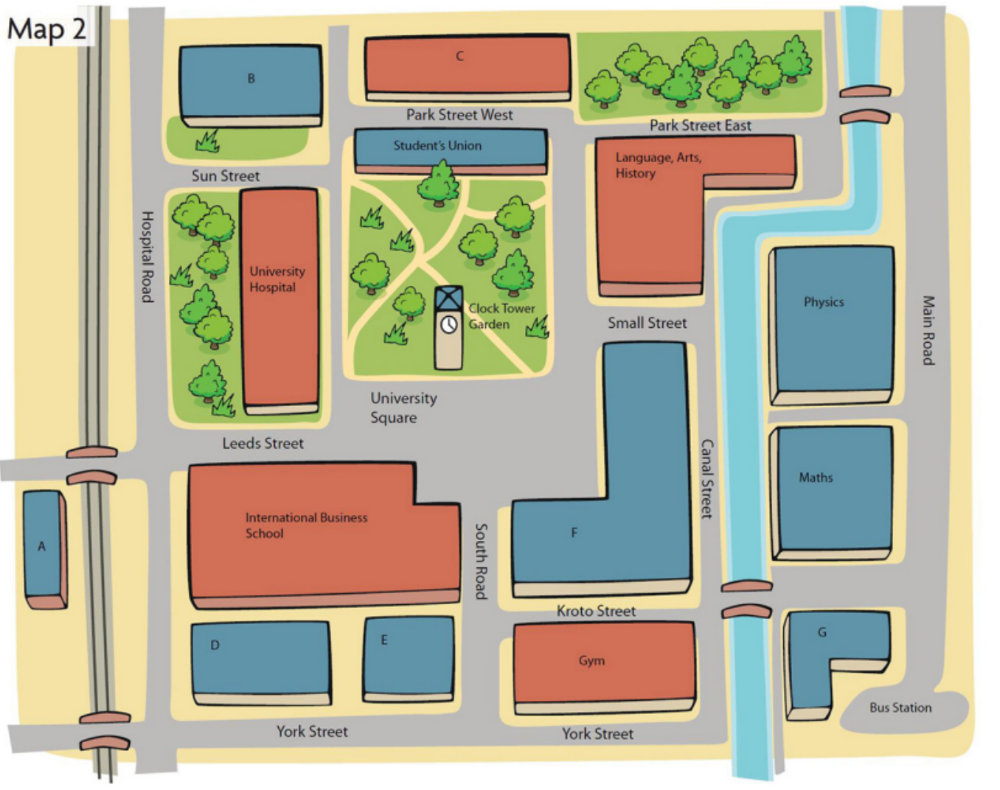
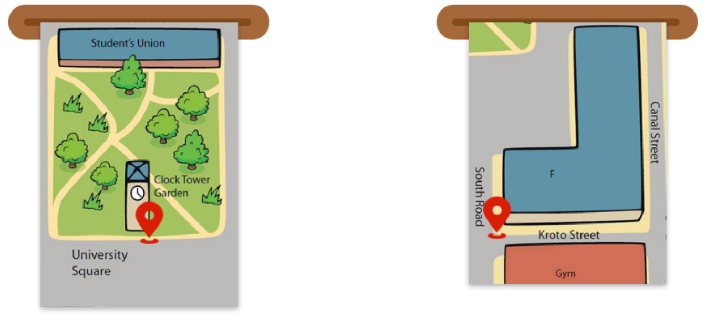
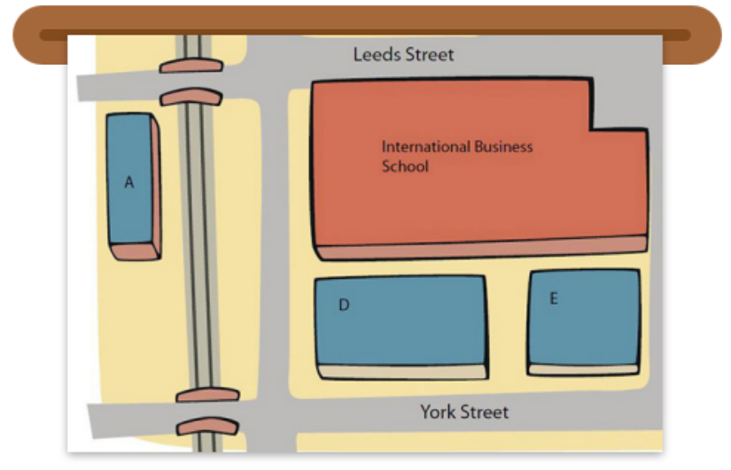
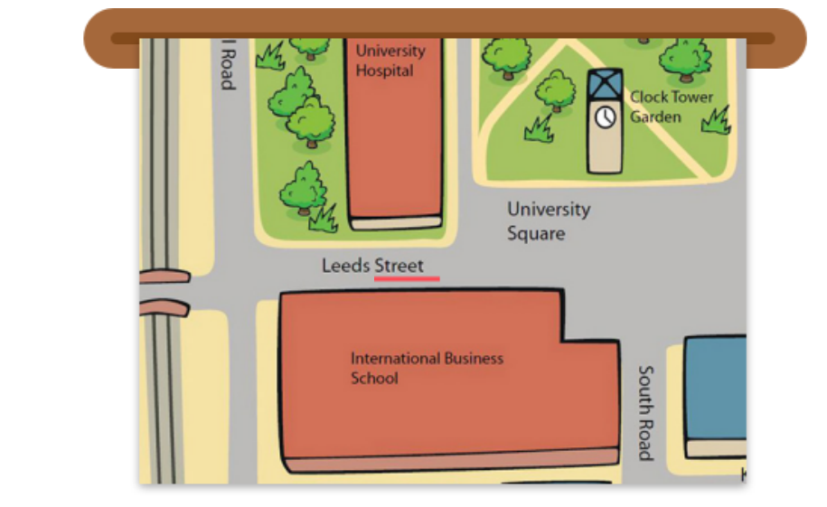
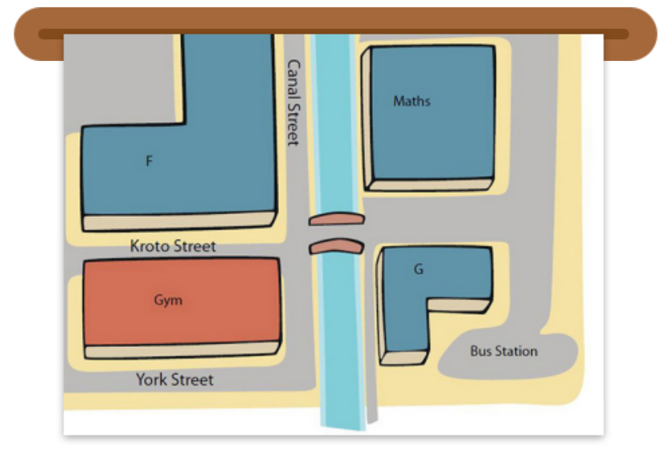
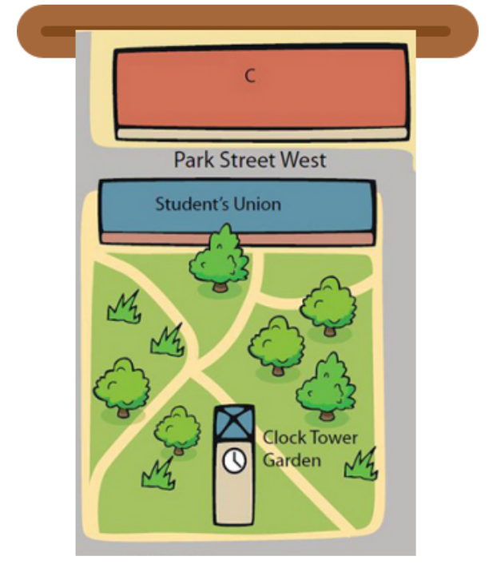
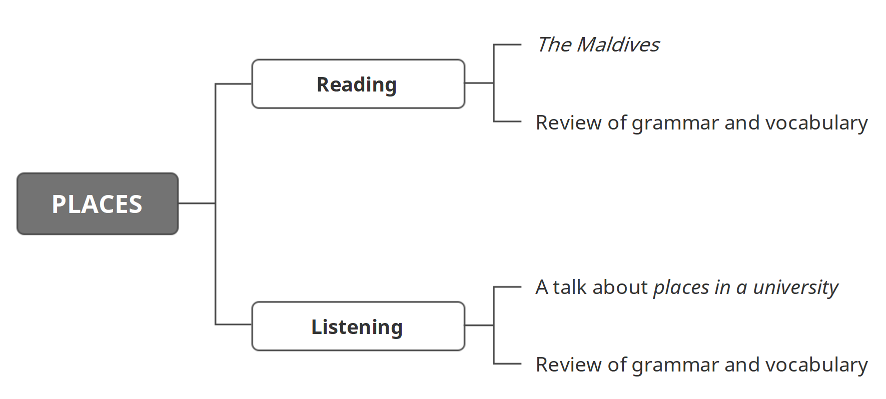

学习目标

> Read and understand The Maldives
>
> 精读并理解短文：The Maldives

> Listen to and understand a talk about places in a university
>
> 精听并理解一段关于大学校园中的地点的对话

### Reading: The Maldives

The Maldives are islands in the Indian Ocean. The islands are near Sri Lanka. The Maldives are famous for their good climate, beautiful beaches and warm seas. 

There are 360,000 people in the Maldives. Most people live on small islands. 

The capital city of the Maldives is Malé. It is a modern city with an international airport and a big harbour. 

People in Malé speak English and Dhivehi. English is useful because many tourists come here. 

Tourism and fishing are the most important businesses in the Maldives. Many people work in tourist resorts. Others work as fishermen or in fish factories. The currency is the rufiyaa. 

### Listening: A talk about places in a university

> Listen to a conversation. Some students are taking a quiz.
>
> Try to think about three questions:
>
> 1 Where are the students?
>
> 2 How many teams take the quiz?
>
> 3 Who asks the questions?

> ... OK then, so we're at the clock and that means it's the end of today's tour of the university campus. So, any questions? No? OK, so can you remember – what are we going to do now? Faisal?
>
> ... OK then, so we're at the clock and that means it's the end of today's tour of the university campus. So, any questions? No? OK, so can you remember – what are we going to do now? Faisal?
>
> Yes, that's right!

> [groaning]
>
> Oh, come on, guys!

> There's a lot of information in your first week at university. I don't want you to get lost! OK, so, Faisal, Takashi and Abdullah – you're Team A. And Akira, Katsuo and Ahmed – you're Team B. Now – I ask the questions, and you get one point for a correct answer. OK? 
>
> Right then. Question one. Where's the train station? Yes! Katsuo!
>
> It's opposite the International Business School.
>
> OK, and how do I get there from here? 
>
> Go along Leeds Street ...
>
> Uh-huh.
>
> Then go over the bridge.

> Excellent! One point to Team B. OK, two. How do I get to the supermarket from here? Yes! Ahmed.
>
> Em, OK, you can go along South Road and then turn left.
>
> Turn left where?
>
> At the Chemistry building on Kroto Street. Go along Kroto Street and over the bridge on Canal Street. The supermarket is on the right, next to the bus station.

> Perfect! Another point to Team B. Right then. Next question. Can you tell me the way to the library? Yes! Takashi! 
>
> Yes, go through Clock Tower Garden to the Student's Union. Then turn right ...
>
> Uh-huh.
>
> ... then turn left. The university library is behind the student's union on Park Street West.
>
> Is that East or West?
>
> West.

> Correct! You guys are brilliant.

#### at; on

... we're at the clock ...

At the Chemistry building on Kroto Street.

#### opposite

It's opposite the International Business School.

#### along

Go along Leeds Street ...

OK, you can go along South Road and then turn left.

Go along Kroto Street and over the bridge on Canal Street. 

#### over; next to

Then go over the bridge.

Go along Kroto Street and over the bridge on Canal Street.

The supermarket is on the right, next to the bus station.

#### through; behind

Yes, go through Clock Tower Garden to the Student's Union.

The university library is behind the student's union on Park Street West.

#### Question List

> 1 How do I get to the gym?
>
> 2 Where is the bus station?
>
> 3 Can you tell me the way to the International Business School? 

### 小结

