学习目标

> Understand key vocabulary about sport
>
> 理解关于体育运动的词汇

> Understand subject – verb – adjective, comparative adjectives 
>
> and subject – verb – adverb 
>
> 理解主系形容词结构、形容词比较级与主谓副词结构

> Pronounce weak vowel sounds /ə/ correctly 
>
> 正确发出元音 /ə/ 的弱读 

### Key vocabulary: sport

#### Sports with ball

basketball [ˈbɑːskɪtˌbɔːl]n. 篮球

football [ˈfʊtˌbɔːl]n. 足球

volleyball [ˈvɒlɪˌbɔːl]n. 排球

baseball [ˈbeɪsˌbɔːl]n. 棒球

tennis [ˈtɛnɪs]n. 网球

badminton [ˈbædmɪntən]n. 羽毛球

rugby [ˈrʌɡbɪ]n. 橄榄球

squash [skwɒʃ]n. 壁球

#### Sports with no ball

pilates [pɪˈlɑːtiːz]n. 普拉提

zumba [ˈzʊmbə]n. 尊巴

capoeira [ˌkæpʊˈeɪrə]n. 卡波耶拉（巴西战舞）

yoga [ˈjəʊɡə]n. 瑜伽

#### Sports nouns with -ing 

swimming [ˈswɪmɪŋ]n. 游泳

jogging [ˈdʒɒɡɪŋ]n. 慢跑

skiing [ˈskiːɪŋ]n. 滑雪

ice skating [aɪs ˈskeɪtɪŋ]n. 溜冰

#### Words for sports

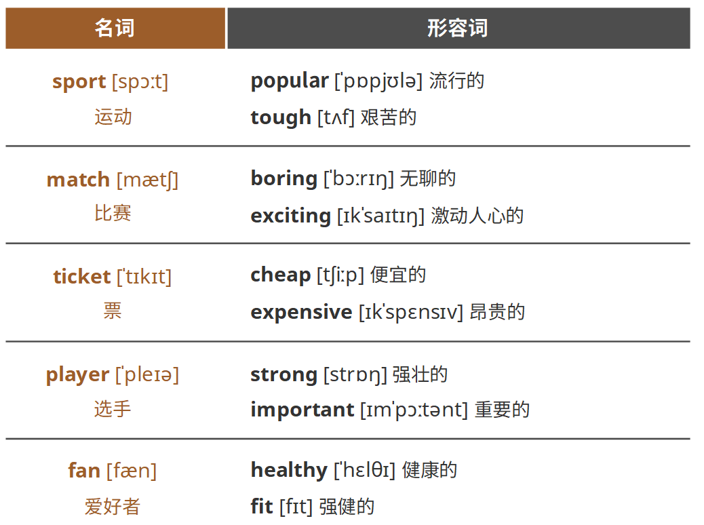

### Key grammar: subject – verb – adjective, comparative adjectives and subject – verb – adverb 

#### Sports collocations

> Use the verbs do, play and go with nouns for sport and exercise. 
>
> 用do, play和go这些动词来和运动或锻炼进行搭配。

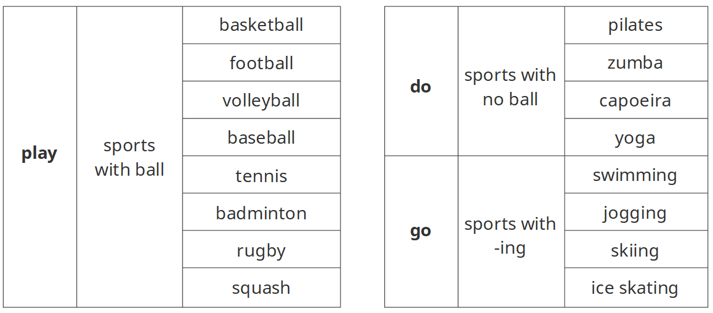

#### Prepositions collocations

> We use prepositions with particular nouns. The words in and on are examples of prepositions. 
>
> 我们在使用介词的时候，要注意与特定名词的搭配。这里用in和on进行举例说明。 

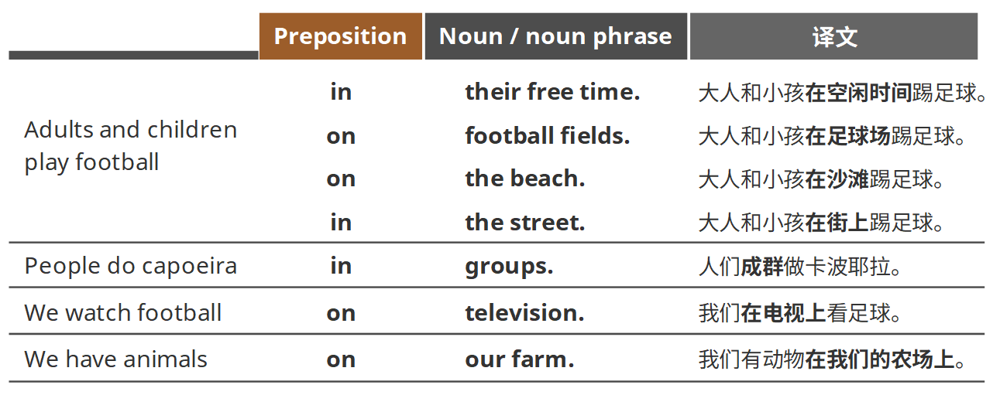

#### Positions of adjectives

> Adjectives describe qualities.
>
> Write adjectives: before a noun or after verb be.
>
> 形容词描述事物的性质。
>
> 把形容词写在名词前面或be动词后面。 

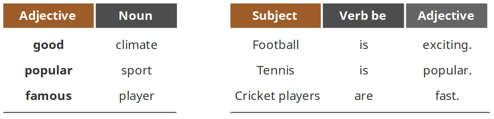

#### Subject – verb – adjective

Write a noun, a noun phrase or an adjective after the verb am/is/are (not). 

在be动词（am/is/are）或其否定形式的后面，可以写一个名词、名词词组或形容词。 

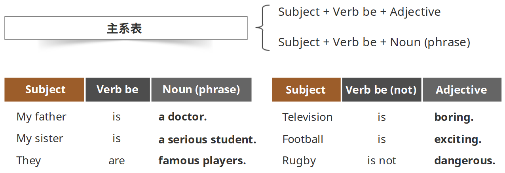

#### Comparative adjectives

> Use comparative adjectives to compare two or more things. 
>
> 使用形容词的比较级来对比两个或更多的事物。

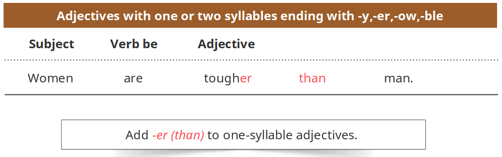

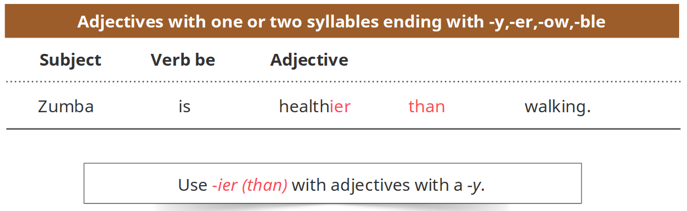

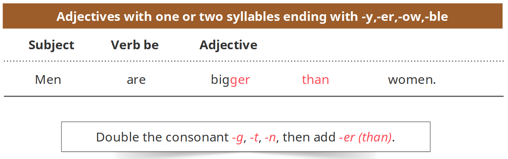

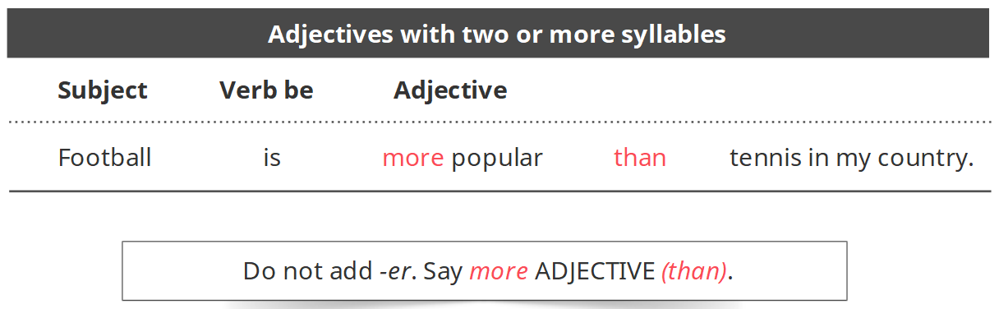

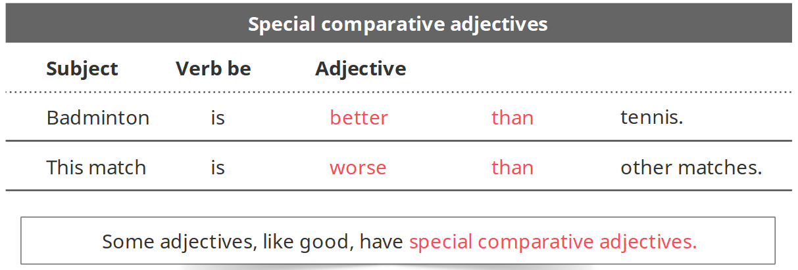

Adverbs can say when (time) or where  (place) something happens. 

Prepositional phrases can be an adverb. 

副词可以表明事物发生的时间或地点。 

介词短语可以担任副词。 

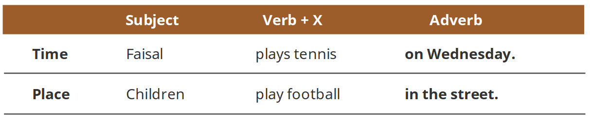

### Correct Pronunciation: weak vowel sounds /ə/

If a syllable does not have stress, it is a weak vowel sound: faster, better, bigger. 

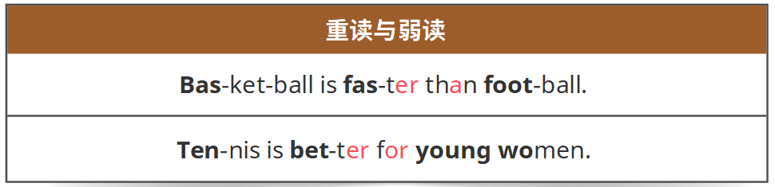

### 小结

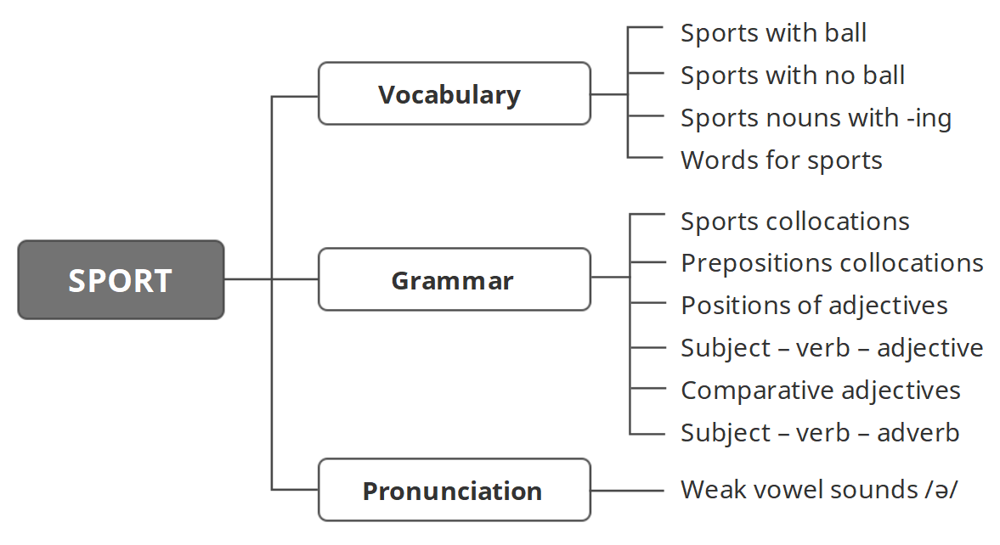

`习题A`

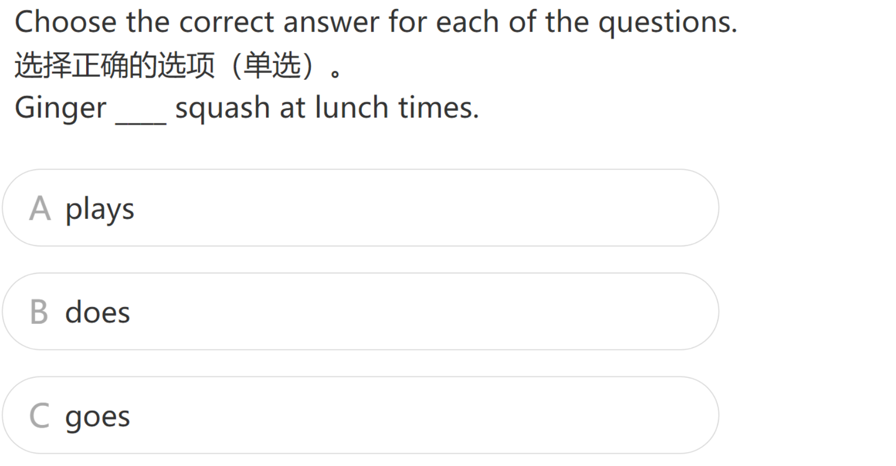

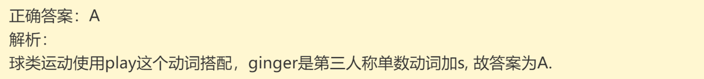

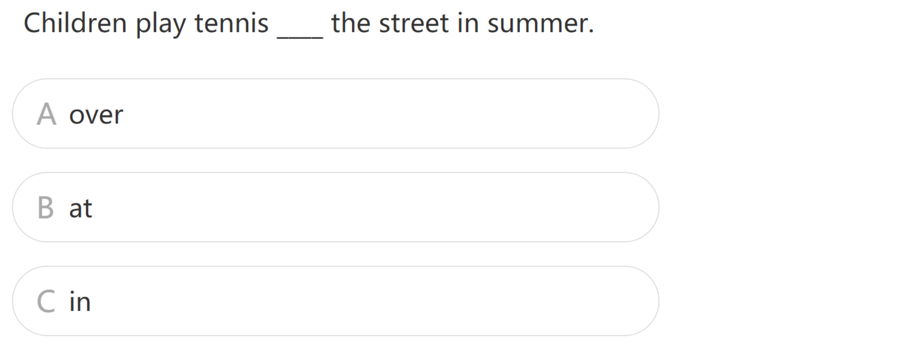

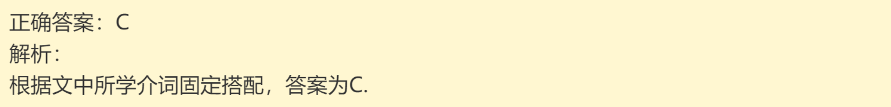

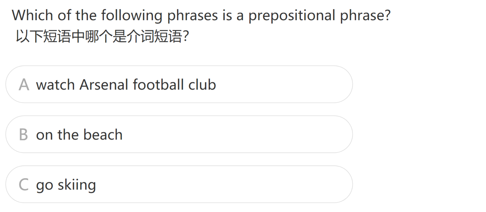

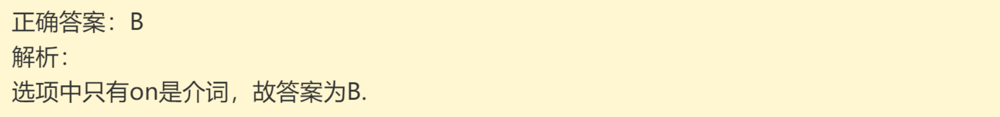

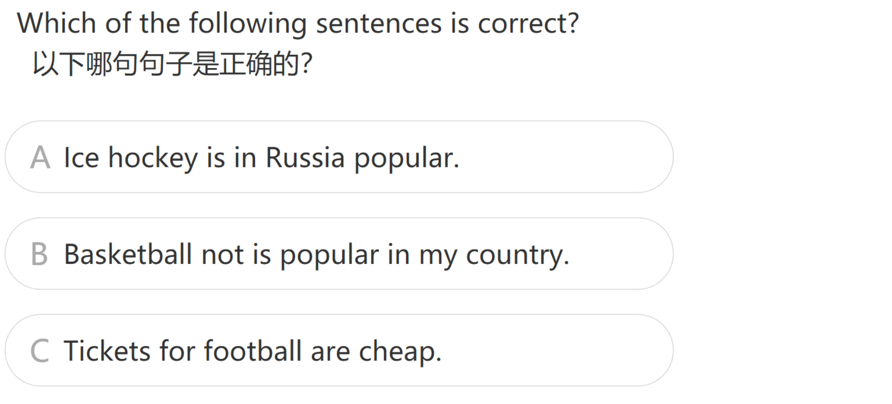

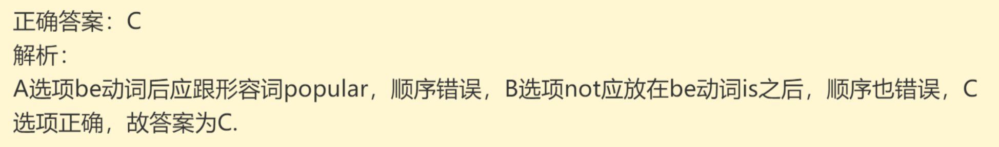

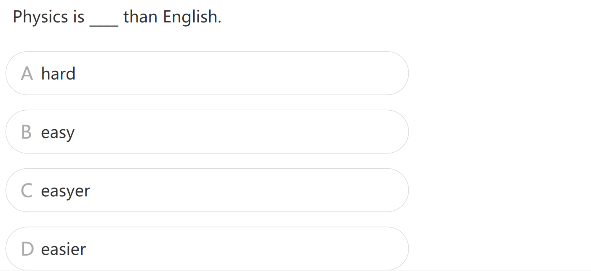

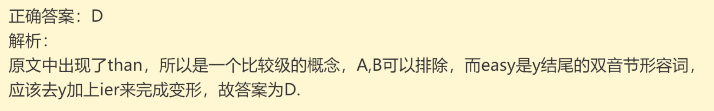