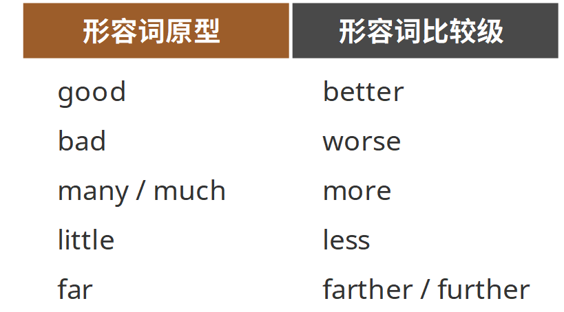
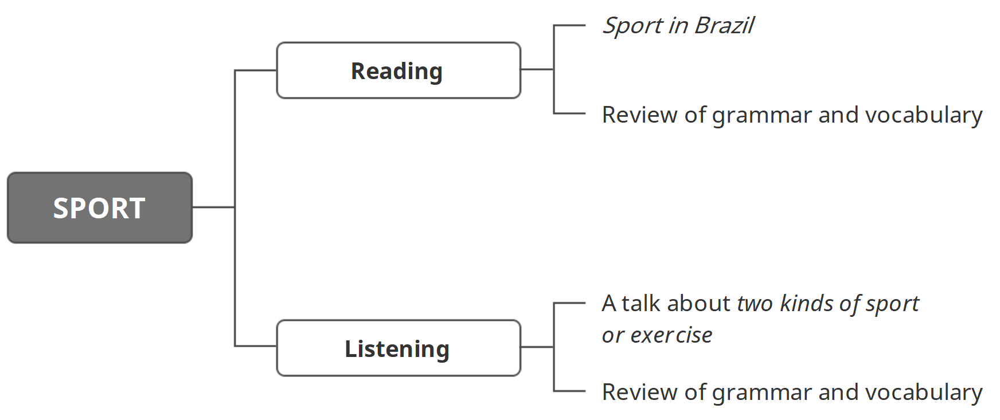

学习目标

> Read and understand Sport in Brazil
>
> 精读并理解短文：Sport in Brazil
>
> Listen to and understand a talk about two kinds of sport or exercise
>
> 精听并理解一段关于两种运动的对话

### Reading: Sport in Brazil

football

Football is very important in Brazil. People play football everywhere, and everybody plays. Adults and children play football in their free time. They usually play on football fields, but sometimes they play football on the beach or in the street. Brazil has many world-famous footballers, like Pele, Kaka, and Ronaldinho. In total, there are over 13 million players and 29,208 football clubs. If you want to watch a football match, you can buy tickets from any tourist office. 

capoeira

Football is not the only popular sport in Brazil. Capoeira is an important part of Brazilian culture. It is a mix of martial arts, exercise and music. People do capoeira in groups. You can watch capoeira groups in the park or in the street. People come from around the world to Brazil to learn it. Why not learn capoeira when you are in Brazil?  

### Listening: A talk about two kinds of sport or exercise 

> What kinds of sports and exercise does she talk about? 
>
> Which sport or exercise is faster? 
>
> Which sport or exercise is better for older people? 

>  OK, thank you, Sara. Very interesting! Now! Who's next? 
>
> It's me.

> Ah, yes, Alma. OK and you're going to talk about … ? 
>
> I'm going to compare two kinds of sport. Well, two kinds of exercise. 

> Yes, I remember now! Good, good. OK, so please go ahead. 
>
> Thank you. OK, good afternoon, everybody! Today, many young people have an unhealthy lifestyle and this means they can be unhappy. This is a real problem. 
>
> So I want to start with this question: How can we make young people fitter? How can we make them healthier? Happier? 
>
> Here's one answer. Well, in fact, here are two answers. Pilates and zumba. These are two very good kinds of exercise. They are more popular with women than men, but men can also do them. 
>
> Now, why are they good for you? And are they the same or different? Well, they are different for sure. Zumba is faster than pilates and, I think, people enjoy zumba more. There is music, you can dance with your friends, have a good time … all very good. But is it better than pilates? 
>
> We-e-ll … no. Pilates is slower than zumba. That's true. But it's not a problem. In fact, it means that it's better for older people. Zumba is better for your heart and you can lose more weight. But pilates is good for your bones and muscles. That means it can make you stronger. Now, let's look at … 

#### 复习

> Comparative adjectives（形容词比较级）： 
>
> Use comparative adjectives to compare two or more things.

> I'm going to compare two kinds of sport.

> How can we make young people fitter?
>
> How can we make them healthier? Happier?
>
> They are more popular with women than men.
>
> Zumba is faster than pilates.
>
> But is it better than pilates?
>
> Pilates is slower than zumba.
>
> In fact, it means that it's better for older people.
>
> Zumba is better for your heart and you can lose more weight.
>
> That means it can make you stronger.

#### 不规则形容词比较级

### 小结

