学习目标

> Understand key vocabulary about jobs
>
> 理解关于工作的词汇 

> Understand must and have to and joining sentences with and, and expressing opinions
>
> 理解must和have to的用法与使用and合并句子以及表达观点

> Pronounce consonants in have to, have, has to, has correctly
>
> 正确发出have to、have、has to、has中的辅音

### Key vocabulary: jobs

#### Nouns for jobs

builder [ˈbɪldə]n. 建筑工人

instructor [ɪnˈstrʌktə]n.  教练

engineer [ˌɛndʒɪˈnɪə]n. 工程师

lawyer [ˈlɔːjə]n. 律师

fireman [ˈfaɪəmən]n. 消防队员

musician [mjuːˈzɪʃən]n. 音乐家

accountant [əˈkaʊntənt]n. 会计师

scientist [ˈsaɪəntɪst]n. 科学家

pilot [ˈpaɪlət]n. 飞行员

architect [ˈɑːkɪˌtɛkt]n.  建筑师

cook [kʊk]n. 厨师

nurse [nɜːs]n. 护士

good-looking [ɡʊdˈlʊkɪŋ]adj. 好看的；美貌的

slim [slɪm]adj. 苗条的

clever [ˈklɛvə]adj. 聪明的；机灵的

friendly [ˈfrɛndlɪ]adj. 友好的；亲切的

helpful [ˈhɛlpfʊl]adj. 乐于助人的

interesting [ˈɪntrɪstɪŋ]adj. 有趣的

kind [kaɪnd]adj. 和蔼的；宽容的

polite [pəˈlaɪt]adj. 有礼貌的，客气的

#### Suffixes for job nouns

Verb + Suffix = Noun for job

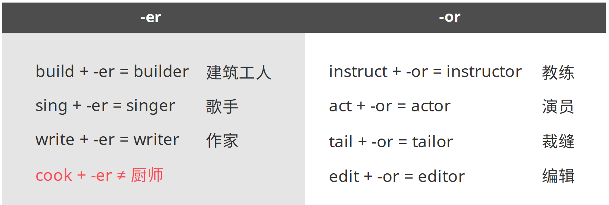

Noun + Suffix = Noun for job

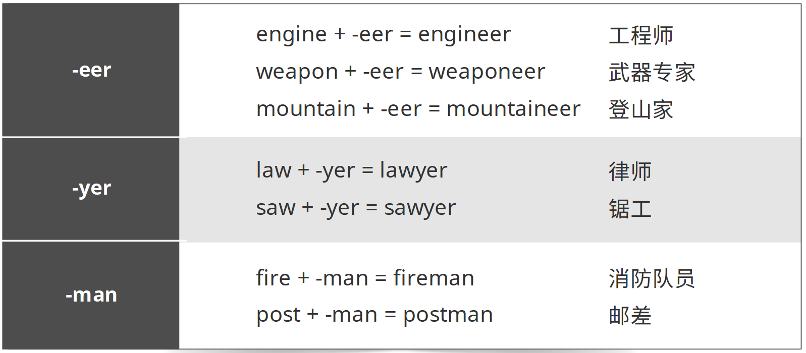

Word (part) + Suffix = Noun for job

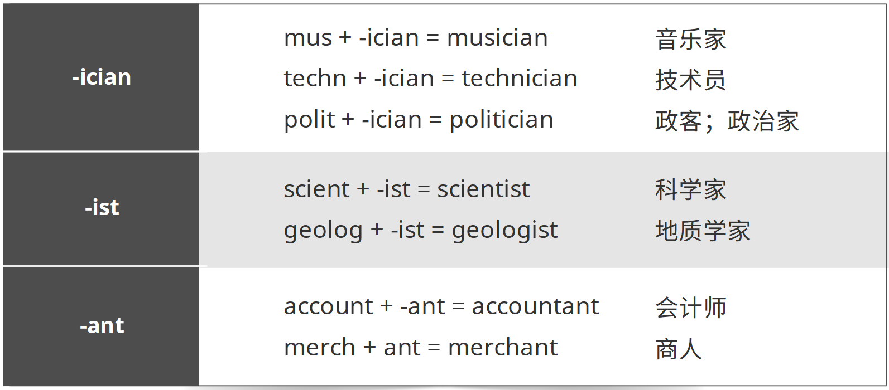

### Key grammar: must and have to and joining sentences with and and expressing opinions

#### Must and have to

> We can use must + infinitive or have to + infinitive to say that something is necessary.
>
> 我们可以用must+动词不定式或have to加动词不定式这两种形式来表示一样事物的必要性。

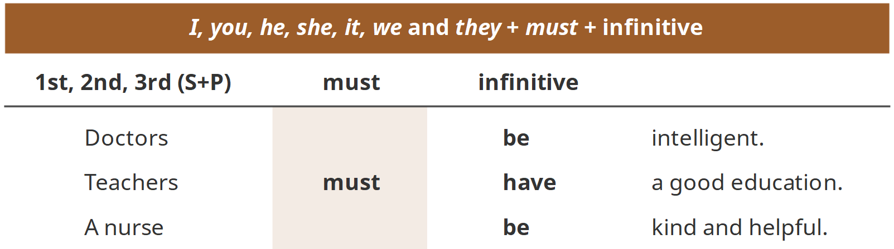

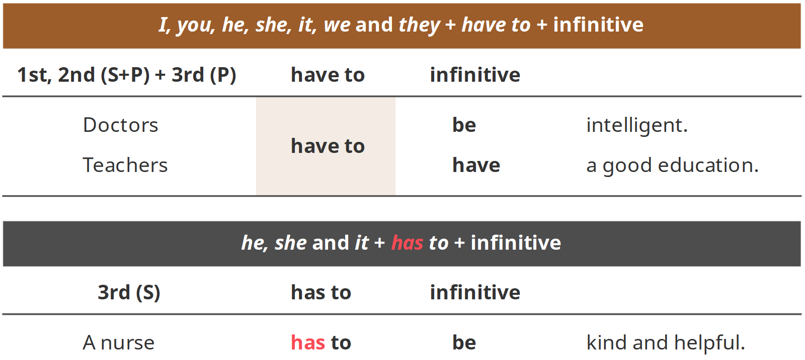

> We can use do not have to / does not have to + infinitive to say that something is not necessary.
>
> 我们可以用do not have to或does not have to+动词不定式来表示一样事物没有必要性。

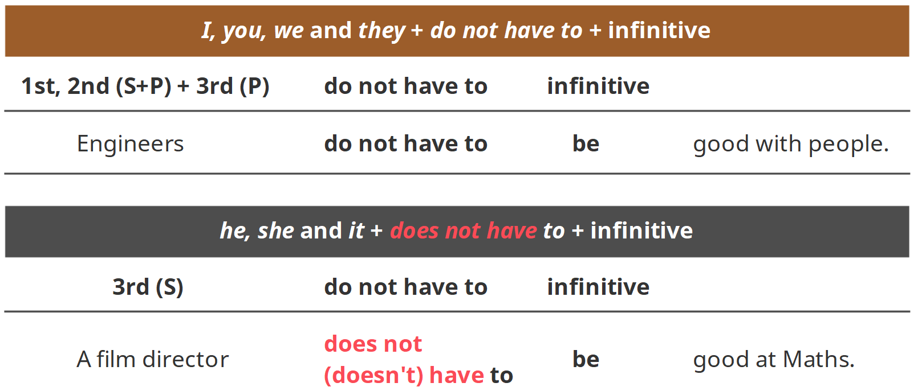

> We do not use must not + infinitive to say that something is not necessary.
>
> 我们不用must not + 动词不定式来表示一样事物没有必要性。

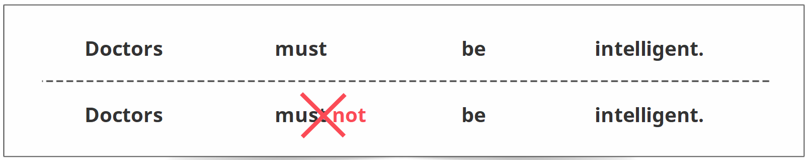

> We can add do / does to ask whether something is necessary.
>
> 我们可以加上do或does来对一样事物的必要性进行提问。

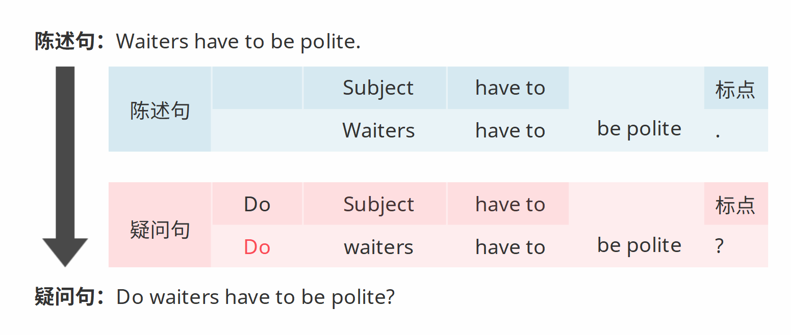

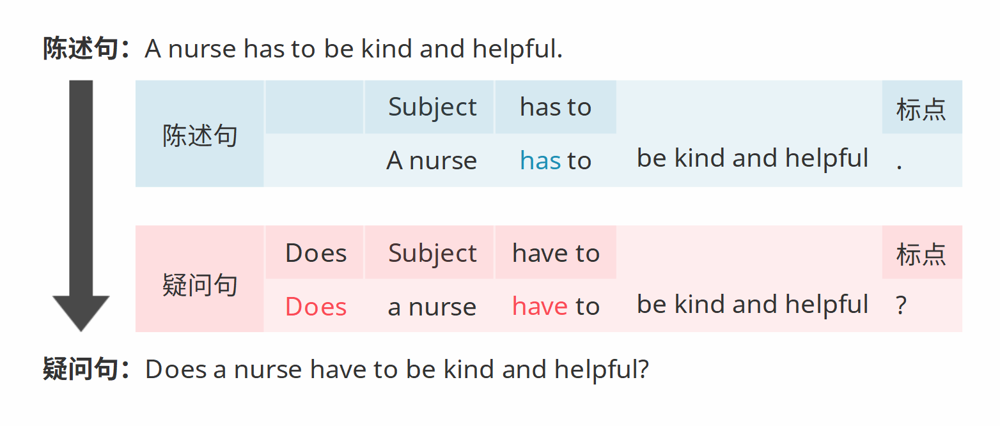

> An adjective phrase describes the subject of the sentence.
>
> 形容词短语描述句子的主语。

#### Adjective phrases

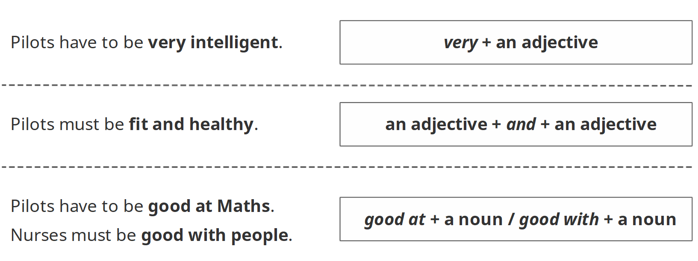

#### Joining sentences with and

> We use and to join two sentences.
>
> 我们用and来连接两句句子。

> We do not have to repeat the subject and verb if it is the same in both sentences.
>
> 我们不需要重复两句话中相同的主语和谓语（动词）。

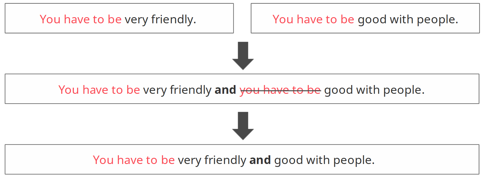

#### Expressing opinions

We can use should to give advice and think to give an opinion.

我们可以用should来给出建议，用think来给出观点。

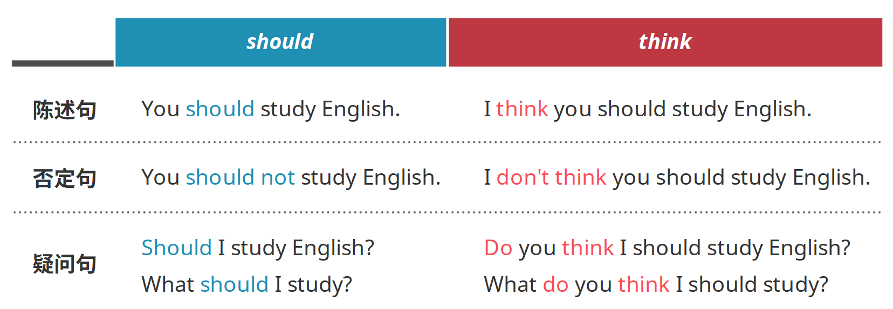

### Correct Pronunciation: consonants in have to, have, has to, has

> The have in have to and has in has to are pronounced in a different way.
>
> Have to中的have与has to中的has，它们的发音会发生变化。

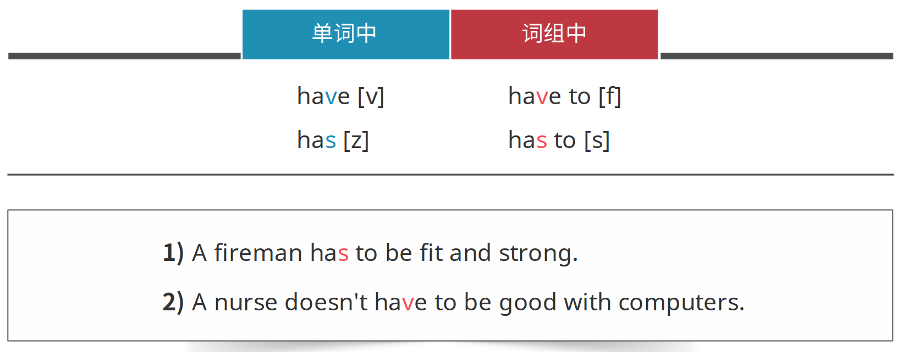

### 小结

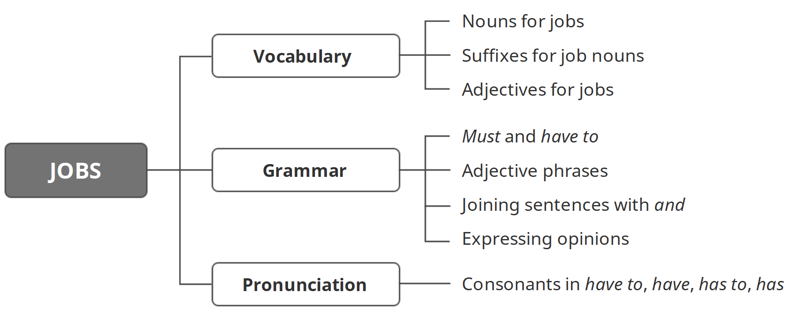

`习题A`

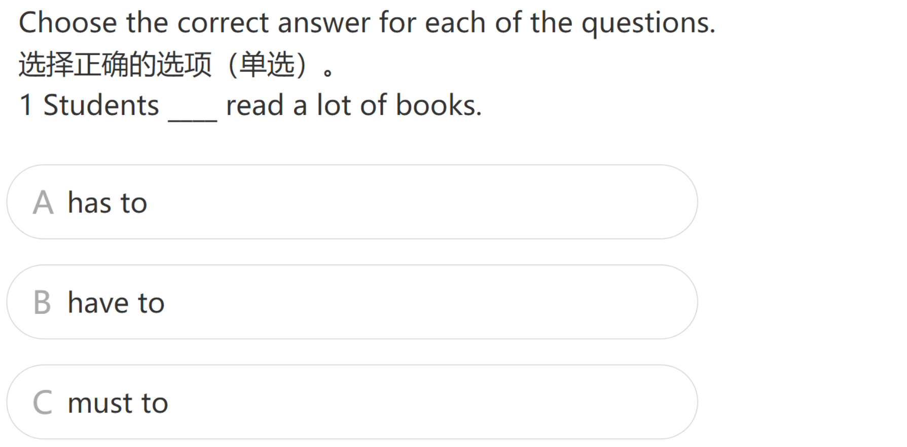

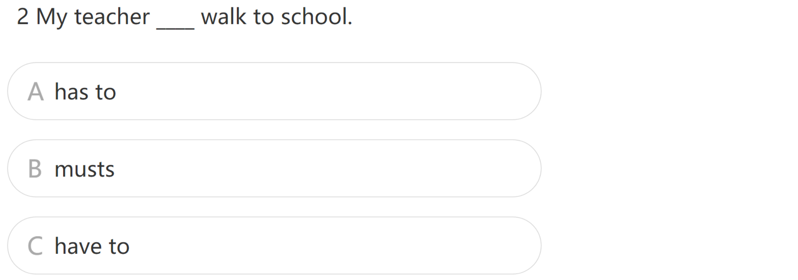

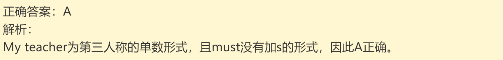

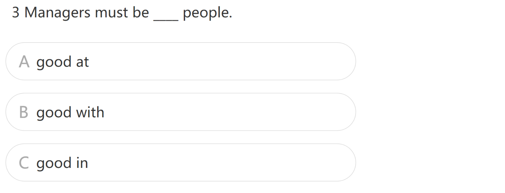

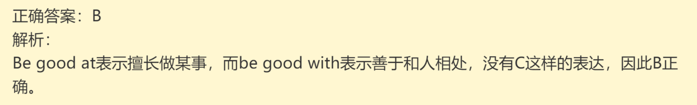

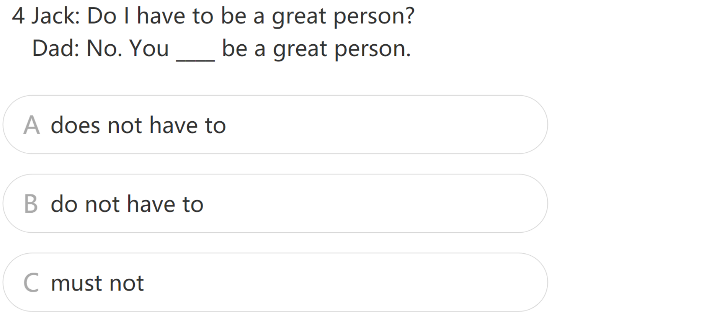

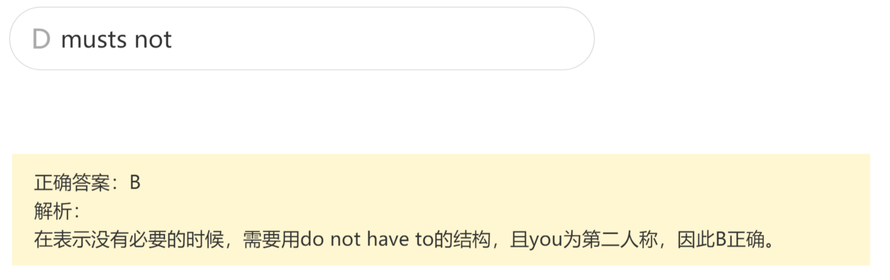

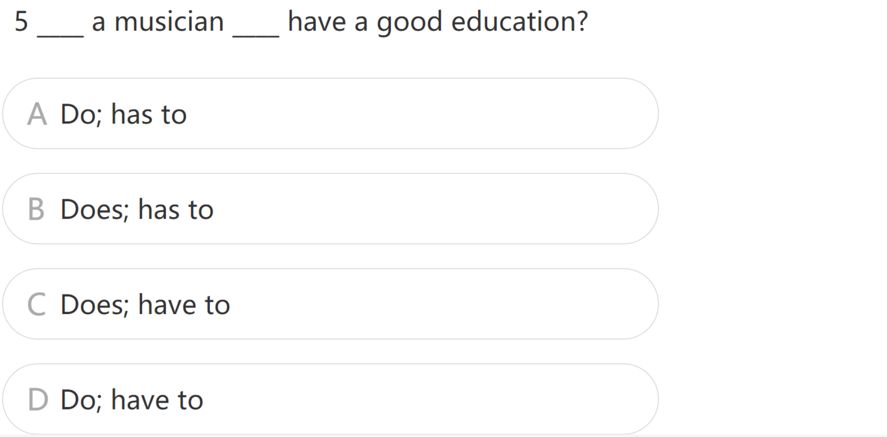

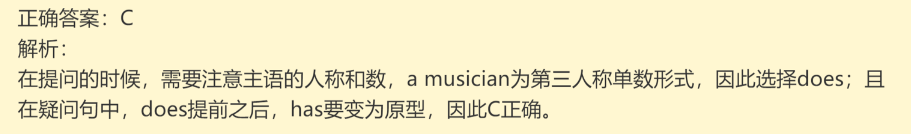

