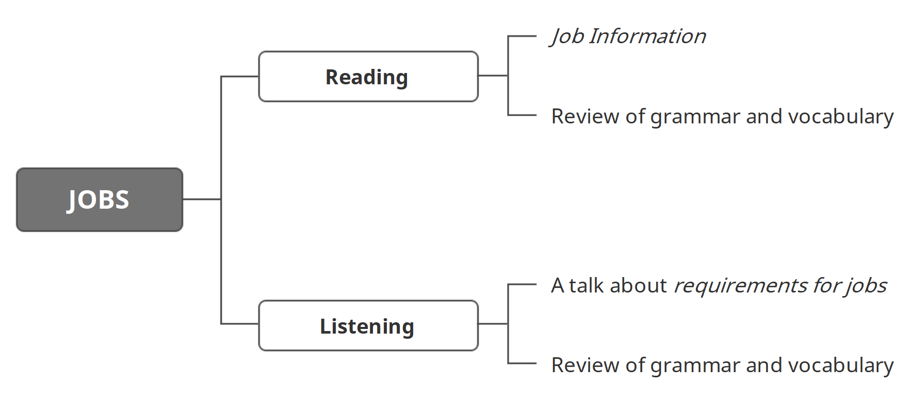

学习目标

> Read and understand Job Information
>
> 精读并理解短文：工作信息
>
> Listen to and understand a talk about requirements for jobs
>
> 精听并理解一段关于工作要求的对话

### Reading: Job Information

To:c_ jones@gmail.com 

From: k_t_b1001@yahoo.com 

Subject:Interesting job for you!

Carrie! 

I have found a great job for you. It's for a full-time fitness instructor. The job is at David Allen's Irish Gym in Manchester. 

You have to get up early in the morning. There are 12 students in each group. You have to be very friendly and good with people. The wages are very good - they pay £28 an hour. You don't have to work on Friday or Saturday.

I think you'll like this job. Here's the link: www.ukjobs.co.uk/Fitness-instructor 

Apply soon! 

Karel

To:erik1221@yahoo.com

From: ingrid_s@hotmail.com

Subject:IT'S MOM - LOOK AT THIS JOB! 

Erik, 

I have found a great job for you. It's in Oslo - here's the link: www.itcompany.org/jobs

I know this company. 

The job is for a software engineer. It's

full-time. They pay £4,150 per month!

You must have a university degree (in computer science!) and you have to have

2 years' experience. It also says that you must speak Norwegian. You don't have to speak fluent Norwegian - so it's OK for you. 

Please apply soon! 

Love, 

Mom x

### Listening: A talk about requirements for jobs

> Listen to a conversation. Two managers choose a new fitness instructor.
>
> Try to think about three questions:
>
> 1 What other job do they talk about?
>
> 2 What sport does Alan do?
>
> 3 What is the job of Lucy?

> Morning, Emma! And how are you today? 
>
> I'm fine thanks, Paul.

> Good, good. Now then - what do you have for me here?
>
> Well, here are two people for the job at the Sports Centre.

> I see. Which job is this? Is it for the fitness instructor? Or for the sports-centre nurse?
>
> This is for the fitness instructor. We're going to look at people for the nurse's job next week.

> Ah, next week, OK, I see. So, who's this?
>
> Well, this is Alan Green.

> Ah, I see he's an American.
>
> Yes. What do you think?

> Well, he's fit and strong ... and he does a lot of sport. Football, basketball, karate, judo. That's great.
>
> But ...?

> But, he's a student. I think a good fitness instructor should be a good teacher. I want a person who has experience, a person who can teach me tennis or volleyball.
>
> OK, well, here's Lucy Lau.

> Hmm. Ah good! She's a sports scientist ... and she's a fitness instructor! That's great! So, I think Lucy is our new fitness instructor. What do you think?
>
> Well ...

> You're not sure?
>
> Lucy is very good. But I think a fitness instructor has to be fit and strong. I think he - or she - has to be a good example for the students.
>
> Interesting, go on.

### 小结 

