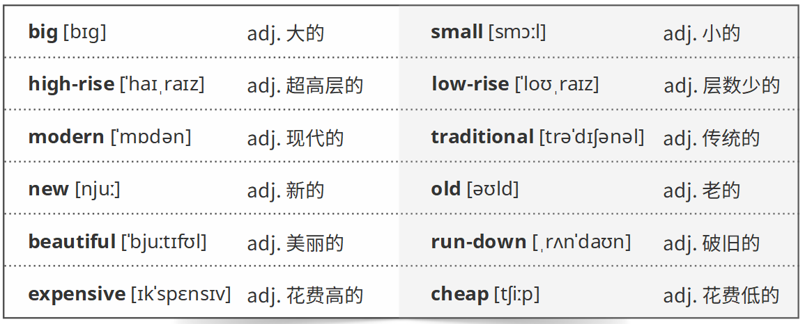
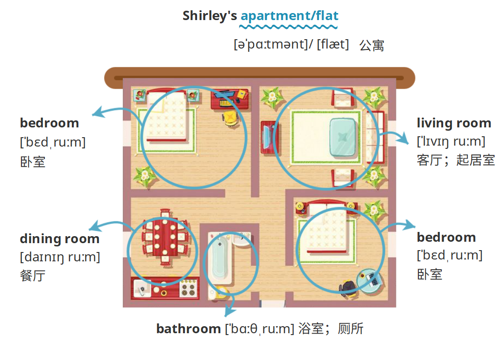
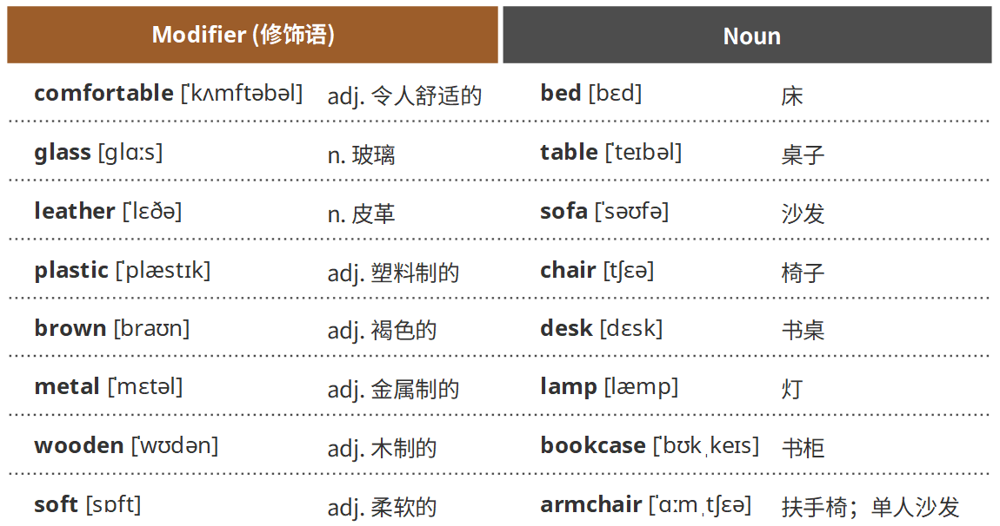
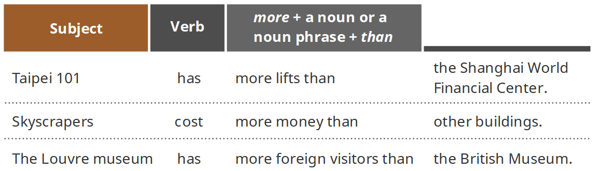
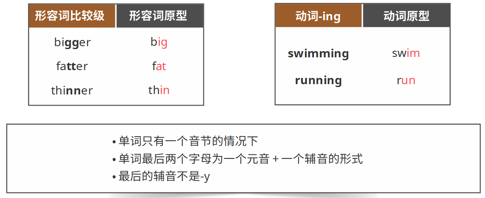
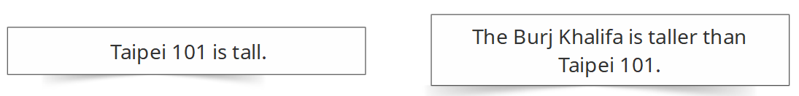
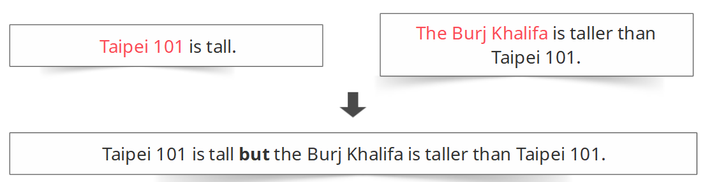
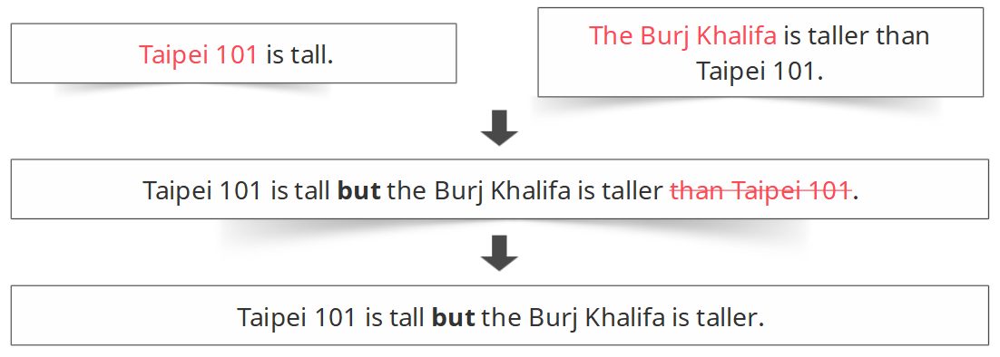
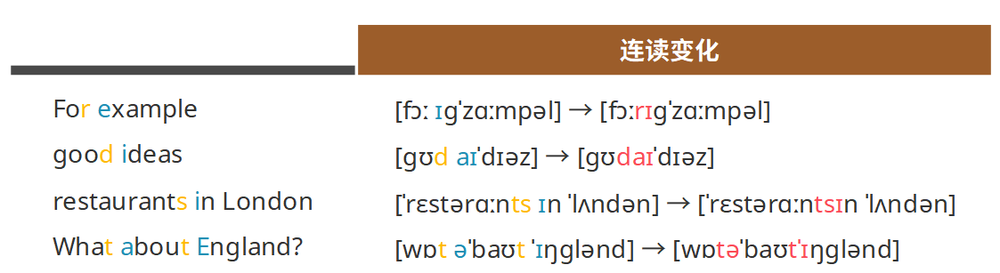
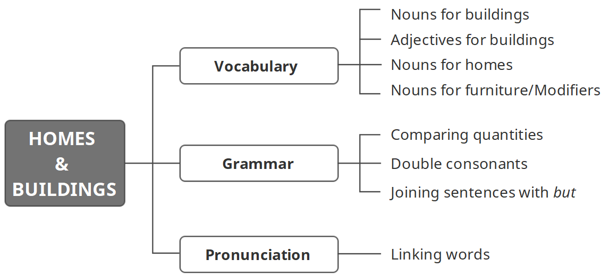

学习目标

> Understand key vocabulary about homes and buildings 
>
> 理解关于家与建筑的词汇

> Understand comparing quantities, comparative adjectives and joining sentences with but 
>
> 理解比较数量，形容词比较级与用but合并句子 

> Pronounce linking words correctly
>
> 正确连读

### Key vocabulary: homes and buildings

#### Nouns for buildings  

mall[mɔːl]购物商场

car park[kɑː pɑːk]停车场

entrance[ˈɛntrəns]入口

escalator[ˈɛskəˌleɪtə]自动扶梯

elevator[ˈɛlɪˌveɪtə]电梯

lift[lɪft]电梯

exit[ˈɛksɪt]出口

restaurant[ˈrɛstərɑːnt]餐馆

stadium[ˈsteɪdɪəm]体育场

#### Adjectives for buildings 

#### Nouns for homes

#### Nouns for furniture 

### Key grammar: comparing quantities, comparative adjectives and joining sentences with but

#### Comparing quantities

> We can compare quantities with more 
>
> \+ a noun or a noun phrase + than. 
>
> This phrase comes after the subject and the verb. 
>
> 我们可以用“more + 名词或名词短语 
>
> \+ than”这个结构来比较数量的多少 。 
>
> 这个短语跟在主谓结构的后面。 

#### Double consonants 

#### Joining sentences with but

> A sentence usually has a subject and a verb. 
>
>  一句话通常有一个主语和一个谓语（动词）。   

> Use but to join two sentences.
>
> 我们用but来连接两句句子。

> Do not repeat than + noun/noun phrase after a comparison. 
>
> 我们不需要重复第二句话中的“than + 名词或名词短语” 

### Correct pronunciation: linking words

> Link consonant sounds to vowel sounds.  
>
> 将两个单词中的辅音和元音进行连读。

### 小结

