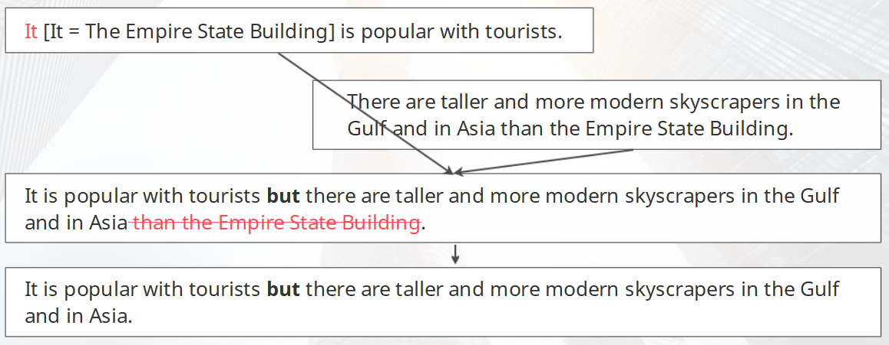

学习目标

> Read and understand Skyscrapers
>
> 精读并理解短文：摩天大楼
>
> Listen to and understand a talk about a new building
>
> 精听并理解一段关于新大楼的对话

### Reading: Skyscrapers

The Empire State Building in New York is a world-famous skyscraper. It has two million visitors every year. It is popular with tourists but there are taller and more modern skyscrapers in the Gulf and in Asia. The Shanghai World Financial Center, Taipei 101 and the Burj Khalifa in Dubai, are taller than the Empire State Building. The Burj Khalifa is taller than the World Financial Center and Taipei 101. Taipei 101 is taller than the World Financial Center. The Burj Khalifa is also more modern than the other two buildings. It opened in 2010. 

Skyscrapers are very expensive. They cost more money than other buildings. The Burj Khalifa cost $1,500,000,000 to build. It was more expensive than the World Financial Center ($850,000,000) but it was cheaper than Taipei 101. Taipei 101 cost $1,760,000,000. 

The Burj Khalifa has 163 floors. This is more than Taipei 101 or the World Financial Center. They have 101 floors each. All skyscrapers have lifts. Taipei 101 has more lifts than the Burj Khalifa or the World Financial Center. It has 61 lifts. The Burj Khalifa has 57 lifts but the World Financial Center has only 31. Many skyscrapers also have shopping centres or malls inside them. A lot of people come shopping every day. 

#### 复习

> Comparing quantities（比较数量）: 
>
> We can compare quantities with more + a noun or a noun phrase + than. 
>
> This phrase comes after the subject and the verb. 

> The Empire State Building in New York is a world-famous skyscraper. It has two million visitors every year. It is popular with tourists but there are taller and more modern skyscrapers in the Gulf and in Asia. 
>
> Joining sentences with but（用but合并句子）: 
>
> Use but to join two sentences. 
>
> Do not repeat than + noun or noun phrase after a comparison. 

### Listening: A talk about a new building 

> Listen to a conversation. Two men discuss ideas for a new building.
>
> Try to think about three questions: 
>
> 1 What kind of building do they discuss? 
>
> 2 Where does Hakan's sister work?
>
> 3 Why are the buildings near the train station not 
>
> a good choice? 

> … thanks for the coffee, Hakan! Very nice! 
>
> Yes, it's good Turkish coffee. OK then, shall we start?

> Yes, I think so. OK, so we need a place 
>
> for our new office. What about here? 
>
> Where? 

> The town centre. What do you think? 
>
> Well, it's a good place. It's near some good roads. But … I don't think we should go there.

> Oh? Why not?
>
> Because the buildings in the town centre are very old. They are cold in winter and hot in summer. They're not comfortable places. 

> Oh, I see. That's not good.
>
> No. And the buildings there are expensive. 

> Really? 
>
> Yes. My sister's a lawyer and her office is in the town centre. She likes her job but she does not like her building. 

> OK, so not there, then! Hm. What about here? 
>
> The park?  

> Yes. It's quiet and it's not far from a big road. What do you think? 
>
> Hm, I'm not sure. It's quite far from the town. What about here? Near the train station?  

> The train station is good. It's good for travel … but I think we should go to the park. The buildings near the train station aren't cheap. 
>
> They're not? 
>
> No. They're quite expensive. 

### 小结

