学习目标

> Understand key vocabulary about food
>
> 理解关于食物的词汇 
>
> Understand countable and uncountable nouns, subject-verb agreement and determiners (a, an, some) 
>
> 理解可数与不可数名词，主谓一致与限定词（a, an, some）
>
> Pronounce -teen and -ty numbers correctly
>
> 正确发出以-teen和-ty结尾的数字

### Key vocabulary: food

#### Nouns for food

`vegetable [ˈvɛdʒtəbəl] 蔬菜 `

bean [biːn]豆；豆荚

carrot [ˈkærət]胡萝卜

pepper [ˈpɛpə]椒类

mushroom [ˈmʌʃruːm]蘑菇

cabbage [ˈkæbɪdʒ]卷心菜

onion [ˈʌnjən]洋葱

`fruit [fruːt] 水果 `

lemon [ˈlɛmən]柠檬

orange [ˈɒrɪndʒ]橙子

pineapple [ˈpaɪnˌæpəl]菠萝

grape [ɡreɪp]葡萄

mango [ˈmæŋɡəʊ]芒果

blueberry [ˈbluˌbɛri]蓝莓

`grain [ɡreɪn] 粮食；谷物`

rice [raɪs]米

bread [brɛd]面包

noodle [ˈnuːdəl]面条

`nut [nʌt] 坚果`

walnut [ˈwɔːlˌnʌt]核桃

almond [ˈɑːmənd]杏仁

peanut [ˈpiːˌnʌt]花生

`dairy [ˈdɛərɪ] 乳制品`

milk [mɪlk]牛奶

cheese [tʃiːz]奶酪

yoghurt [ˈjəʊɡət]酸奶

`white meat [waɪt miːt] 白肉类`

chicken [ˈtʃɪkɪn]鸡肉

duck [dʌk]鸭肉

fish [fɪʃ]鱼肉

`red meat [rɛd miːt] 红肉类`

pork [pɔːk]猪肉

beef [biːf]牛肉

lamb [læm]羔羊肉

`fat-rich foods [fæt rɪtʃ fuːdz] 高脂食物`

butter [ˈbʌtə]黄油

coconut [ˈkəʊkəˌnʌt]椰子

palm oil [pɑːm ɔɪl]棕榈油

`sweets [swiːts] 糖果；甜食`

chocolate [ˈtʃɒkəlɪt]巧克力

candy [ˈkændɪ]糖果

pastry [ˈpeɪstrɪ]油酥点心

`fast food [fɑːst fuːd] 快餐`

pizza [ˈpiːtsə]披萨

cheeseburger [ˈtʃiːzˌbɜːɡə]奶酪汉堡

chip [tʃɪp]炸薯条

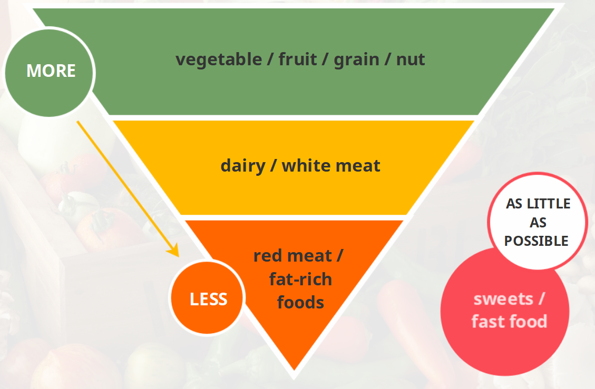

### Key grammar: countable and uncountable nouns, subject-verb agreement and determiners (a, an, some) 

#### Countable and uncountable nouns

> Countable nouns [c]
>
> • singular form + singular verb 
>
> • plural form + plural verb
>
> Uncountable nouns [u]
>
> • singular form + singular verb
>
> • no plural form or verb
>
> 可数名词 [c] 
>
> • 单数形式 + 单数形式动词 
>
> • 复数形式 + 复数形式动词
>
> 不可数名词 [u]
>
> • 单数形式 + 单数形式动词
>
> • 无复数形式，不接复数形式动词

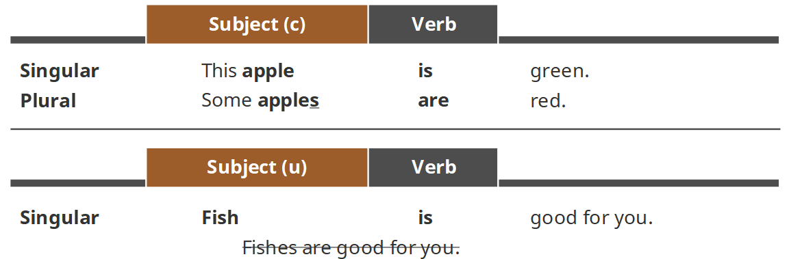

部分不可数名词分类

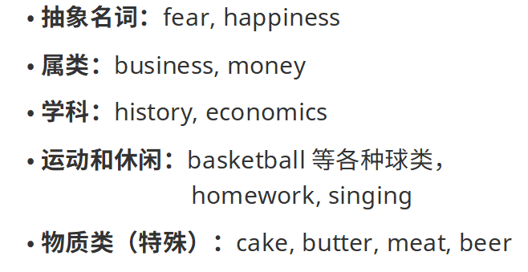

#### Subject–Verb agreement

> The subject can be singular or plural.
>
> The verb must agree with the subject.
>
> 主语可以是单数或复数。 
>
> 谓语动词必须和主语在数量上一致。 

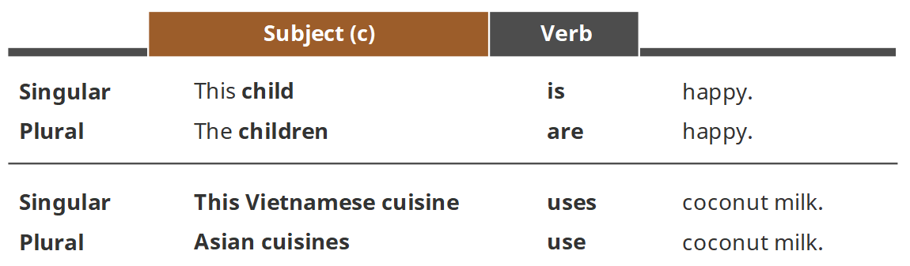

#### Determiners: a, an and some

> Use the articles a / an before a singular countable noun. 
>
> 在可数名词前可以使用冠词a或者an。 
>
> Use a before a consonant sound. Use an before a vowel sound.
>
> 在辅音前使用a，在元音前使用an。

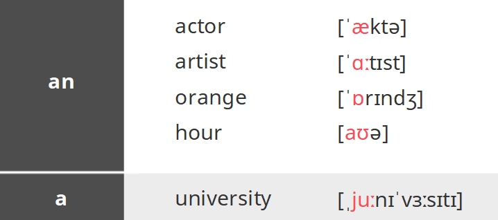

> 元音辅音表

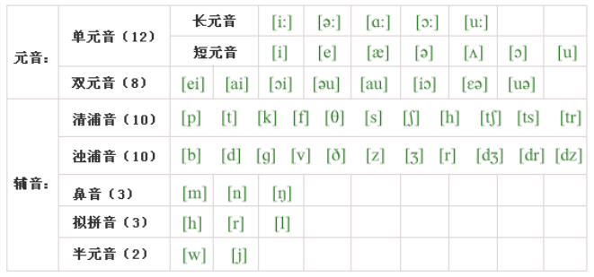

> We can use some before: 
>
> • a plural countable noun 
>
> • an uncountable noun
>
> 我们可以把some用在： 
>
> • 一个复数可数名词之前 
>
> • 一个不可数名词之前

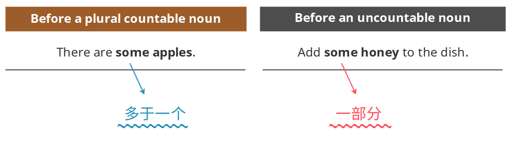

> With countable and uncountable nouns, we can use some and any.
>
> 对于可数名词和不可数名词，我们都可以用some和any这两个词。

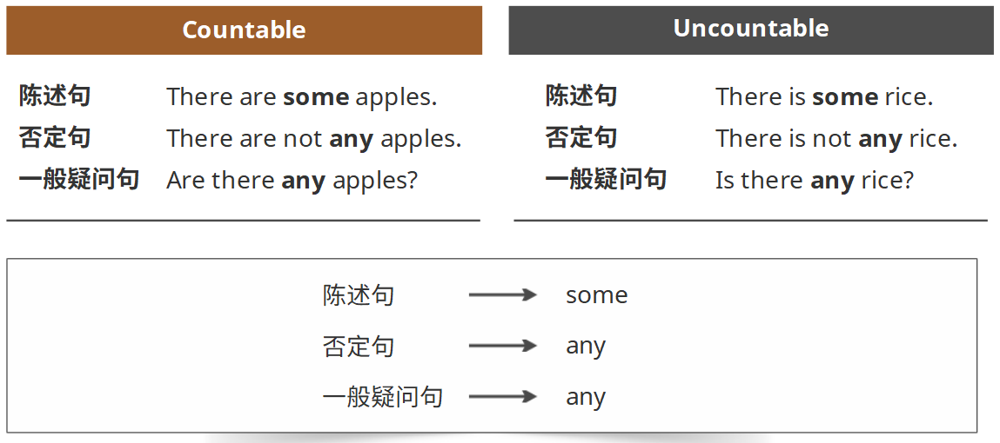

> When we want to talk about numbers and measurements, we use how many and how much.
>
> 在谈论数字与度量的时候，我们使用how many和how much这两个表达。

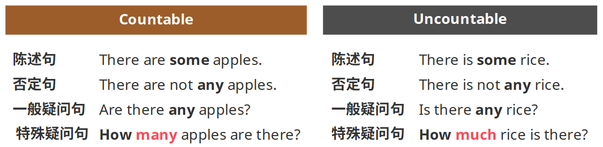

### Correct pronunciation: -teen and -ty numbers

> For -teen numbers (e.g. 13, 14, 15): 
>
> • stress the first syllable when the number
>
>    is before a noun. 
>
> • stress the last syllable when the number
>
>    is at the end of a statement. 
>
> For -ty numbers (e.g. 20, 30, 40), always stress the first syllable.
>
> 对于以-teen结尾的数字（比如13、14、15）： 
>
> • 当这个数字在名词前的时候，重读第一个
>
>    音节。 
>
> • 当这个数字在一句话最后的时候，重读最后
>
>    一个音节。 
>
> 对于以-ty结尾的数字（比如20、30、40），重音都在第一个音节上。

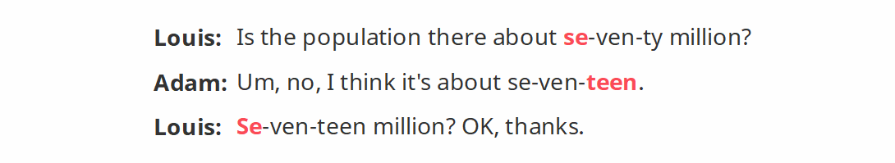

### 小结

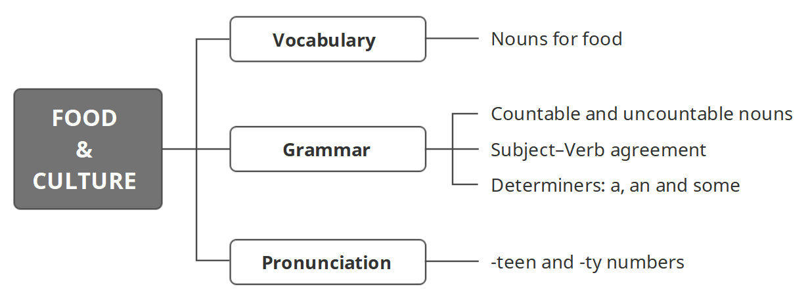