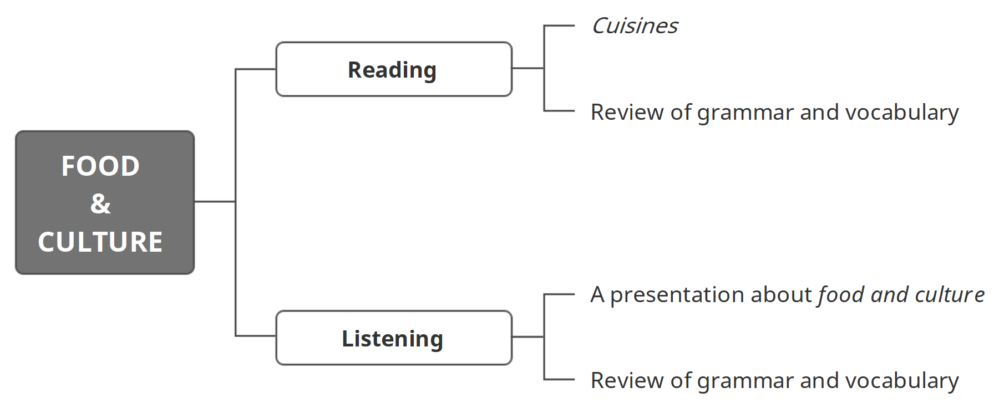

学习目标

> Read and understand Cuisines
>
> 精读并理解短文：佳肴
>
> Listen to and understand a talk about food and culture
>
> 精听并理解一段关于食物与文化的对话

### Reading: Cuisines

Australian cuisine

If you are in Australia, you must try a crocodile or kangaroo dish! Many Australian restaurants serve crocodile curry. Crocodile meat is tasty and very good for you (it is better that you eat crocodile than a crocodile eats you!). Kangaroo meat is also good for you. Kangaroo burgers are served in white bread. Australian restaurants also serve great fish and other ...

Cambodian cuisine

At a Cambodian restaurant, there is a lot of fruit. You can find mangoes, melons and pineapples. Cambodians also like fish with rice or noodles. Cambodian dishes are served with a lot of vegetables. Mushrooms and cabbage are very popular in Cambodian cuisine. One famous dish is amok trey. Cambodians prepare amok trey with fish, nuts, coconut milk and egg. Another dish is ...

#### 复习

> Countable and uncountable nouns（可数名词与不可数名词）:
>
> Countable nouns (c) 
>
> • 单数形式 + 单数形式动词           • 复数形式 + 复数形式动词
>
> Uncountable nouns (u) 
>
> • 单数形式 + 单数形式动词（无复数形式，不接复数形式动词） 

> Subject–Verb agreement （主谓一致）: 
>
> • 主语可以是单数或复数。         • 谓语动词必须和主语在数量上一致。

### Listening: A presentation about food and culture

> Listen to a presentation. Sofia reports the results of her survey.
>
> Try to think about three questions:
>
> 1 How many students are there in Sofia's survey?
>
> 2 Where is Sofia from?
>
> 3 How many questions are there in Sofia's survey?

Hello! I'm Sofia. This afternoon, I'm going to tell you about the results of my survey. There were 20 students in my survey. My questions were on the topic of 'Food and culture'. I think this is an interesting topic. For example, I'm from Italy, and food is very important in my country and in my culture.

OK, so my first question was 'Where are you from?' and here are the results. You can see here that 50% of students come from England and 15% come from Spain. 20% of students come from Italy, like me, and 15% of students come from Egypt. So you can see that half of the students are from England.

OK, my second question was 'Is food important in your culture?'. The answers are interesting. You can see here that 'yes' is 70% and 'no' is 30%. That's six people! I was very surprised!

My third question was 'Are family meals important?'. That is, is it important to eat with your family? Again, I was very surprised because again 'yes' is 70% and 'no' is 30%.

My last question was 'Why are family meals important?'. You can see here that the results are interesting. There were two answers to this question.

#### 小结

