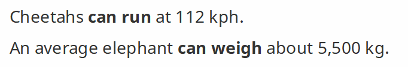
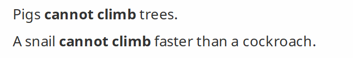
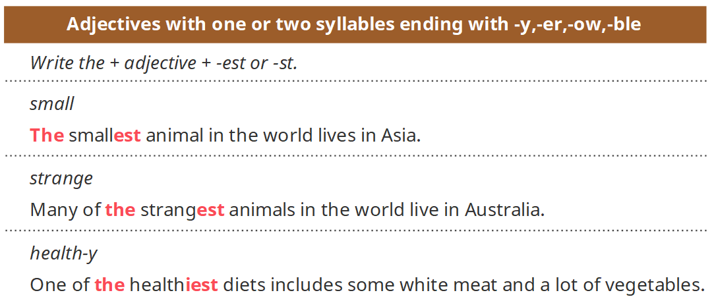
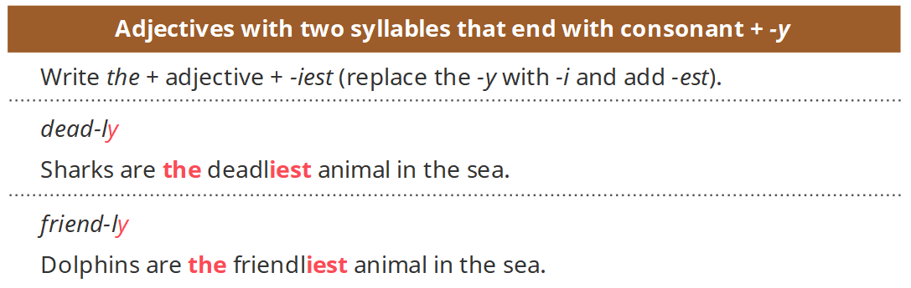
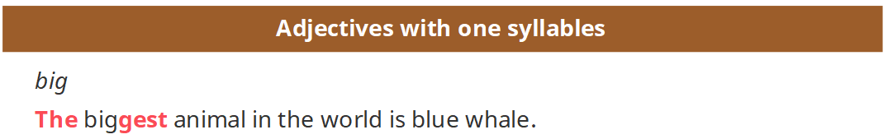
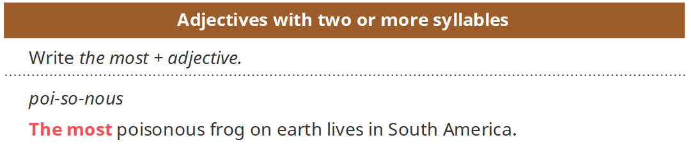
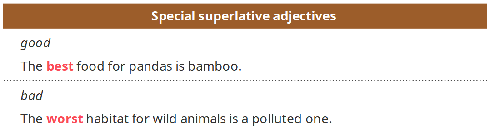
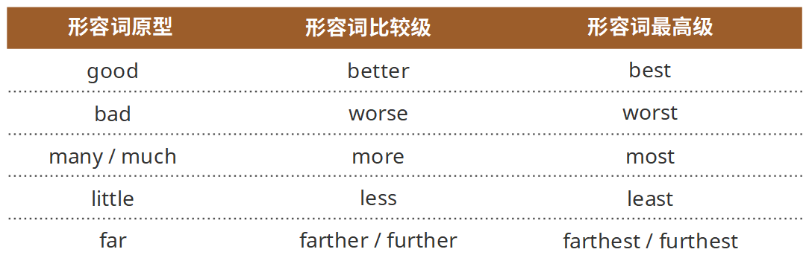
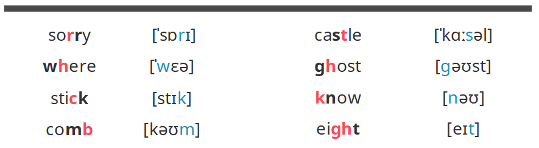
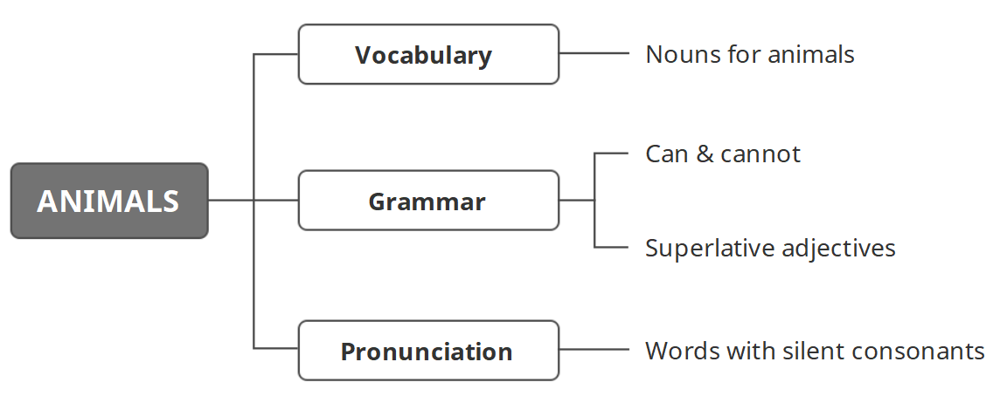

学习目标

> Understand key vocabulary about animals
>
> 理解关于动物的词汇 
>
> Understand can & cannot and superlative adjectives 
>
> 理解can & cannot的使用方法，以及形容词最高级 
>
> Pronounce words with silent consonants correctly
>
> 正确发出带有不发音辅音字母的单词

### Key vocabulary: animals

#### Nouns for animals

`animal [ˈænɪməl] 动物`

> vertebrate [ˈvɜːtɪˌbreɪt]脊椎动物 

mammal [ˈmæməl] 哺乳动物  

reptile [ˈrɛptaɪl] 爬行动物 

bird [bɜːd] 鸟类 

amphibian [æmˈfɪbɪən] 两栖动物 

fish [fɪʃ] 鱼类

> invertebrate[ɪnˈvɜːtɪbrɪt]无脊椎动物

arthropod [ˈɑːθrəˌpɒd] 节肢动物 

mollusc [ˈmɒləsk] 软体动物 

`MAMMAL`

bear [bɛə] 熊

lion [ˈlaɪən] 狮子

tiger [ˈtaɪɡə] 老虎 

cub [kʌb]  (狮子、狼、熊等的) 幼仔 

wolf [wʊlf] 狼 

camel [ˈkæməl] 骆驼

oryx [ˈɒrɪks] 大羚羊 

horn [hɔːn]  (牛、鹿等动物头上的) 角 

rhino [ˈraɪnəʊ] 犀牛 

zebra [ˈziːbrə] 斑马 

kangaroo [ˌkæŋɡəˈruː] 袋鼠

squirrel [ˈskwɪrəl] 松鼠

dolphin [ˈdɒlfɪn] 海豚 

gorilla [ɡəˈrɪlə] 大猩猩 

`BIRD`

eagle [ˈiːɡəl] 鹰

falcon [ˈfɔːlkən] 隼

parrot [ˈpærət] 鹦鹉 

kiwi [ˈkiːwiː] 几维鸟 

beak [biːk] 鸟嘴

wing [wɪŋ] 翅膀 

feather [ˈfɛðə] 羽毛

nest [nɛst] 巢

`REPTILE`

snake [sneɪk] 蛇

lizard [ˈlɪzəd] 蜥蜴 

turtle [ˈtɜːtəl] 海龟

tortoise [ˈtɔ:təs] 陆龟 

`AMPHIBIAN`

frog [frɒɡ] 青蛙 

toad [təʊd]癞蛤蟆

`ARTHROPOD`

locust [ˈləʊkəst] 蝗虫 

cockroach [ˈkɒkˌrəʊtʃ] 蟑螂 

mosquito [məˈskiːtəʊ] 蚊子 

fly[flaɪ]苍蝇 

`MOLLUSC`

snail [sneɪl] 蜗牛

squid [skwɪd] 鱿鱼 

### Key grammar: can & cannot and superlative adjectives

#### Can & cannot

> We use can + infinitive to show that an action is possible. 
>
> We use cannot + infinitive to show that an action is not possible.
>
> 我们用can加上不定式来说明一个动作是能做到的。 
>
> 我们用cannot加上不定式来说明一个动作是无法做到的。 

#### Superlative adjectives 

> Superlative adjectives have four forms.
>
> Write the + adjective + -est or -st. 
>
> 形容词的最高级有4种形式。 
>
> 在形容词前面加上the，并在最后加上
>
> est或st。 

> Write the + adjective + -iest (replace the -y with -i and add -est). 
>
> 以y结尾的形容词，在前面加上the，并将最后的y变成i，再加上est。 

#### 复习

> Double consonants: 
>
> the word has one syllable 
>
> the last two letters of the word are a vowel + a consonant 
>
> the last consonant is not -y 
>
> 双写辅音字母： 
>
> 单词只有一个音节 
>
> 单词最后两个字母为一个元音 + 一个辅音的形式 
>
> 最后的辅音不是-y

> Superlative adjectives have four forms. 
>
> Write the + adjective + -est or -st. 
>
> Write the + adjective + -iest (replace the -y with -i and add -est). 
>
> Write the most + adjective. 
>
> 形容词的最高级有4种形式。 
>
> 在形容词前面加上the，并在最后加上est或st。 
>
> 以y结尾的形容词，在前面加上the，并将最后的y变成i，再加上est。 
>
> 在形容词前面加上the most。 

> Special superlative adjectives 
>
> 形容词最高级的特殊变化。 

`不规则形容词比较级最高级变化表`

### Correct pronunciation: words with silent consonants 

> Silent consonants: We do not always pronounce every consonant when they are in a group. 
>
> 不发音的辅音字母：在一个单词中出现几个辅音字母聚在一起的情况下，我们并不总是发出每个辅音字母的音。 

### 小结

