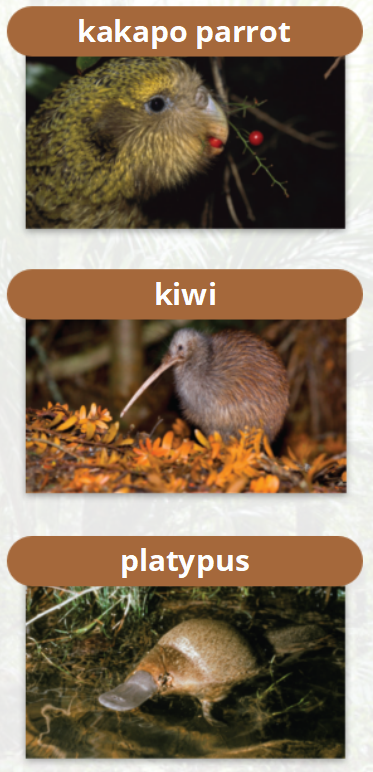
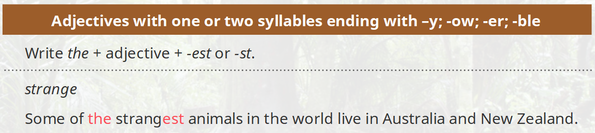
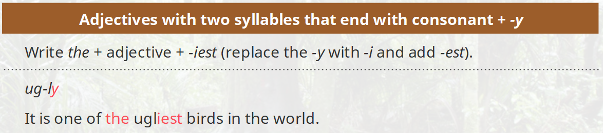
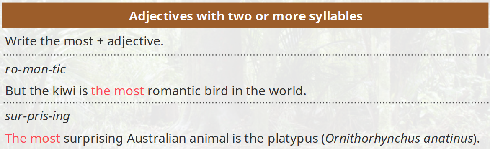
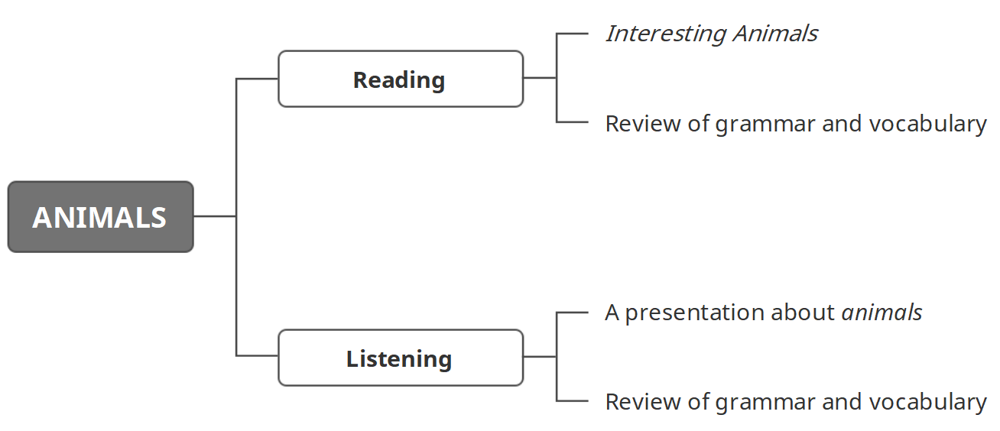

学习目标

> Read and understand Interesting Animals
>
> 精读并理解短文：有趣的动物
>
> Listen to and understand a presentation about animals 
>
> 精听并理解一段关于动物的演示

### Reading: Interesting Animals 

Some of the strangest animals in the world live in Australia and New Zealand. There is the kakapo parrot (Strigops habroptila). It is a bird but it cannot fly. It is a nocturnal animal. It sleeps in the day and eats at night. There are only 131 kakapo parrots in the world. 

The kiwi (Apteryx australis) is another bird that cannot fly. Some birds are very beautiful – but the kiwi is not. It is one of the ugliest birds in the world. But the kiwi is the most romantic bird in the world. Male and female kiwis can live together for 30 years. 

Australia has many strange animals. The most surprising Australian animal is the platypus (Ornithorhynchus anatinus). It has the face and feet of a bird, the body of a rat and the tail of a beaver. It is a mammal but it lays eggs.

#### 复习

> We use can + infinitive to show that an action is possible.
>
> We use cannot + infinitive to show that an action is not possible.

> Superlative adjectives（形容词最高级）： 
>
> Adjectives with one or two syllables ending with –y; -ow; -er; -ble 
>
> Adjectives with two syllables that end with consonant + -y 
>
> Adjectives with two or more syllables 
>
> Special superlative adjectives 

### Listening: A presentation about animals 

> Listen to a presentation. Two students talk about an animal from 
>
> their country. 
>
> Try to think about three questions: 
>
> 1 What are the two animals?
>
> 2 Where do the animals live? 
>
> 3 What do they eat? 

> Hi! How are you today? Good? Good! OK, good morning! I'm Jason, and today I'm going to tell you about a bird from my country – the American bald eagle. OK, so, where do they live? Well, you can see them in the US and Canada and here's a photograph of one.
>
> You can see here that this bird is flying to its nest. 'Nest' is the name for the place where the eagle lives. Some nests can be very big. How big can they be? Well, there was one eagle's nest that was more than 1,000 kilos! 
>
> Here's another photograph. You can see she has these white feathers on her head.
>
> So what do bald eagles eat? Well, fish are their prey. That means the eagles hunt them. And you see her yellow beak here? That beak is very sharp. That means it can cut the fish very easily.   
>
> OK, uh, and now Khaled is going to talk about an animal from his country. 

> OK, good morning, everybody. My name's Khaled and I'm going to talk about the animal in this photograph here. So this is an Arabian oryx. 
>
> An oryx is a kind of wild animal that lives in the desert. You can see them in many countries in the Arab world. For example, Oman, Jordan, Saudi Arabia and near my home in Abu Dhabi.  
>
> They are famous for their horns. That's these two long, hard things on their head. You can see their horns better in this photograph. The horns are very sharp! Oryx can run and jump very fast. Oryx eat grass and also fruit when they can find it. 
>
> The oryx are nomadic. That means they do not live in one place in the desert, but they travel around. Thank you! Now, I think ... 

### 小结

