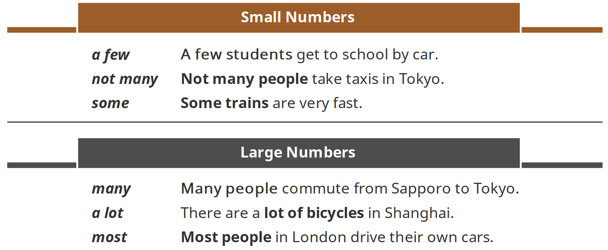
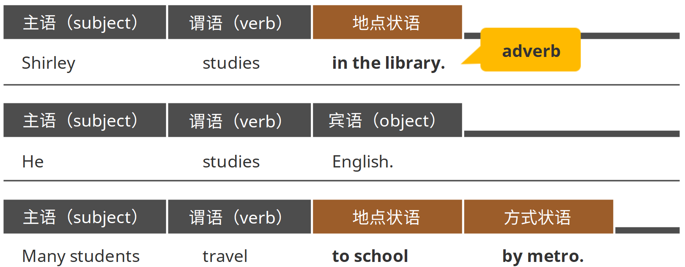
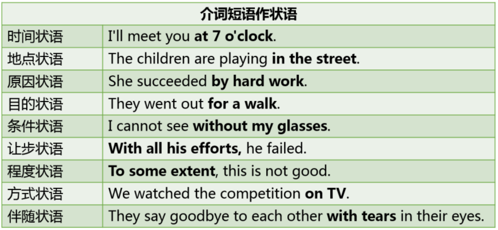
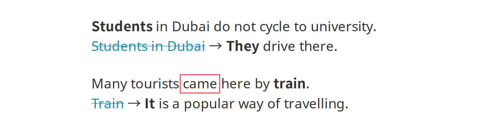
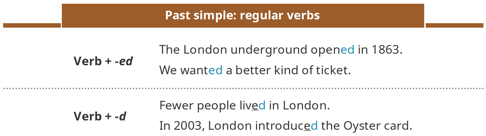
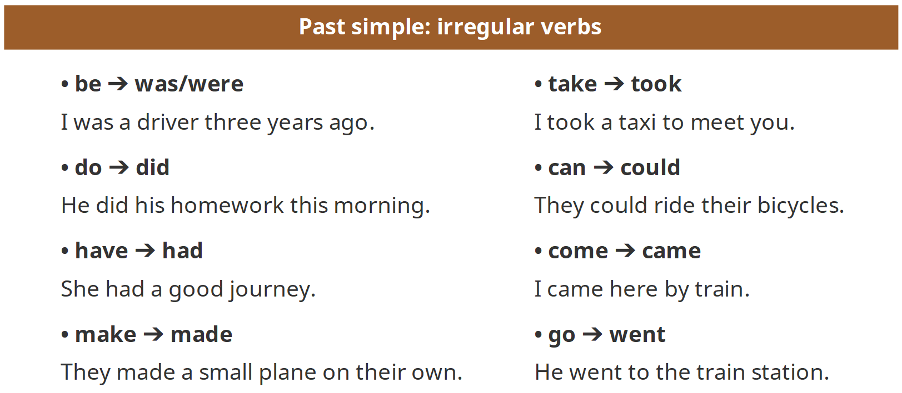
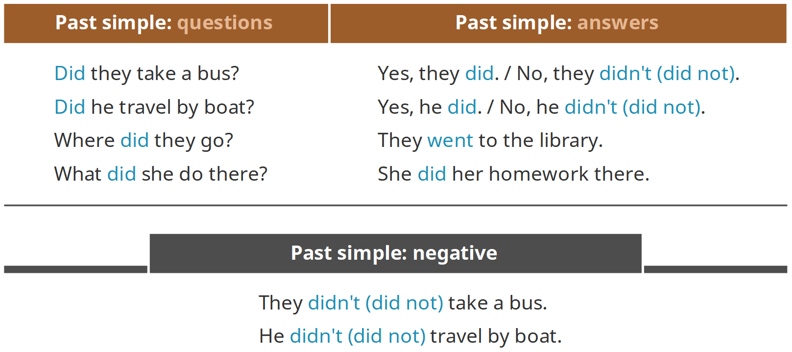
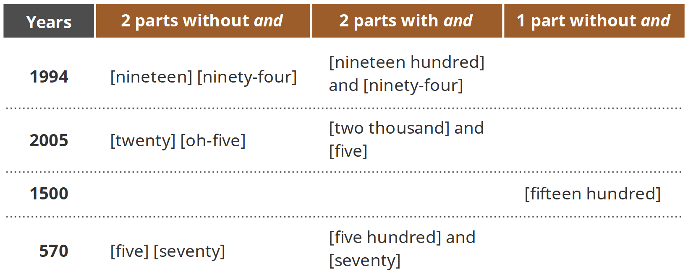
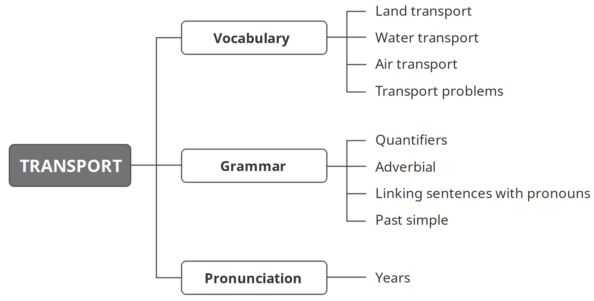

学习目标

> Understand key vocabulary about transport
>
> 理解关于运输的词汇 
>
> Understand quantifiers, adverbial, linking sentences with pronouns and past simple
>
> 理解数量词，状语，用代词衔接句子以及一般过去时
>
> Pronounce years correctly
>
> 正确发出年份

### Key vocabulary: transport

#### Land transport

bicycle [ˈbaɪsɪkəl]自行车

motorbike [ˈməʊtəˌbaɪk]摩托车

taxi [ˈtæksɪ]出租车

bus [bʌs]公交车

underground [ˈʌndəˌɡraʊnd]地铁

tube [tjuːb]地铁

metro [ˈmɛtrəʊ]地铁

subway [ˈsʌbˌweɪ]地铁

train [treɪn]火车

maglev [ˈmæɡˌlɛv]磁悬浮

#### Water transport

water taxi [ˈwɔːtə ˈtæksɪ]水上的士

boat [bəʊt]小船

yacht [jɒt]游艇

ferry [ˈfɛrɪ]渡船

#### Air transport

plane [pleɪn]飞机

helicopter [ˈhɛlɪˌkɒptə]直升机

chopper[ˈtʃɒpə]直升机

balloon [bəˈluːn]热气球

airship [ˈɛəˌʃɪp]飞艇

#### Transport problems

accident [ˈæksɪdənt]事故

traffic jam [ˈtræfɪk dʒæm]交通堵塞

road rage [rəʊd reɪdʒ]公路暴怒

pollution [pəˈluːʃən]污染

### Key grammar: quantifiers, adverbial, linking sentences with pronouns and past simple

### Quantifiers

> Quantifiers tell us the answer to the question How many? 
>
> We use quantifiers before a noun.
>
> 数量词可以用来回答“How many”这类问题。 
>
> 数量词出现在名词之前。

#### Adverbial

> Adverbial: an adverb, or a phrase or clause that functions as an adverb. 
>
> A prepositional phrase after a verb is NOT an object, it can be an adverbial modifying a verb.
>
> 状语：可以是副词，也可以是相当于副词作用的短语或从句。 
>
> 谓语（动词）后面的介词短语不是宾语，它可以是用来修饰谓语（动词）的状语。

介词短语可以担当的状语类型

#### Linking sentences with pronouns

> We use pronouns when we do not want to repeat the same noun or noun phrase in a paragraph.
>
> 当我们不想在一段话中重复相同的名词或名词短语的时候，我们会使用代词。

#### Past simple: regular & positive

> We use the past simple to talk about an event or an activity in the past. 
>
> We add -ed to regular verbs in the past, or just -d to verbs that end in -e.
>
> 我们使用一般过去时来谈论一个过去的事件或活动。 
>
> 对于规则变化的动词，我们在动词后面加-ed构成相应的过去式；如果动词以-e结尾，则只加-d来构成相应的过去式。

> Some verbs are irregular. They do not add -d/-ed in the past simple.
>
> 一些动词的变化并不规则。在变为过去式的时候，不在它们的后面加-d或者-ed。

> In past simple, we use did to make questions or negative sentences.
>
> 一般过去时情况下，我们用did来制造问句或否定句。

### Correct pronunciation: years

> Pronounce years in two parts with and or two parts only.
>
> 遇到年份的时候，我们将它们分成两个部分。读的时候，可以加一个and连接这两个部分，也可以直接读这两个部分。

### 小结

