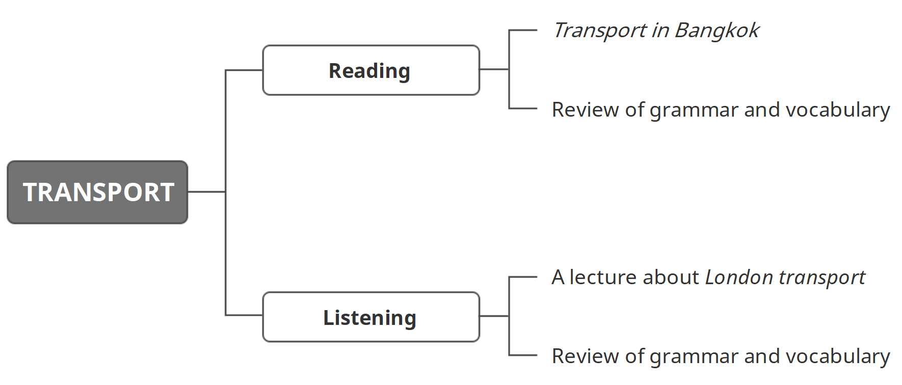

学习目标

> Read and understand Transport in Bangkok
>
> 精读并理解短文：曼谷交通
>
> Listen to and understand a lecture about London transport
>
> 精听并理解一段关于伦敦交通的讲座

### Reading: Transport in Bangkok

Over 12 million people live in Bangkok. Every day, thousands of people use public and private transport. A popular form of transport is the SkyTrain. 21% of the population of Bangkok take the SkyTrain to work or school. Another way to travel in the city is by bus. 18% of people who live in Bangkok take buses. Most people in Bangkok drive their own cars. 14% of people ride motorbikes to get to work or take children to school. People prefer buses to tuk-tuks. Only 8% of people use tuk-tuks to get to work or school. Only 3% walk to work and only 2% cycle to work. Most offices are too far away to walk or cycle to. 

The traffic in Bangkok is very heavy. The roads are full of different types of vehicle (cars, motorbikes, tuk-tuks, etc.). Most people spend more than one hour every day travelling. Almost 35% of people are late because of traffic jams. There are no traffic jams on the river. 11% of people take the river taxi. 

### Listening: A lecture about London transport

> Listen to a lecture. A man talks about Transport for London.
>
> Try to think about four questions:
>
> 1 What does Transport for London (TfL) do?
>
> 2 How many people travel in London?
>
> 3 When did the London Underground open?
>
> 4 What is an Oyster card?

> Hi! Good morning! Thank you for asking me here today. OK, so my name's Steve and I work for Transport for London. Today I'm going to tell you about the work we do and especially tell you about the electronic tickets we use in London.
>
> OK, so what do we do at Transport for London? Well, we look after travellers in London. This can be people who travel in private transport or public transport. Three million people travel in private cars and taxis and another five million use the bus, trains and, of course, the famous London Underground – the world's *oldest* underground train network. So that's a total of around eight million people.

> How old is it?
>
> Sorry? What was that? 
>
> How old is the London Underground? 
>
> Ah! Oh, uh it's more than 150 years old. It opened in 1863.
>
> Thanks.

> That's OK. So, Transport for London started in 2000, and in 2003 we introduced the Oyster card system of electronic tickets. Before Oyster cards, people had to buy paper tickets. And that was OK when fewer people lived and worked in London. They could buy tickets for one journey, or for a day or for a month. But there was a problem – it was very slow.
>
> Why, how did people use tickets before? 

### 小结

