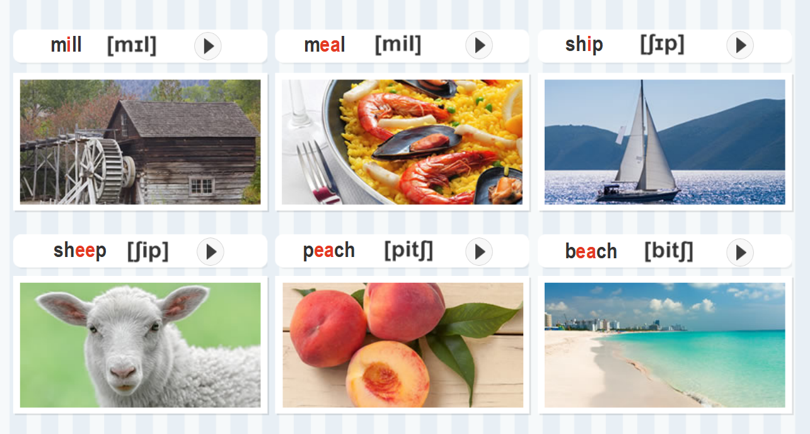
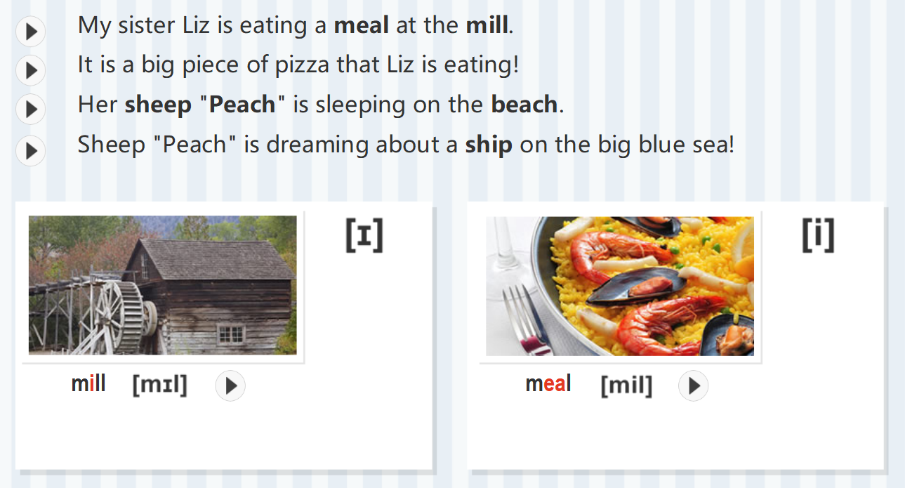
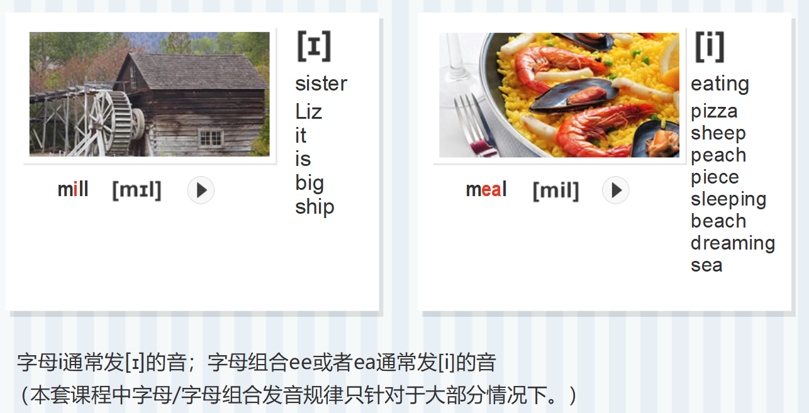
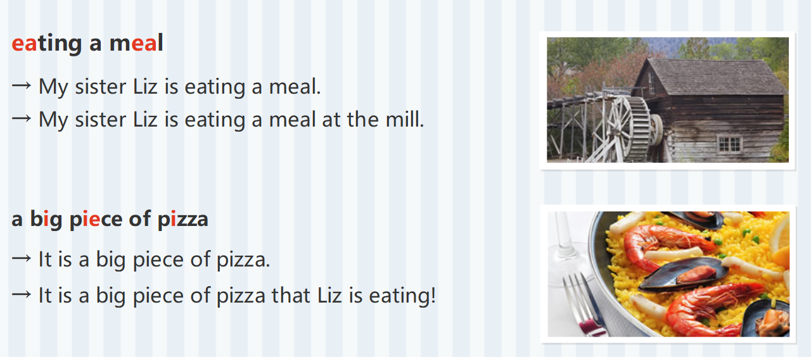
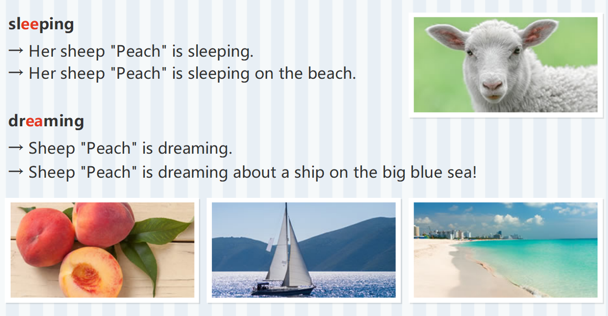
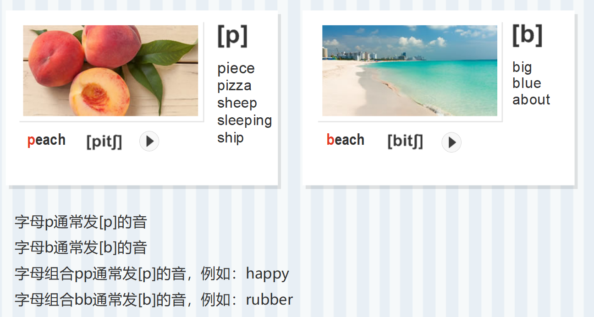

# [I] VS [i]

`[I]`：''yi ei''

`[i]`：''yi...''

字母i通常发[I]的音；字母组合ee或者ea通常发[i]的音

# [P] vs [b]

[P]：''pe''

[b]：''be''

字母P通常发[P]的音

字母b通常发[b]的音

字母组合pp通常发[p]的音，例如：happy

字母组合bb通常发[b]的音，例如：rubber

