# [ʊ]vs[u:]

`[ʊ]`："wu"

`[u:]`："wu..."

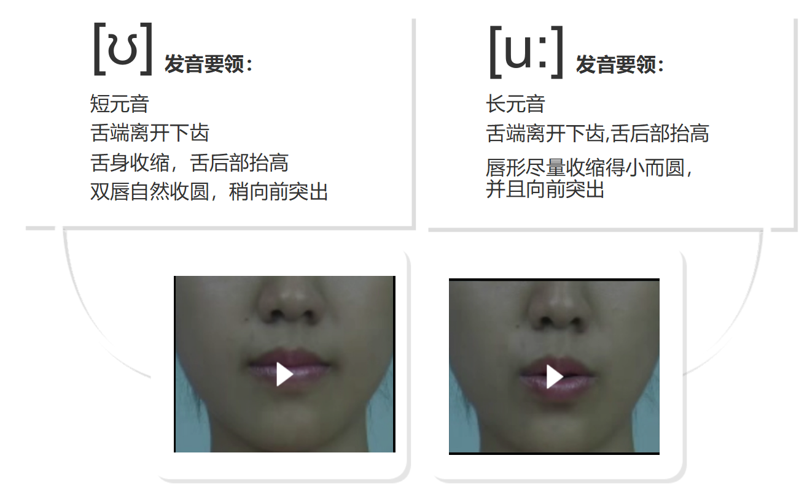

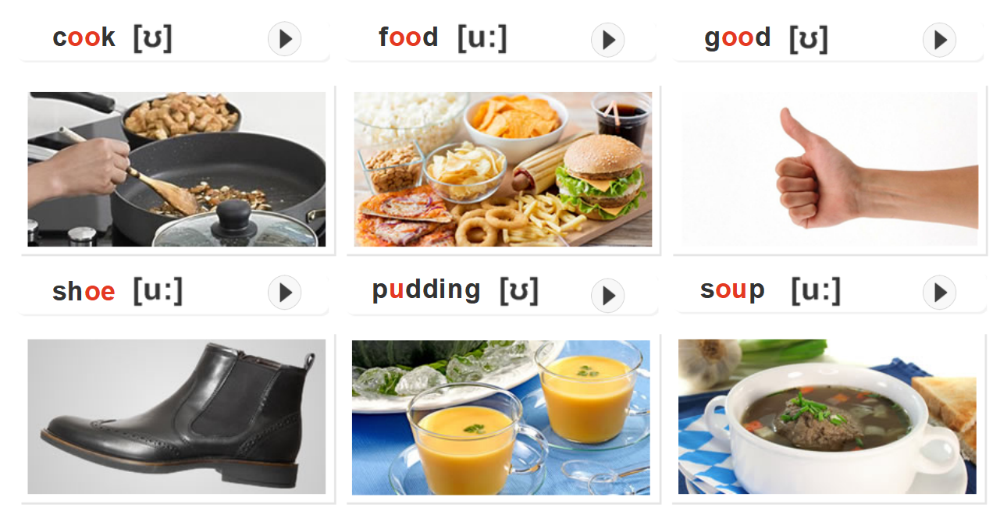

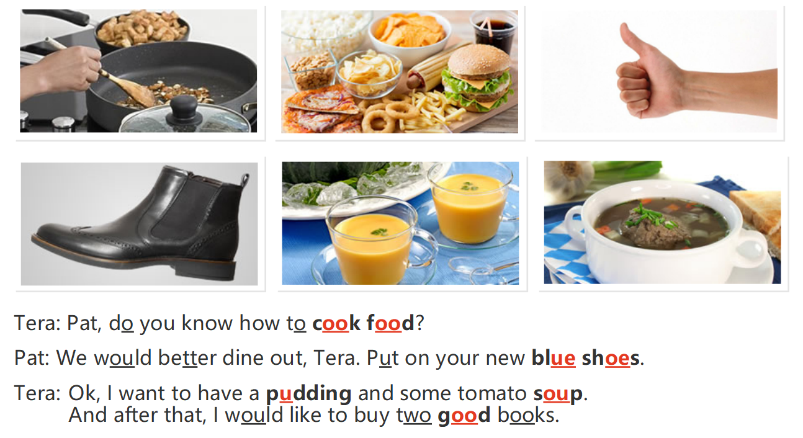

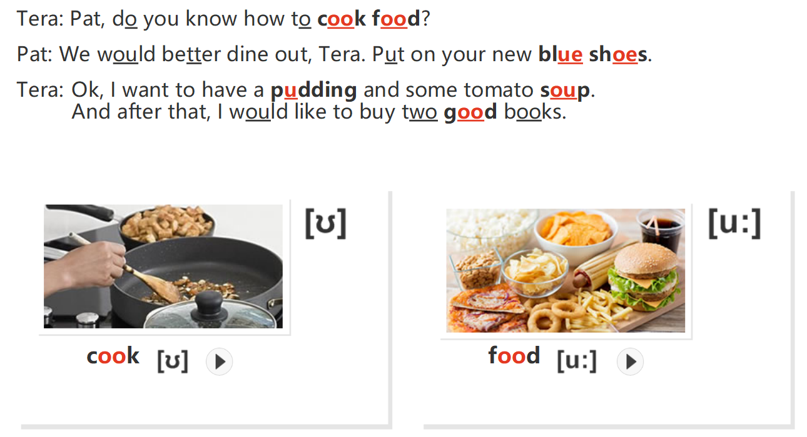

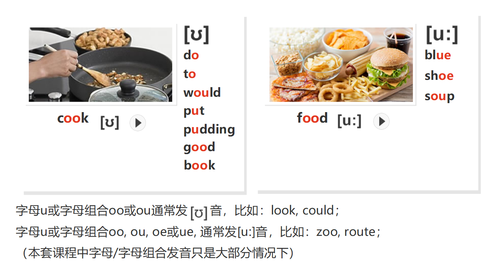

字母u或字母组合oo或ou通常发[ʊ]音，比如：look，could；

字母u或字母组合oo，ou，oe或ue，通常发[u:]音，比如：zoo，route；

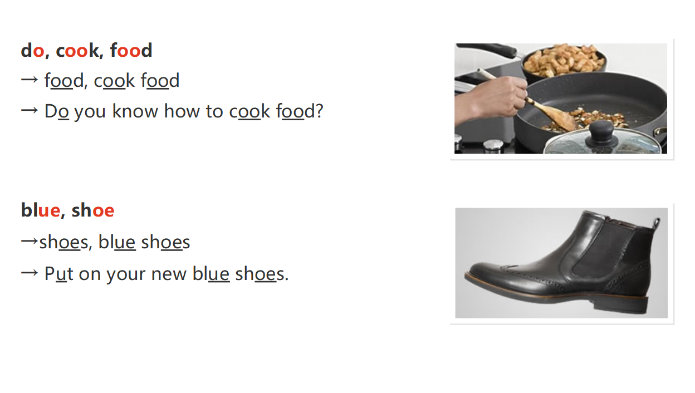

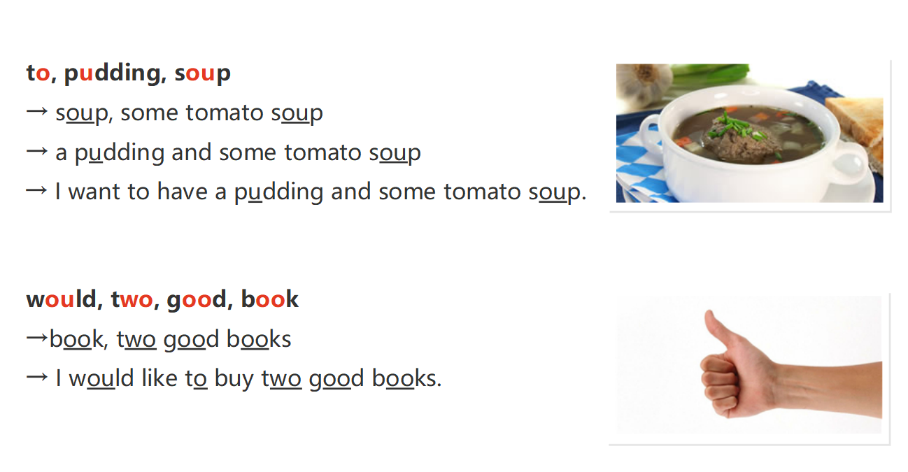

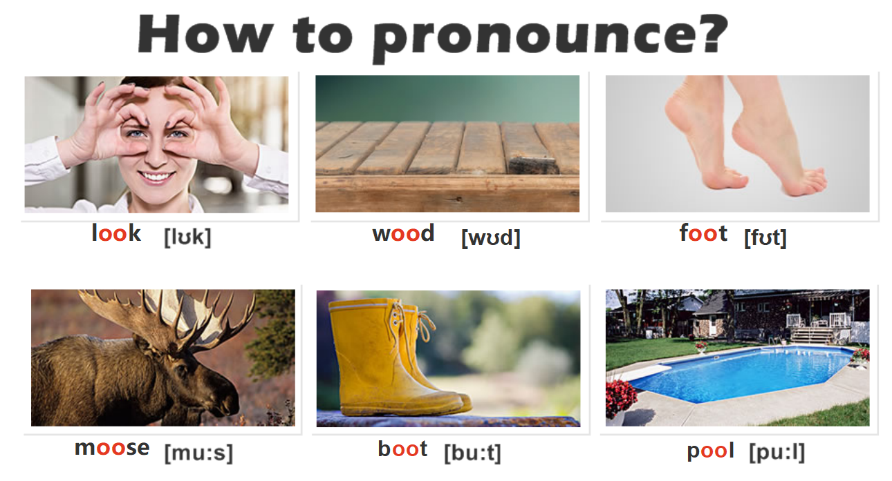

# [t]vs[d]

`[t]`："te"

`[d]`："en.de"

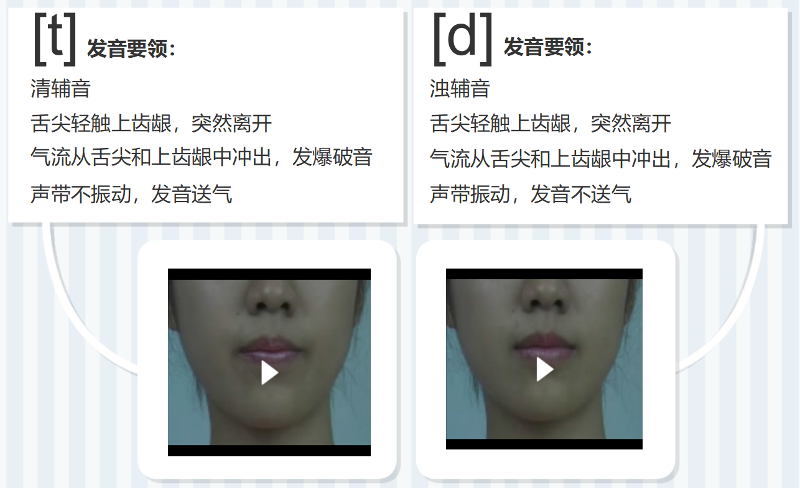

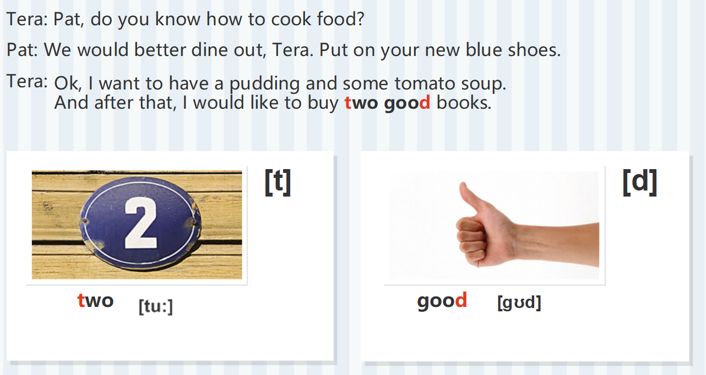

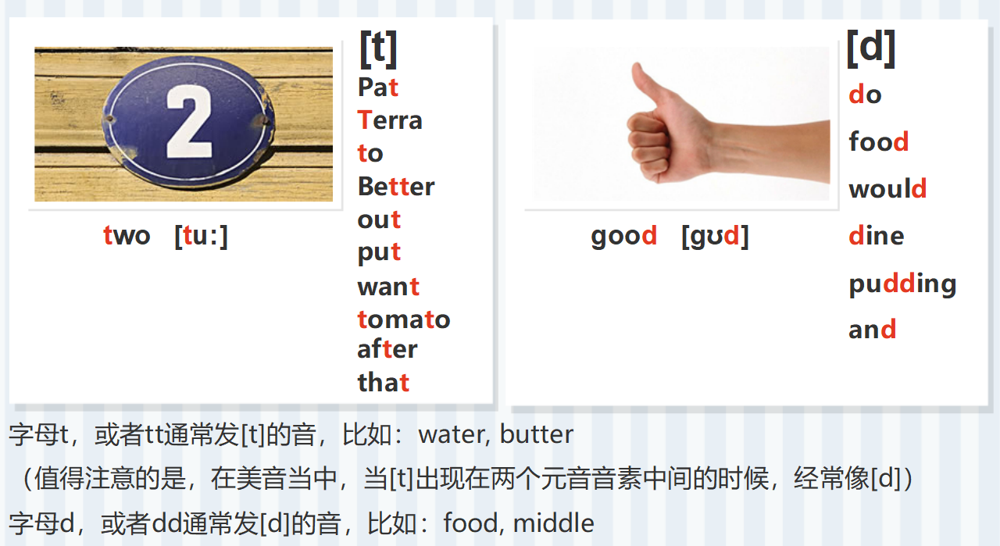

字母t，或者tt通常发[t]的音，比如：water，butter

(值得注意的是，在美国当中，当[t]出现在两个元音音素中间的时候，经常像[d])

字母d，或者dd通常发[d]的音，比如：food,middle

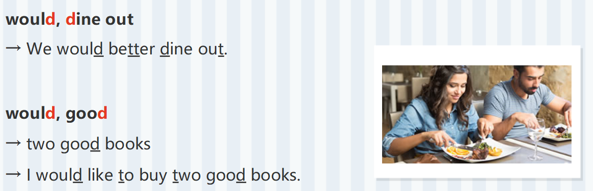

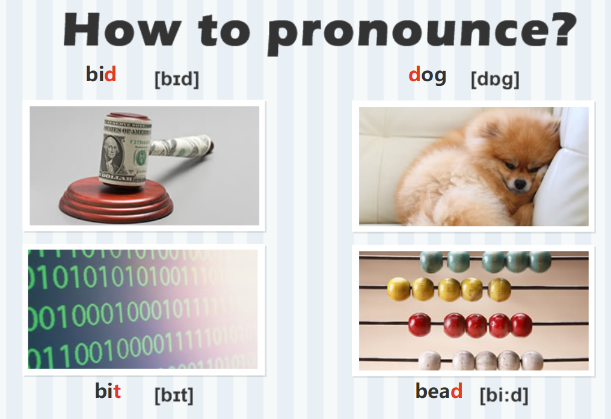

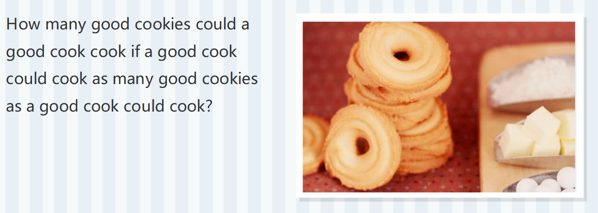