# [ɪə]vs[eə]

`[ɪə]`："yi e"

`[eə]`："ei e"

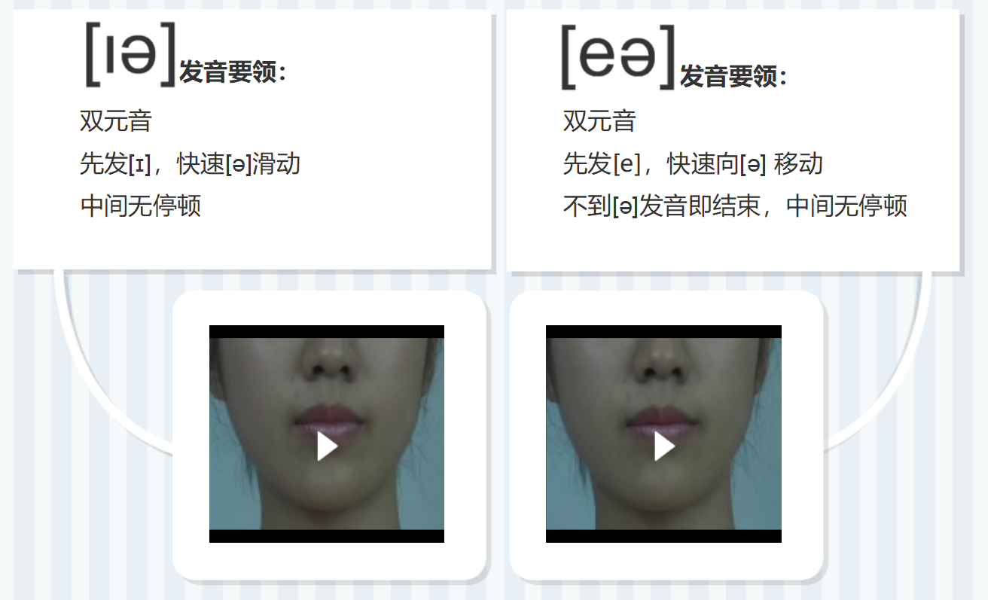

# [aɪ]vs[eɪ]

`[aɪ]`："ai"

`[eɪ]`："ei"

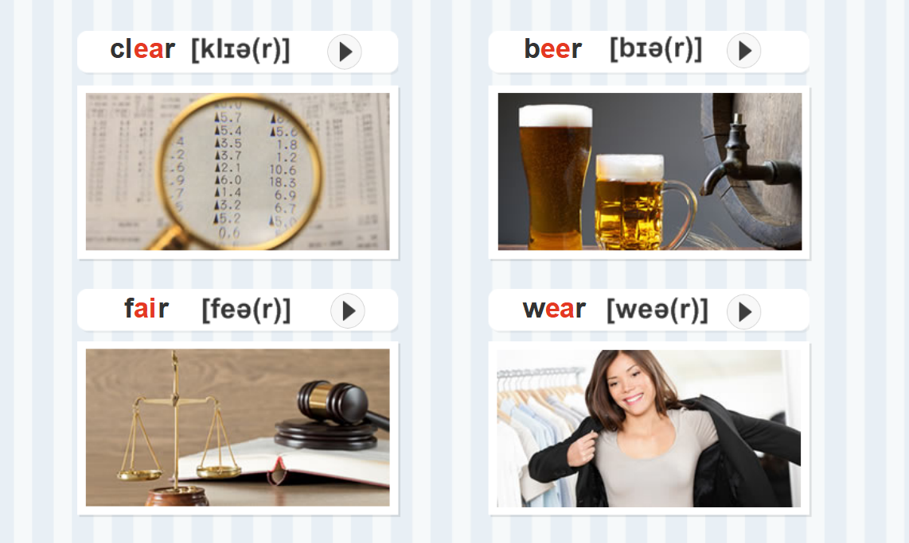

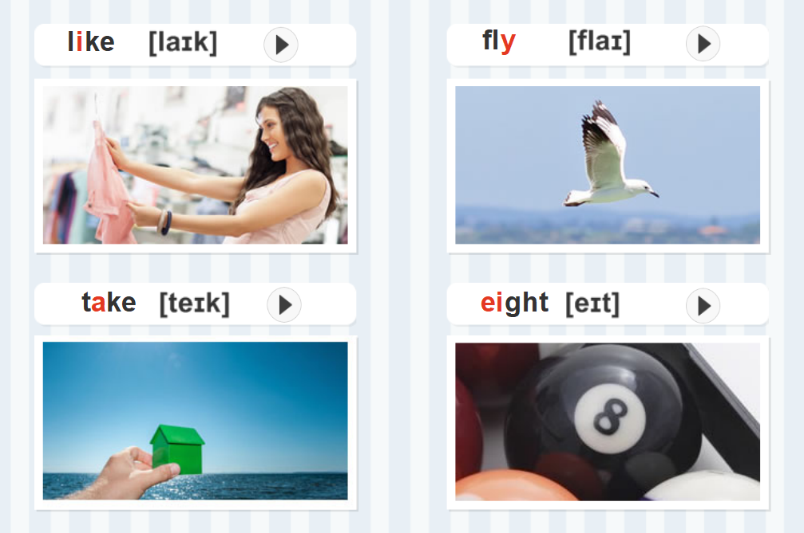

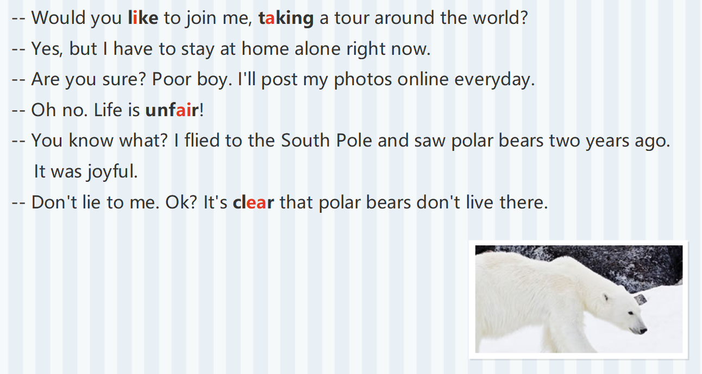

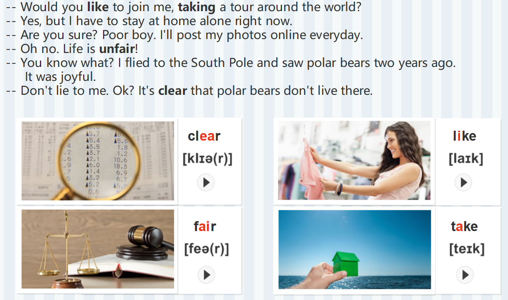

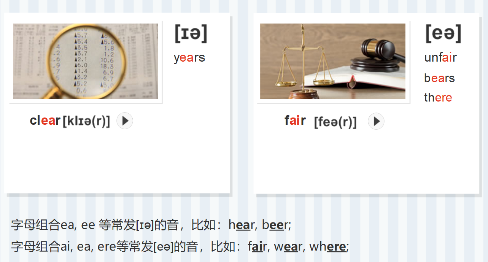

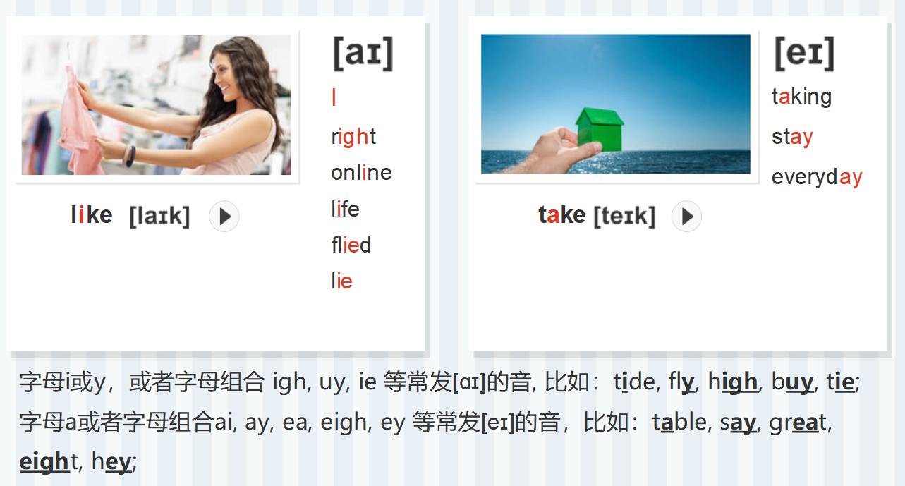

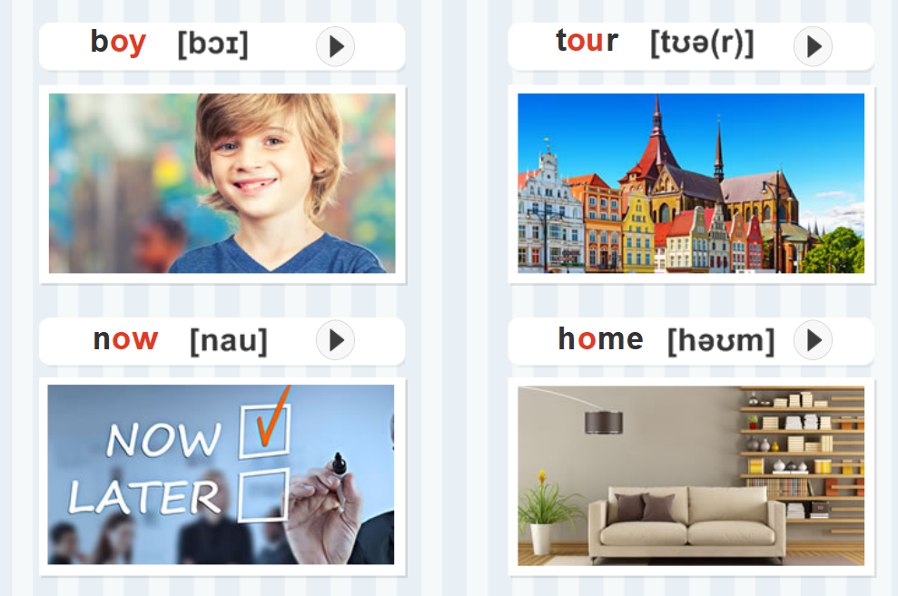

# [ɒɪ]vs[ʊə]

`[ɒɪ]`："o yi"

`[ʊə]`："wu e"

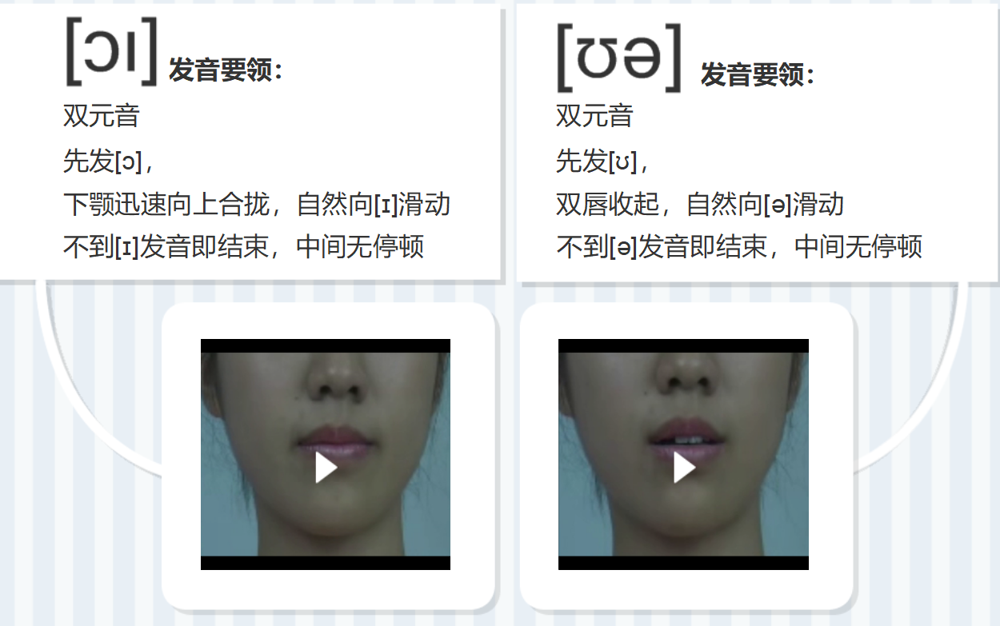

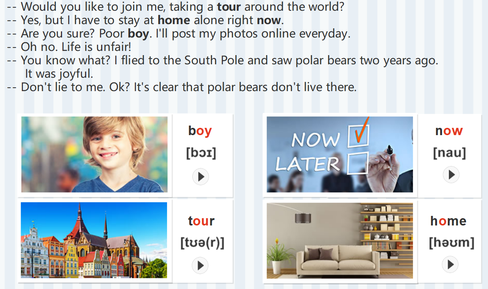

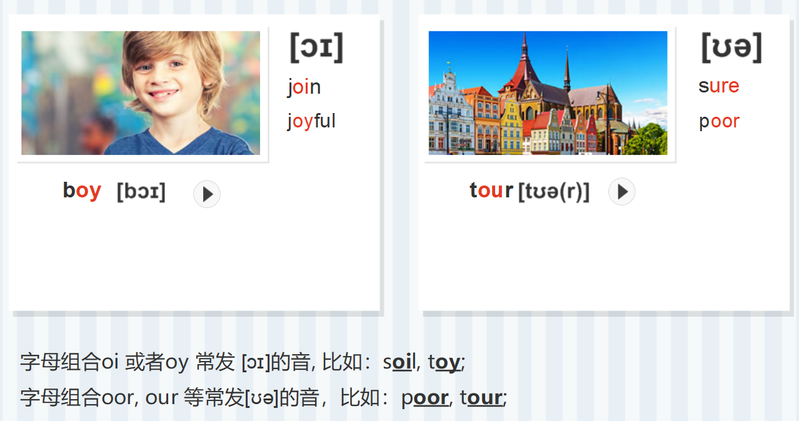

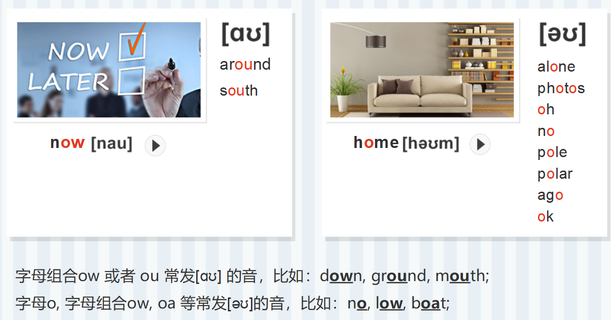

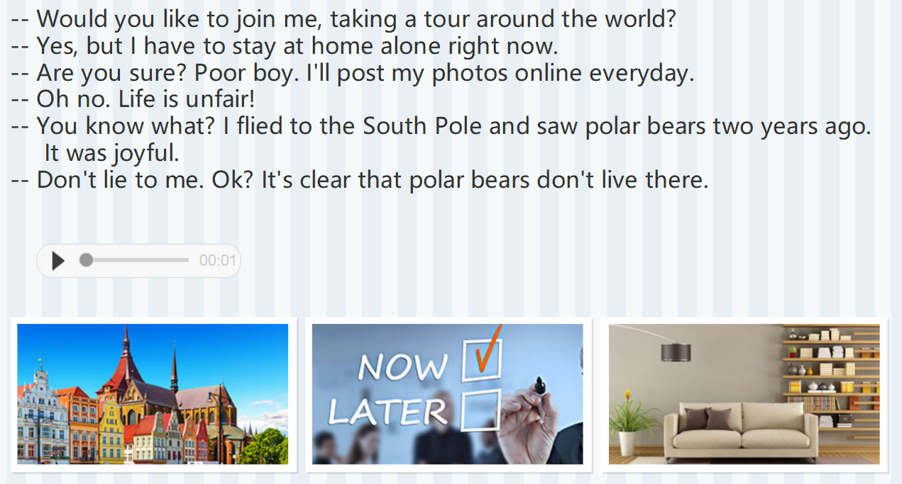

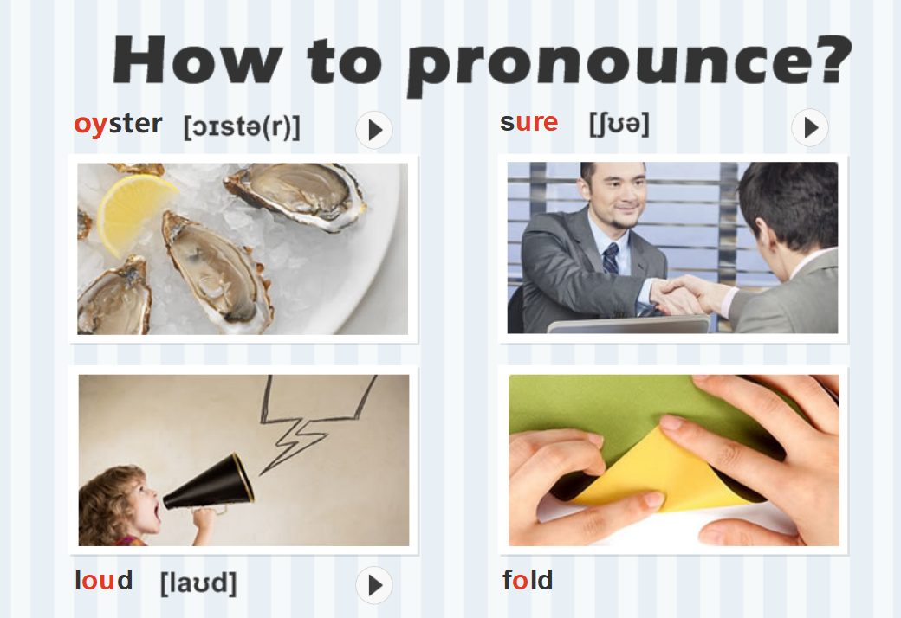

# [aʊ]vs[əʊ]

`[aʊ]`："a wu"

`[əʊ]`："e wu"

**开音节/闭音节**

26个字母中：

元音字母：a, e, i, o, u

辅音字母：其他

**开音节**

(1)以发音的元音字母结尾的音节。

be, he, so, also, photo

(2)以辅音字母(r除外) + 不发音的e结尾的音节。

date, make, like;

在重读的开音节中元音字母按字母名称读音。

**闭音节**

以一个或几个辅音字母(r除外)结尾

而中间只有一个元音字母的音节，称为闭音节。

tip, is, desk, drink;