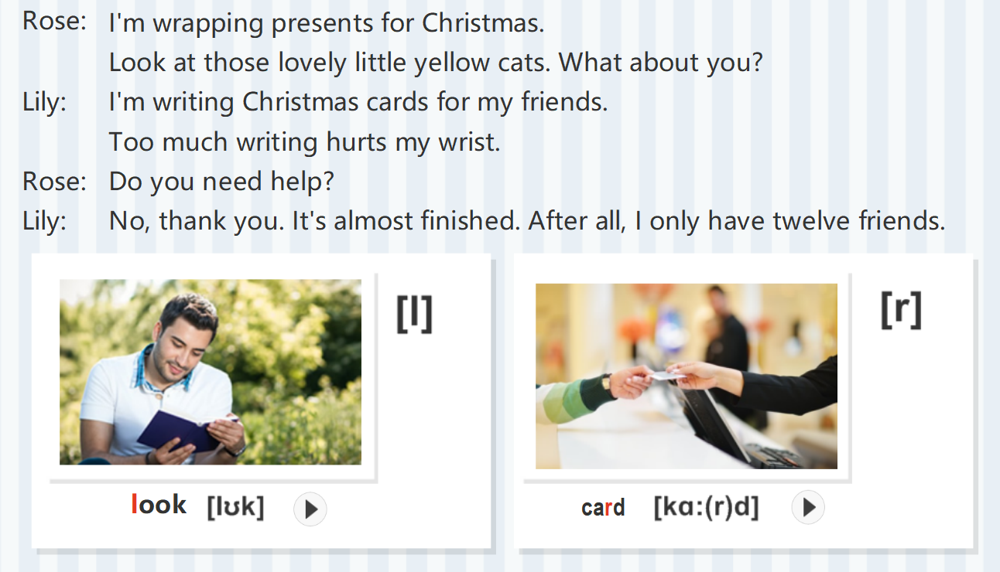
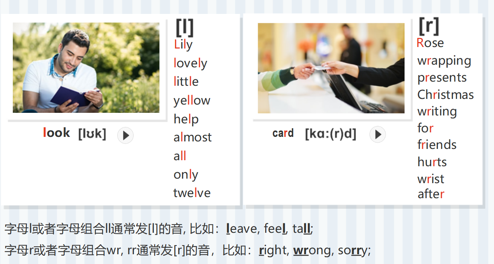
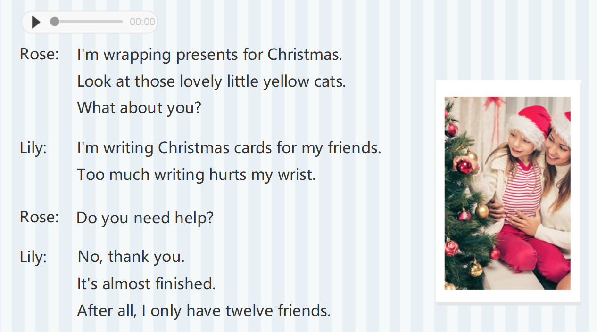
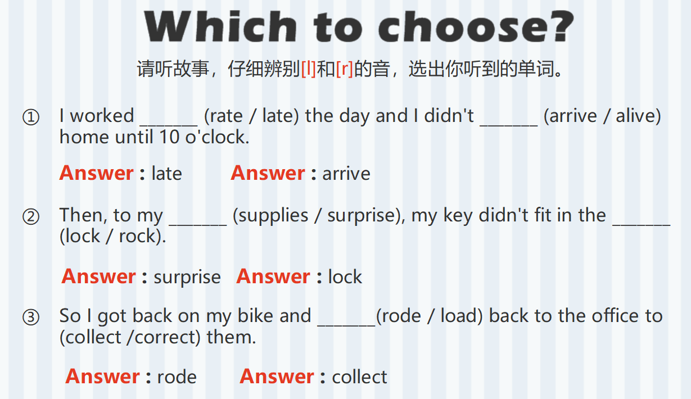
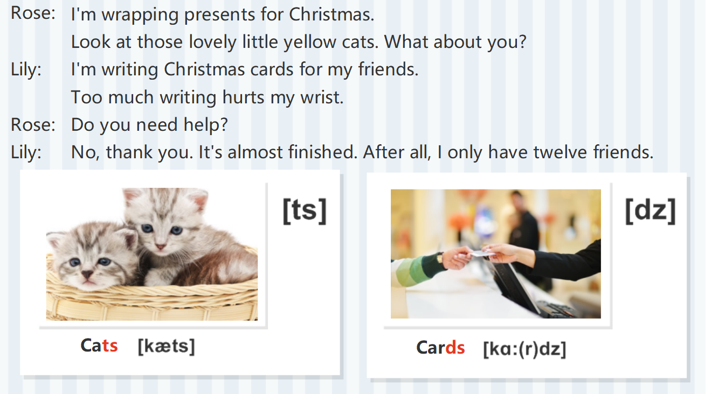
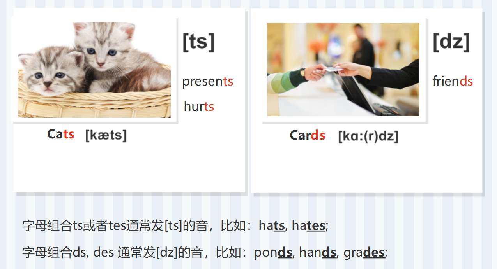
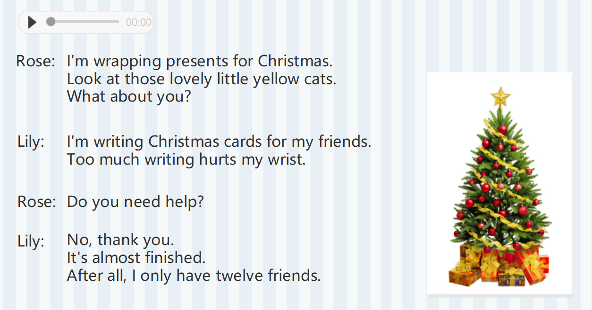

# [ǀ]vs[r]

`[ǀ]`："rz"

`[r]`："wz"

# [ts]vs[dz]

`[ts]`："ci"

`[dz]`："zi"

**失去爆破/不完全爆破**

两个辅音相邻时前面的爆破辅音由于受到后面辅音的影响，在发音的时候，只需要做出口型，并不需要大声发出来，这种现象就叫失去爆破。

爆破辅音：[p]、[b]、[t]、[d]、[k]、[g]    +

   [p]、[b]、[t]、[d]、[k]、[g]    = 失去爆破

(前者只做口型，马上发出后面的爆破音) 

爆破辅音：[p]、[b]、[t]、[d]、[k]、[g]    +

[ts]、[dz]、[tr]、[dr]、[tʃ]、[dʒ]、[f]、[v]、[θ]、[ð]、[s]、[z]、[ʃ]、[ʒ]、[r]、[h]  =   不完全爆破

(前者只做口型，马上过度到后面的音)

爆破辅音：[p]、[b]、[t]、[d]、[k]、[g]   +

[m]、[n]、[ŋ]、[I]   =   不完全爆破(轻微爆破)

(前者只做口型，马上过度到后面的音)

